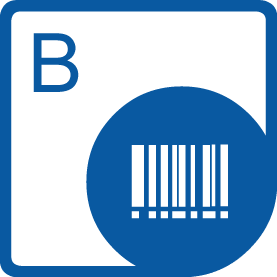
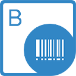

## Aspose.BarCode for .NET

{} 

**Welcome to Aspose.BarCode for .NET**

***Aspose.BarCode for .NET*** is a powerful library with a set of barcode generation and recognition components aimed to deploy barcode functionality in .NET applications. It provides a group of classes to work with barcodes on the backend, as well as GUI-based controls to process barcodes in Windows Forms and WPF. ***Aspose.BarCode for .NET*** enables compatibility with most of the existing barcode standards and specifications. It not only enables barcode generation but also provides an extensive framework to control the key aspects of barcode processing. 

Why choose ***Aspose.BarCode for .NET*** to manage barcodes? First, it allows setting the barcode recognition engine variables to obtain the desired trade-off between reading quality and speed. This means that you can enable recognizing even severely corrupted barcodes. 
Then, it is possible to customize various parameters of barcode and its appearance, such as background color, bar color, rotation angle, X-dimension, image quality, resolution, captions, size, and others. 
Moreover, ***Aspose.BarCode for .NET*** supports various symbologies and enables multiple barcode reading and generating functions so that you can implement the barcode functionality as required for your business processes and needs.  

{} 

The links to some useful resources can be found below.

- [Aspose.BarCode for .NET Online Documentation](/barcode/net/)
- [Aspose.BarCode for .NET Product Overview and Features](/barcode/net/product-overview)
- [Aspose.BarCode for .NET Release Notes](/barcode/net/release-notes/)
- [Aspose.BarCode for .NET Product Page](https://products.aspose.com/barcode/net)
- [Install Aspose.BarCode for .NET NuGet Package](https://www.nuget.org/packages/Aspose.Barcode/)
- [Download Aspose.BarCode for .NET](https://downloads.aspose.com/barcode/net)
- [Download Code Examples from GitHub Repository](https://github.com/aspose-barcode/Aspose.BarCode-for-.NET)
- [Aspose.BarCode for .NET API Reference Guide](https://apireference.aspose.com/net/barcode)
- [Aspose.BarCode for .NET Free Support Forum](https://forum.aspose.com/c/barcode)
- [Aspose.BarCode for .NET Paid Support Helpdesk](https://helpdesk.aspose.com/)

## Aspose.BarCode for Java

{}

Welcome to Aspose.BarCode for Java

Aspose.BarCode for Java is a robust and reliable barcode generation and recognition component, written in Java, it allows developers to quickly and easily add barcode generation and recognition functionality to their Java applications. It is available for the Java SE, Java EE, and Java ME platforms.

Aspose.BarCode for Java supports the most established barcode standards and barcode specifications. It can export to multiple image formats including: BMP, GIF, JPEG, PNG, and TIFF.

This section introduces Aspose.BarCode for Java and its features, gives examples as case studies, and lists some customers who choose to use Aspose.BarCode in their solutions. This section also includes information about Aspose.BarCode for Java [installation](https://docs.aspose.com/barcode/java/installation/), [evaluation](https://docs.aspose.com/barcode/java/licensing/) and [licensing](https://docs.aspose.com/barcode/java/licensing/). 

{} 

Following are the links to some useful resources you may need to accomplish your tasks.

- [Aspose.BarCode for Java Online Documentation](/barcode/java/)
- [Aspose.BarCode for Java Features](https://docs.aspose.com/barcode/java/product-overview/)
- [Aspose.BarCode for Java Release Notes](https://docs.aspose.com/barcode/java/release-notes/)
- [Aspose.BarCode for Java Product Page](https://products.aspose.com/barcode/java)
- [Install Aspose.BarCode for Java from Maven Repository](https://docs.aspose.com/barcode/java/installation/)
- [Download Aspose.BarCode for Java](https://downloads.aspose.com/barcode/java)
- [Download Code Examples from GitHub Repository](https://github.com/aspose-barcode/Aspose.Barcode-for-Java)
- [Aspose.BarCode for Java API Reference Guide](https://apireference.aspose.com/java/barcode)
- [Aspose.BarCode for Java Free Support Forum](https://forum.aspose.com/c/barcode)
- [Aspose.BarCode for Java Paid Support Helpdesk](https://helpdesk.aspose.com/)

## Aspose.BarCode for C++
{}

Welcome to Aspose.BarCode for C++

Aspose.BarCode for C++ is a set of barcode generation and recognition components built to allow developers to add barcode functionality in their C++ applications. Aspose.BarCode conforms to most of the barcode standards and specifications available nowadays. Aspose.BarCode for C++ does not just create barcodes but it provides a complete framework to control almost everything about them. The API is easy to use, installable on different platforms, and has a rich functionality as compared to other commercially available software.

{} 

The following are the links to some useful resources you may need to accomplish your tasks.

- [Aspose.BarCode for C++ Online Documentation](/barcode/cpp/)
- [Aspose.BarCode for C++ Features](/barcode/cpp/product-overview/)
- [Aspose.BarCode for C++ Release Notes](/barcode/cpp/release-notes/)
- [Aspose.BarCode for C++ Product Page](https://products.aspose.com/barcode/cpp)
- [Install Aspose.BarCode for C++ NuGet Package](https://www.nuget.org/packages/Aspose.barcode.Cpp/)
- [Download Aspose.BarCode for C++](https://downloads.aspose.com/barcode/cpp)
- [Download Code Examples from GitHub Repository](https://github.com/aspose-barcode/Aspose.Barcode-for-C)
- [Aspose.BarCode for C++ API Reference Guide](https://apireference.aspose.com/cpp/barcode)
- [Aspose.BarCode for C++ Free Support Forum](https://forum.aspose.com/c/barcode)
- [Aspose.BarCode for C++ Paid Support Helpdesk](https://helpdesk.aspose.com/)

## Aspose.BarCode for Android via Java
{}

Welcome to Aspose.BarCode for Android via Java

Aspose.BarCode for Android via Java API gives you the tools you need to generate barcode images and recognize barcodes from within Android applications. You can not only generate barcodes of different types, but also control the size of bars in the barcodes and overall barcode images. You can also customize the appearance of barcode text on barcode images.

{} 

The following are the links to some useful resources you may need to accomplish your tasks.

- [Aspose.BarCode for Java Online Documentation](/barcode/java) (Aspose.BarCode for Android via Java is very similar to Aspose.BarCode for Java. So, you can use the same documentation)
- [Aspose.BarCode for Android via Java Features](/barcode/java/aspose-barcode-for-android-via-java-features)
- [Aspose.BarCode for Android via Java Release Notes](/barcode/java/android-via-java-release-notes)
- [Aspose.BarCode for Android via Java Product Page](https://products.aspose.com/barcode/android-java)
- [Aspose.BarCode for Android via Java API Reference Guide](https://apireference.aspose.com/java/barcode) 

## Aspose.BarCode for ReportingServices
{} 

Welcome to Aspose.BarCode for Reporting Services

Aspose.BarCode for Reporting Services is a unique and robust solution for making your reports unique and more professional. It allows developers to display high-quality barcode labels on SQL reports. These barcode labels can be rendered in various formats: BMP, JPEG, GIF, and PNG.

{} 

The following are the links to some useful resources you may need to accomplish your tasks.

- [Aspose.BarCode for Reporting Services Online Documentation](/barcode/reportingservices/)
- [Aspose.BarCode for Reporting Services Features](/barcode/reportingservices/features/)
- [Aspose.BarCode for Reporting Services Release Notes](/barcode/reportingservices/release-notes/)
- [Aspose.BarCode for Reporting Services Product Page](https://products.aspose.com/barcode/reporting-services)
- [Download Aspose.BarCode for Reporting Services](https://downloads.aspose.com/barcode/reportingservices)
- [Aspose.BarCode for Reporting Services Free Support Forum](https://forum.aspose.com/c/barcode)
- [Aspose.BarCode for Reporting Services Paid Support Helpdesk](https://helpdesk.aspose.com/)

## Aspose.BarCode for SharePoint
{}

Welcome to Aspose.BarCode for SharePoint

Aspose.BarCode for SharePoint is a flexible solution that allows you to add barcode type columns to SharePoint lists.

Aspose.BarCode for SharePoint is designed to be used with Microsoft SharePoint Server 2010. There are no additional system requirements.

{} 

The following are the links to some useful resources you may need to accomplish your tasks.

- [Aspose.BarCode for SharePoint Online Documentation](/barcode/sharepoint/)
- [Aspose.BarCode for SharePoint Features](/barcode/sharepoint/features/)
- [Aspose.BarCode for SharePoint Release Notes](/barcode/sharepoint/release-notes/)
- [Aspose.BarCode for SharePoint Product Page](https://products.aspose.com/barcode/sharepoint)
- [Download Aspose.BarCode for SharePoint](https://downloads.aspose.com/barcode/sharepoint)
- [Aspose.BarCode for SharePoint Free Support Forum](https://forum.aspose.com/c/barcode)
- [Aspose.BarCode for SharePoint Paid Support Helpdesk](https://helpdesk.aspose.com/)

## Aspose.BarCode for JasperReports
{} 

Welcome to the Aspose.BarCode for JasperReports

Aspose.BarCode for JasperReports provides a unique and robust solution to make your reports unique and more professional. It allows developers to display high-quality barcode labels on JasperReports. These barcode labels can be rendered in several formats: BMP, JPEG, GIF, and PNG. Aspose.BarCode for JasperReports is a very lightweight component that supports more than 25 types of most popular barcode symbologies.

{} 

The following are the links to some useful resources you may need to accomplish your tasks.

- [Aspose.BarCode for JasperReports Online Documentation](/barcode/jasperreports/)
- [Aspose.BarCode for JasperReports Features](/barcode/jasperreports/features/)
- [Aspose.BarCode for JasperReports Release Notes](/barcode/jasperreports/release-notes/)
- [Aspose.BarCode for JasperReports Product Page](https://products.aspose.com/barcode/jasperreports)
- [Download Aspose.BarCode for JasperReports](https://downloads.aspose.com/barcode/jasperreports)
- [Aspose.BarCode for JasperReports Free Support Forum](https://forum.aspose.com/c/barcode)
- [Aspose.BarCode for JasperReports Paid Support Helpdesk](https://helpdesk.aspose.com/)