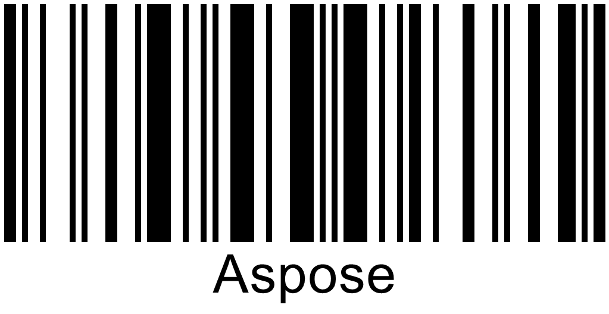

{}[Read Barcodes Online](https://products.aspose.app/barcode/recognize): You can check the quality of Aspose.BarCode recognition and view the results online.{}

## **Overview**
Barcode reading relies on machine vision mechanisms and uses various mathematical algorithms for object detection. Same as in other computer vision tasks, source image quality is crucial to convert an arbitrary image to machine-readable code. Low-quality barcode images may result being unreadable depending on specific recognition standards. There are different approaches to read barcodes of unacceptable quality. However, running such methods takes extra CPU computation time and may lead to the considerable increase in recognition time.

***Aspose.BarCode for Android via Java*** suggests optimizing the recognition process in terms of quality and speed in line with specific business needs. A special class called [*QualitySettings*](https://reference.aspose.com/barcode/androidjava/com.aspose.barcode.barcoderecognition/QualitySettings) provides flexible recognition settings to achieve the acceptable trade-off between reading acuracy and speed depending the quality of a source barcode image.
  
{}*If you need any clarifications, feel free to reach out [Aspose Technical Support](/barcode/java/technical-support/): ask your questions at [Aspose.Barcode Forum](https://forum.aspose.com/c/barcode/13) or contact [Aspose Paid Support Helpdesk](https://helpdesk.aspose.com/).*{}

## **Recognition Speed and Quality Options and Presets**
As stated above, ***Aspose.BarCode for Android via Java*** contains class [*QualitySettings*](https://reference.aspose.com/barcode/androidjava/com.aspose.barcode.barcoderecognition/QualitySettings) that is used to enable and disable various algorithms to read barcodes with damages or artifacts. In addition, class [*QualitySettings*](https://reference.aspose.com/barcode/androidjava/com.aspose.barcode.barcoderecognition/QualitySettings) allows customizing the trade-off between recognition quality and speed in common cases. Corresponding methods are grouped into dedicated presets that allow improving image recovery and barcode reading for various scenarios.

## **Recognition Presets**
In this section, supported recognition presets are described, including *HighPerformance*, *NormalQuality*, *HighQuality*, *MaxBarCodes*, and others, as represented in the table below. By default, the *NormalQuality* preset is applied. 

|Recognition Preset|Description|
|---|---|
|*NormalQuality*|Suitable for regular-quality barcode images|
|*HighQuality*|Intended for low-quality barcode images. It allows scanning diagonal and severely damaged barcode images|
|*HighPerformance*|Used for high-quality barcode images|
|*HighQualityDetection*|Same as *NormalQuality* but with the *setDetectorSettings()* method called passing the *HighQuality* value|
|*MaxQualityDetection*|Same as *NormalQuality* but with the *setDetectorSettings()* method called using the *MaxQuality* value. It allows detecting diagonal and damaged barcode images|
|*MaxBarcodes*|Allows scanning all barcodes possibly presented in an image, including invalid ones. It is recommended for debugging tasks only|
  
### **Universal Presets for All Barcode Types**
***Aspose.BarCode for Android via Java*** suggests various universal recognition presets and corresponding methods to activate them, such as *setHighPerformance*, *setNormalQuality*, and *setHighQuality*. These presets establish linear dependence between reading accuracy and speed for all barcode types. Generally, using the default *NormalQuality* preset is sufficient for most of barcodes that have acceptable scanning quality. 
  
<!--The following code sample shows how to use universal presets.-->
  

  
<!--
Console.WriteLine("QualityPresetsMain:");

//read barcode image with QualitySettings set to HighPerformance
Console.WriteLine("QualitySettings: HighPerformance");
using (BarCodeReader read = new BarCodeReader($"{path}barcodes_different_quality.png", DecodeType.Code128, 
    DecodeType.Code39Extended, DecodeType.Planet, DecodeType.QR, DecodeType.MicroQR, DecodeType.Pdf417, DecodeType.DataMatrix, DecodeType.Aztec))
{
    read.QualitySettings = QualitySettings.HighPerformance;
    Console.WriteLine($"Barcodes read: {read.ReadBarCodes().Length}");
    foreach (BarCodeResult result in read.FoundBarCodes)
        Console.WriteLine($"{result.CodeTypeName}:{result.CodeText}");
}

//read barcode image with QualitySettings set to NormalQuality
Console.WriteLine("QualitySettings: NormalQuality");
using (BarCodeReader read = new BarCodeReader($"{path}barcodes_different_quality.png", DecodeType.Code128,
    DecodeType.Code39Extended, DecodeType.Planet, DecodeType.QR, DecodeType.MicroQR, DecodeType.Pdf417, DecodeType.DataMatrix, DecodeType.Aztec))
{
    read.QualitySettings = QualitySettings.NormalQuality;
    Console.WriteLine($"Barcodes read: {read.ReadBarCodes().Length}");
    foreach (BarCodeResult result in read.FoundBarCodes)
        Console.WriteLine($"{result.CodeTypeName}:{result.CodeText}");
}

//read barcode image with QualitySettings set to HighQuality
Console.WriteLine("QualitySettings: HighQuality");
using (BarCodeReader read = new BarCodeReader($"{path}barcodes_different_quality.png", DecodeType.Code128,
    DecodeType.Code39Extended, DecodeType.Planet, DecodeType.QR, DecodeType.MicroQR, DecodeType.Pdf417, DecodeType.DataMatrix, DecodeType.Aztec))
{
    read.QualitySettings = QualitySettings.HighQuality;
    Console.WriteLine($"Barcodes read: {read.ReadBarCodes().Length}");
    foreach (BarCodeResult result in read.FoundBarCodes)
        Console.WriteLine($"{result.CodeTypeName}:{result.CodeText}");
}
-->

### **Presets for 1D Barcode Types**
To scan linear barcodes, ***Aspose.BarCode for Android via Java*** allows using dedicated recognition presets suitable for normal-quality barcodes. These presets provide improved methods for 1D barcode detection and decoding and are useful to work with barcodes of small dimensions or complex documents with multiple text blocks and tables. For example, compared with general recognition settings, *HighQualityDetection* and *MaxQualityDetection* presets allow improving recognition results for 1D barcodes in complex documents. Alternatilvely, such imprment can be implemented using the *NormalQuality* preset and tuning [*BarcodeSvmDetectorSettings*](https://reference.aspose.com/barcode/androidjava/com.aspose.barcode.barcoderecognition/BarcodeSvmDetectorSettings) through the *setDetectorSettings* method.  
  
The image shown below is a sample document with multiple barcodes that contains also text parts and figures. 

  
<!--The following code sample shows how to tune reading quality parameters to enable correct detection and decoding of all 1D barcodes corresponding to the target symbologies. 


Console.WriteLine("QualityPresetsOneD:");

//read barcode image with QualitySettings set to NormalQuality
Console.WriteLine("QualitySettings: NormalQuality");
using (BarCodeReader read = new BarCodeReader($"{path}many_code128.png", DecodeType.Code128))
{
    read.QualitySettings = QualitySettings.NormalQuality;
    Console.WriteLine($"Barcodes read: {read.ReadBarCodes().Length}");
    foreach (BarCodeResult result in read.FoundBarCodes)
        Console.WriteLine($"{result.CodeTypeName}:{result.CodeText}");
}

//read barcode image with QualitySettings set to HighQualityDetection
Console.WriteLine("QualitySettings: HighQualityDetection");
using (BarCodeReader read = new BarCodeReader($"{path}many_code128.png", DecodeType.Code128))
{
    read.QualitySettings = QualitySettings.HighQualityDetection;
    Console.WriteLine($"Barcodes read: {read.ReadBarCodes().Length}");
    foreach (BarCodeResult result in read.FoundBarCodes)
        Console.WriteLine($"{result.CodeTypeName}:{result.CodeText}");
}

//read barcode image with QualitySettings set to MaxQualityDetection
Console.WriteLine("QualitySettings: MaxQualityDetection");
using (BarCodeReader read = new BarCodeReader($"{path}many_code128.png", DecodeType.Code128))
{
    read.QualitySettings = QualitySettings.MaxQualityDetection;
    Console.WriteLine($"Barcodes read: {read.ReadBarCodes().Length}");
    foreach (BarCodeResult result in read.FoundBarCodes)
        Console.WriteLine($"{result.CodeTypeName}:{result.CodeText}");
}
-->

### **Using ***MaxBarCodes*** Preset for Debugging**
To detect all possible barcodes in an image including invalid ones, ***Aspose.BarCode for Android via Java*** contains a special preset called *MaxBarCodes*. This preset allows restoring up to 1% more barcodes (severely damaged or incorrectly generated) in comparison with the results that can be reached by the *NormalQuality* preset. Similar reading settings can be implemented through the *setAllowIncorrectBarcodes* method.
The *MaxBarCodes* preset may be used to scan even unreadable barcodes; however, it is intended for debugging tasks only as it may result in considerably augmenting the time needed to complete the reading process and providing invalid decoding outputs. This preset is suggested only for advanced users of the ***Aspose.BarCode*** library. 
  
<!--The following code sample shows how to use the *MaxBarCodes* preset.


Console.WriteLine("MaxBarCodesPreset:");

//read barcode image with QualitySettings set to MaxBarCodes
Console.WriteLine("QualitySettings: MaxBarCodes");
using (BarCodeReader read = new BarCodeReader($"{path}barcodes_different_quality.png", DecodeType.Code128,
    DecodeType.Code39Extended, DecodeType.Planet, DecodeType.QR, DecodeType.MicroQR, DecodeType.Pdf417, DecodeType.DataMatrix, DecodeType.Aztec))
{
    read.QualitySettings = QualitySettings.MaxBarCodes;
    Console.WriteLine($"Barcodes read: {read.ReadBarCodes().Length}");
    foreach (BarCodeResult result in read.FoundBarCodes)
        Console.WriteLine($"{result.CodeTypeName}:{result.CodeText}");
}
-->

## **Recognition Options**

### **Fast Detection for High-Quality Barcode Images**
To recognize high-quality 1D barcodes created through web-based applications, it is suggested to use *setAllowOneDFastBarcodesDetector* and *setFastScanOnly* reading methods. These methods enable fast scanning of target image areas through lightweight scanning techniques. The difference between these two options is that the *setFastScanOnly* method does not enable further barcode search after the failure to idetify more barcodes through lightweight scanning methods.  
  
<!--The following code snippet explains how to implement fast barcode recognition.-->  

<!--
Console.WriteLine("FastScan:");

//read barcode image with FastScan options disabled
Console.WriteLine("FastScan: disabled");
using (BarCodeReader read = new BarCodeReader($"{path}code128_hq.png", DecodeType.Code128))
{
    read.QualitySettings.FastScanOnly = false;
    read.QualitySettings.AllowOneDFastBarcodesDetector = false;
    Stopwatch watch = new Stopwatch();
    watch.Start();
    read.ReadBarCodes();
    watch.Stop();
    Console.WriteLine($"Barcodes read: {read.FoundCount}, Recognition time:{(int)watch.ElapsedMilliseconds} ms");
    foreach (BarCodeResult result in read.FoundBarCodes)
        Console.WriteLine($"{result.CodeTypeName}:{result.CodeText}");
}

//read barcode image with FastScan options enabled
Console.WriteLine("FastScan: enabled");
using (BarCodeReader read = new BarCodeReader($"{path}code128_hq.png", DecodeType.Code128))
{
    read.QualitySettings.FastScanOnly = true;
    read.QualitySettings.AllowOneDFastBarcodesDetector = true;
    Stopwatch watch = new Stopwatch();
    watch.Start();
    read.ReadBarCodes();
    watch.Stop();
    Console.WriteLine($"Barcodes read: {read.FoundCount}, Recognition time:{(int)watch.ElapsedMilliseconds} ms");
    foreach (BarCodeResult result in read.FoundBarCodes)
        Console.WriteLine($"{result.CodeTypeName}:{result.CodeText}");
}
-->

### **Regular Recognition of Barcode Images without Damage**
To decode regular barcode images, ***Aspose.BarCode for Android via Java*** applies a method called *setAllowRegularImage* that uses standard recognition techniques. This mode is suggested to be enabled in most cases, as its deactivation may lead to decoding failures for regular barcode images.  
  
<!--The following code sample shows how to perform regular barcode recognition.-->
  

<!--
Console.WriteLine("RegularImage:");

//read barcode image with AllowRegularImage set to false
Console.WriteLine("AllowRegularImage: false");
using (BarCodeReader read = new BarCodeReader($"{path}aztec_regular_inverse.png", DecodeType.Aztec))
{
    read.QualitySettings = QualitySettings.HighPerformance;
    read.QualitySettings.AllowRegularImage = false;
    read.QualitySettings.AllowInvertImage = true;
    Console.WriteLine($"Barcodes read: {read.ReadBarCodes().Length}");
    foreach (BarCodeResult result in read.FoundBarCodes)
        Console.WriteLine($"{result.CodeTypeName}:{result.CodeText}");
}

//read barcode image with AllowRegularImage set to true
Console.WriteLine("AllowRegularImage: true");
using (BarCodeReader read = new BarCodeReader($"{path}aztec_regular_inverse.png", DecodeType.Aztec))
{
    read.QualitySettings = QualitySettings.HighPerformance;
    read.QualitySettings.AllowRegularImage = true;
    read.QualitySettings.AllowInvertImage = true;
    Console.WriteLine($"Barcodes read: {read.ReadBarCodes().Length}");
    foreach (BarCodeResult result in read.FoundBarCodes)
        Console.WriteLine($"{result.CodeTypeName}:{result.CodeText}");
}
-->

## **Detection of Areas with Potential Barcodes**
To read barcodes, ***Aspose.BarCode for Android via Java*** first performs the segmentation of a source image and finds areas with potential barcodes. Two barcode region detectors are available: the one with flexible sensitivity implemented in a class called [*BarcodeSvmDetectorSettings*](https://reference.aspose.com/barcode/androidjava/com.aspose.barcode.barcoderecognition/BarcodeSvmDetectorSettings) and the other one that relies on the previous detector version that allows correctly identifying about 97% of barcodes without the need in additional settings. [*BarcodeSvmDetectorSettings*](https://reference.aspose.com/barcode/androidjava/com.aspose.barcode.barcoderecognition/BarcodeSvmDetectorSettings) is used by default together with calling the *setNormalQuality* method.

### **Barcode Detector with Flexible Sensibility**
[*BarcodeSvmDetectorSettings*](https://reference.aspose.com/barcode/androidjava/com.aspose.barcode.barcoderecognition/BarcodeSvmDetectorSettings) allows adjusting the sensitivity of the barcode detector in a flexible manner according to specific needs. The better is the detector sensitivity, the lower is reading speed and the better are the results of barcode region detection in complex source images with many text blocks and tables. For 1D barcodes, [*BarcodeSvmDetectorSettings*](https://reference.aspose.com/barcode/androidjava/com.aspose.barcode.barcoderecognition/BarcodeSvmDetectorSettings) supports the following sensitivity settings:
-	*NormalQuality* 
-	*HighQuality* 
-	*HighPerformance*
-	*MaxQuality*  
  
<!--The following code sample illustrates how to use [*BarcodeSvmDetectorSettings*](https://reference.aspose.com/barcode/java/com.aspose.barcode.barcoderecognition/BarcodeSvmDetectorSettings).
    

Console.WriteLine("OneDDetectorSettings:");

//read barcode image with DetectorSettings set to HighPerformance
Console.WriteLine("DetectorSettings: HighPerformance");
using (BarCodeReader read = new BarCodeReader($"{path}many_code128.png", DecodeType.Code128))
{
    read.QualitySettings.DetectorSettings = BarcodeSvmDetectorSettings.HighPerformance;
    Console.WriteLine($"Barcodes read: {read.ReadBarCodes().Length}");
    foreach (BarCodeResult result in read.FoundBarCodes)
        Console.WriteLine($"{result.CodeTypeName}:{result.CodeText}");
}

//read barcode image with DetectorSettings set to MaxQuality
Console.WriteLine("DetectorSettings: MaxQuality");
using (BarCodeReader read = new BarCodeReader($"{path}many_code128.png", DecodeType.Code128))
{
    read.QualitySettings.DetectorSettings = BarcodeSvmDetectorSettings.MaxQuality;
    Console.WriteLine($"Barcodes read: {read.ReadBarCodes().Length}");
    foreach (BarCodeResult result in read.FoundBarCodes)
        Console.WriteLine($"{result.CodeTypeName}:{result.CodeText}");
}
-->

### **Previous Version of Barcode Detector**
The *setUseOldBarcodeDetector* method allows performing barcode region detection for 1D barcodes using the previous detector version that does not support flexible sensitivity settings. This region detection mode is close to *NormalQuality* and *HighQuality* modes of the new detector implemented in [*BarcodeSvmDetectorSettings*](https://reference.aspose.com/barcode/androidjava/com.aspose.barcode.barcoderecognition/BarcodeSvmDetectorSettings).  
  
<!--The following code sample explains how to work with the previous version of the barcode region detector. 


Console.WriteLine("OneOldBarcodeDetector:");

//read barcode image with UseOldBarcodeDetector set to false
Console.WriteLine("UseOldBarcodeDetector: false");
using (BarCodeReader read = new BarCodeReader($"{path}many_code128.png", DecodeType.Code128))
{
    read.QualitySettings.UseOldBarcodeDetector = false;
    Console.WriteLine($"Barcodes read: {read.ReadBarCodes().Length}");
    foreach (BarCodeResult result in read.FoundBarCodes)
        Console.WriteLine($"{result.CodeTypeName}:{result.CodeText}");
}

//read barcode image with UseOldBarcodeDetector set to true
Console.WriteLine("UseOldBarcodeDetector: true");
using (BarCodeReader read = new BarCodeReader($"{path}many_code128.png", DecodeType.Code128))
{
    read.QualitySettings.UseOldBarcodeDetector = true;
    Console.WriteLine($"Barcodes read: {read.ReadBarCodes().Length}");
    foreach (BarCodeResult result in read.FoundBarCodes)
        Console.WriteLine($"{result.CodeTypeName}:{result.CodeText}");
}
-->

## **Managing Scan Gap during 1D and 2D Barcode Scanning**
To conduct preliminary detection of large-sized 1D and some 2D types, such as *QR Code*, *PDF417*, or *Aztec Code*, barcode scanning can be applied with a gap of several lines. This option is intended to avoid unaccaptably long scanning and allows speeding up the decoding process. ***Aspose.BarCode for Android via Java*** supports a special method called *setAllowDetectScanGap* to enable the scan gap. However, if large-sized and tiny barcodes are displayed in an image close to each other, applying this recognition option can lead to a failure to read smaller-sized barcode. When this option is not enabled, reading such combinations of barcodes can be executed successfully at the expense of recognition speed.  
  
<!--The following code snippet shows how to adjust the scan gap.-->

<!--
Console.WriteLine("DetectScanGap:");

//read barcode image with AllowDetectScanGap true
Console.WriteLine("AllowDetectScanGap: true");
using (BarCodeReader read = new BarCodeReader($"{path}code128_big_and_small.png", DecodeType.Code128))
{
    read.QualitySettings.AllowDetectScanGap = true;
    Console.WriteLine($"Barcodes read: {read.ReadBarCodes().Length}");
    foreach (BarCodeResult result in read.FoundBarCodes)
        Console.WriteLine($"{result.CodeTypeName}:{result.CodeText}");
}

//read barcode image with AllowDetectScanGap false
Console.WriteLine("AllowDetectScanGap: false");
using (BarCodeReader read = new BarCodeReader($"{path}code128_big_and_small.png", DecodeType.Code128))
{
    read.QualitySettings.AllowDetectScanGap = false;
    Console.WriteLine($"Barcodes read: {read.ReadBarCodes().Length}");
    foreach (BarCodeResult result in read.FoundBarCodes)
        Console.WriteLine($"{result.CodeTypeName}:{result.CodeText}");
}
-->

