This section provides general information about some widely used barcode types presented in the form of detailed information cards. **Aspose.BarCode** supports creating and reading barcodes for over 60 types, including 1D, 2D, and postal ones. References for information cards are listed below.
  
|Information Cards| | | |
|:-:|:-:|:-:|:-:|
|[**QR Code**](/barcode/info-cards/qr-code/) [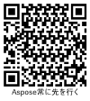](/barcode/info-cards/qr-code)|[**Micro QR Code**](/barcode/info-cards/micro-qr-code/) [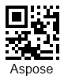](/barcode/info-cards/micro-qr-code/)|[**Data Matrix**](/barcode/info-cards/data-matrix/) |[**Code 39**](/barcode/info-cards/code-39/) [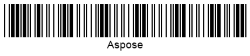](/barcode/info-cards/code-39/)|
|[**Aztec Code**](/barcode/info-cards/aztec-full-range/) [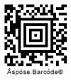](/barcode/info-cards/aztec-full-range/)|[**Aztec Compact**](/barcode/info-cards/aztec-compact/) |[**Aztec Rune**](/barcode/info-cards/aztec-rune/) [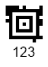](/barcode/info-cards/aztec-rune/)|[**Code 128**](/barcode/info-cards/code-128/) [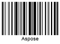](/barcode/info-cards/code-128/)|
|[**PDF417**](/barcode/info-cards/pdf417-family/) [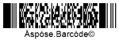](/barcode/info-cards/pdf417-family/)|[**Compact PDF417**](/barcode/info-cards/compact-pdf417/) [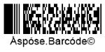](/barcode/info-cards/compact-pdf417/)|[**Macro PDF417**](/barcode/info-cards/macro-pdf417/) |[**Micro PDF417**](/barcode/info-cards/micro-pdf417/) [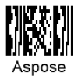](/barcode/info-cards/micro-pdf417/)|
|[**DataBar Omnidirectional**](/barcode/info-cards/databar-omnidirectional/) [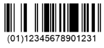](/barcode/info-cards/databar-omnidirectional/)|[**DataBar Truncated**](/barcode/info-cards/databar-truncated/) [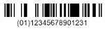](/barcode/info-cards/databar-truncated/)|[**DataBar Expanded**](/barcode/info-cards/databar-expanded/) [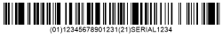](/barcode/info-cards/databar-expanded/)|[**DataBar Limited**](/barcode/info-cards/databar-limited/) [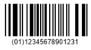](/barcode/info-cards/databar-limited/)|
|[**DataBar Omnidirectional Stacked**](/barcode/info-cards/databar-omnidirectional/) [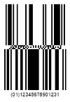](/barcode/info-cards/databar-omnidirectional/)|[**DataBar Stacked**](/barcode/info-cards/databar-truncated/) [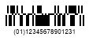](/barcode/info-cards/databar-truncated/)|[**DataBar Expanded Stacked**](/barcode/info-cards/databar-expanded/) [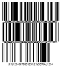](/barcode/info-cards/databar-expanded/)|
  

