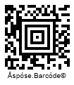

{}[Read](https://products.aspose.app/barcode/recognize/aztec) and [Generate](https://products.aspose.app/barcode/generate/aztec) Aztec barcodes online. You can test the quality of ***Aspose.BarCode*** functionality and view results.{}

Aztec Code is a family of two-dimensional (2D) barcode types that encode data in square modules placing unique finder patterns in the center of barcode labels. Such finder patterns facilitate identifying cell locations while scanning and decoding Aztec barcodes. Aztec Code has been introduced to provide higher accuracy than other 2D symbologies. 

The Aztec Code barcode group includes three subtypes:

- [Full-Range Aztec](/aztec-cards/)
- [Aztec Rune](/aztec-rune-card/)
- [Compact Aztec](/aztec-compact-card/)
  
Further in this article, the Full-Range Aztec barcode type is discussed. This information card outlines its key specifics, including the supported character set, barcode structure, size dimensions, data capacity, and error correction capability. Code samples for barcode generation and recognition through the ***Aspose.BarCode*** library are given [below](#asposesamples).

## **Overview**
Aztec Code was developed in 1995 by Andrew Longacre and Robert Hussey at Welch Allyn, Inc. The symbology is in the public domain. The code's name is derived from the resemblance of the central finder pattern to an Aztec pyramid that is seen from above. The Aztec is a 2D matrix code, typically used for airline tickets and other travel documents, as well as car registration documents. It can also be used in hospitals for patient identification, or to identify medication, samples, or other items related to a particular patient. Aztec Code is typically used for small item labelling applications using an extended variation of printing and marking technologies. 

{}You can find the detailed description of classes and properties that are used in ***Aspose.BarCode for .NET*** for QR Code generation and recognition:
- [**Aztec Code in Aspose.BarCode for .NET**](/barcode/net/aztec-barcode/)

{} 

## **Features**
  
### **Encoding Character Set**
This symbology supports all 255 ASCII characters (digits 0-9, text, binary data), the FNC1 (^1) symbol, and the Flag 7 (^7) symbol. Aztec Code is able to encode all 8-bit values such as 0-127 ASCII and 128-255 ISO 8859-1. Therefore, making it, unlike other 2D barcode types. The Aztec code has the potential to use much less space than other matrix barcodes.

### **Structure**
A full-range Aztec Code symbol has three white and three black finder pattern rings (in addition to the center square), from 4 to 32 data layers, and a reference grid. The Core Symbol, always square and at the exact center of an Aztec Code symbol, consists of a finder pattern, orientation patterns, and a mode message. This core covers a 15 x 15 module area in full-range symbols. It is called the core symbol as it must be successfully found and decoded before decoding can proceed into the surrounding data fields. As Aztec Codes are read from the inside out, no quiet zone is required.

  

Read more

- Finder pattern: a square bull's-eye structure in the center that consists of alternating black and white square rings that are one module wide and a center square that is one module wide and high. (This square is black unless the white-on-black option is being used). The number of rings varies with the size of the barcode.

- Orientation patterns: the first layer outside the outermost ring of the finder pattern is a one-module-wide layer that contains chevron-shaped orientation patterns in each corner. These patterns consist of three one-module squares. The first pattern, at the upper left corner, consists of three black modules. The second pattern, at the upper right, is one white module followed by two black modules. The third, at the lower right, is one black module followed by two white modules. The fourth, at the lower left, is three white modules.

- Mode message: in the same layer as the orientation patterns is a Mode Message that specifies the symbol size and the length of the data (not including check characters). The Mode Message also includes its own Reed-Solomon error correction encoding.

- Reference grid: in full-range Aztec Code symbols, the reference grid serves as an extension of the finder pattern to help accurately map the data field. The reference grid consists of one-module-wide rows and columns of alternating one-module black and white squares. One row and column extend from the center of the finder pattern to the outermost edges. Other rows and columns occur at every 16th row and column from the center. Each of these rows and columns spans the barcode rather than wrapping around as the data layers do.

- Data layers: the remainder of the barcode consists of one or more two-module-wide data layers that contain data and check characters. These layers are read in a clockwise direction. The first data layer is placed right near the first orientation pattern. This first data layer moves clockwise around the orientation pattern and Mode Message layer and ends beside its own starting edge. Each additional data layer begins immediately beside the ending edge of the preceding layer and ends beside its own starting edge. Note that the reading direction of the layer at its end is perpendicular to the reading direction of the next layer at its start. As a result, a barcode scanner can read the data layers as a continuous spiral.

### **Size Dimentions**
Full-Range Aztec barcodes up to 32 layers with the maximal size of 151 x 151 modules. There is a total of 33 different symbol sizes.
Size restrictions: the smallest label can be 15 x 15 modules, and the largest is 151 x 151 modules. Aztec Code allows generating barcodes of the smallest possible size compared with other symbologies. For example, an Aztec label would be approximately 30 times smaller than a Code 39 barcode encoding the same information. A quiet zone is not required with Aztec barcodes because the unique finder pattern is in the center of the symbol.

### **Encoding Capacity and Data Density**
Aztec Code can encode from small to large amounts of data with user-selected percentages of error correction. The symbol size adjusts automatically depending on the amount of input data.  
  
Full-range Aztec can encode at most 3,832 numerical digits or 3,067 alphanumeric symbols or 1,914 bytes, which corresponds to the maximal Aztec Code configuration composed of 32 data layers and 151 x 151 modules. The smallest Aztec barcode encodes up to 13 numeric or 12 alphabetic characters or 6 bytes of data. 

  

Read more

Aztec Code data capacity varies for different configurations depending on the enabled error correction level. E.g., one-layer full-range Aztec barcode with the size of 19 x 19 modules can encode at most 18 textual symbols or 15 numerical digits. The detailed table describing all supported configurations and their encoding capacities is provided in the ISO standard specification for Aztec Code. 

### **Error Correction**
Aztec supports Reed-Solomon error correction. The error correction level can be specified as a value from 5% to 95%, with a minimum of 3 codewords. Including more error correction data results in generating a larger symbol that however is more resistable to damages.  
  
It is not recommended to apply error correction levels over 23% in cases when large portions of data need to be encoded as this may exceed the symbol capacity. When its is known that Aztec barcodes will be utilized in the environment where the probability of barcode damaging is low, the error correction level may be set from 5 to 10 thus generating smaller barcode labels.

## **Advantanges and Weaknesses**
Aztec Code has extremely high damage tolerance capability. Aztec Code uses its space more efficiently than other matrix barcode types. The size can also vary, allowing it potentially to hold vast amounts of information. The other advantage of Aztec Code barcodes is that they do not require a quiet zone thus saving space.
  
Aztec barcodes may be specifically useful in case of sending documentation via fax as they provide good readability even for low resolution images. A scan through the image which detects clusters of such corners, and especially those attached to longer arms or other corners, should be able to find the bullseye even if partially damaged. In this manner, a bullseye that is 25% obliterated but with at least two sets of corners intact can be reliably found.   
  
However, Aztec Code does not support Kana or Kanji characters.

## **Aspose Samples for Full-Range Aztec Generation and Recognition**

### **Aztec Full-Range Generation Code Samples**






//generate Aztec Full Range Barcode
using (BarcodeGenerator gen = new BarcodeGenerator(EncodeTypes.Aztec, "Åspóse.Barcóde©"))
{
    gen.Parameters.Barcode.XDimension.Pixels = 4;
    //set symbol mode FullRange
    gen.Parameters.Barcode.Aztec.AztecSymbolMode = AztecSymbolMode.FullRange;
    //set error correction capacity to 10% (can be from 5% to 95%)
    gen.Parameters.Barcode.Aztec.AztecErrorLevel = 10;
    gen.Save($"{path}AztecFullRange.png", BarCodeImageFormat.Png);
}






<!-->Insert Code<-->





<!-->Insert Code<-->





### **Aztec Full-Range Recognition Code Samples**






//recognize Aztec Full Range Barcode
using (BarCodeReader read = new BarCodeReader($"{path}AztecFullRange.png", DecodeType.Aztec))
    foreach (BarCodeResult result in read.ReadBarCodes())
    {
        Console.WriteLine($"CodeType:{result.CodeTypeName}");
        Console.WriteLine($"CodeText:{result.CodeText}");
    }






<!-->Insert Code<-->





<!-->Insert Code<-->




