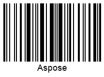

{}[Read](https://products.aspose.app/barcode/recognize/code128) and [Generate](https://products.aspose.app/barcode/generate/code128) Code 128 barcodes online. You can check ***Aspose.BarCode*** functionality and view results.{}

## **Overview**
Code 128 is an efficient linear (1D) barcode type with relatively high data density that allows encoding alphanumeric data. It was introduced in 1981 by Ted Williams from Laserlight Corporation to address the issue of storing both textual and numeric information without deteriorating data density. This symbology has been actively used in different business tasks in which large amounts of information need to be encoded in conditions of limited space. By design, Code 128 enables encoding numerical inputs with even better data density (double-density data compression). It supports validity checks through checksum controls and byte parity verification. At present, this linear symbology corresponds to the most widespread barcode types and has multiple applications, including transport industry and warehouse management, as well as retail and non-retail environments, such as library management, customer loyalty programs, item tracking, etc.  
  
The detailed specification for Code 128 is provided in standard ISO/IEC 15417:2007.
  

{}You can find additional information of classes and properties that are used in ***Aspose.BarCode for .NET*** for linear barcode generation and recognition:
- [**Specific Parameters for 1D barcodes**](https://docs.aspose.com/barcode/net/managing-different-barcode-settings/)

{} 
  
## **Features**
### **Encoding Character Set**
Code 128 supports encoding symbols from the full ASCII 128 character set.  
It provides three different encoding sets that define how encoded information gets interpreted by scanners: A, B, and C. The required option needs to be specified in the start character. It is possible to vary encoding sets within a single barcode.

- Code 128 A: all numerical digits (0-9), uppercase English letters (A-Z), punctuation symbols, 7 special characters, and ASCII control symbols (ASCII characters from 00 to 95)
- Code 128 B: all numerical digits (0-9), uppercase and lowercase English letters (A-Z, a-z), punctuation symbols, and 7 special characters (ASCII from 32 to 127)
- Code 128 C: all numerical digit pairs from 00 to 99 and 3 special symbols. This encoding set supports only numerical digits; in this way, one barcode symbol can contain two data digits

### **Structure**
All symbols in a barcode contain 3 bars and 3 spaces. Each bar or space can have a width of 1, 2, 3, or 4 units (a unit has the size of [X-dimension](/barcode/info-cards/x-dimension/)). The sum of bar widths must be even (4, 6, or 8 units), the sum of the widths of the spaces must be odd (3, 5, or 7 units), and in total, the size is 11 units per symbol. The barcode structure includes the following elements:

- Starting quiet zone
- Start character
- Input information
- Obligatory check digit
- Stop character
- Closing quiet zone

### **Size Dimensions**
To perform manual scanning, the specification of Code 128 suggests setting the minimum height to 5.0 mm or 15% of its width. It is recommended to set the size of quiet zones at least 10 times wider than the current [X-Dimension](/barcode/info-cards/x-dimension/). Each symbol in a barcode is 11 times wider than the [X-dimension](/barcode/info-cards/x-dimension/) (with the exception of the stop digit that is 13-time wider). The minimum possible size of the [X-dimension](/barcode/info-cards/x-dimension/) is 0.0075 inches. Thus, the length may vary depending on the amount of data to be encoded.

### **Encoding Capacity and Data Density**
Code 128 is a variable-length barcode type, which means that it can be used to encode character sets of an arbitrary length. The actual capacity limit that is practically achievable is 30 alphabetical symbols or 60 numerical digits. It allows producing very compact barcodes owing to the so-called double-density data compression. This specificity allows storing two data digits within one barcode symbol thus facilitating efficient conversion of large data sets.

### **Checksum Controls**
Code 128 requires adding a mandatory check digit to detect errors and inconsistencies. Checksum calculation is based on the modulo 103 algorithm. It is computed in the following manner: the value of the start symbol is summed up with the products of values of the remaining symbols multiplied by its position. The start character and the first data symbol are in position 1. Modulo 103 is then applied to the sum of products. Finally, the remainder is converted back to one of the 103 non-delimiter digits and is added to the set of symbols right before the stop digits.

## **Advantages and Limitations**
Among linear symbologies, Code 128 allows generating the most compact labels with large data density. The amount of input information to be encoded can be varied depending on business needs thus allowing users to create barcodes taking very small space. This symbology provides instruments to ensure data integrity through parity bit checks and checksum controls.

Code 128 utilizes four different bar sizes, and therefore, it requires high-quality printers to print out labels. Dot matrix and ink-jet printers are not applicable to print out such barcodes; flexographic printing on corrugated cardboards is not supported as well. 

## **Aspose Samples for Code 128 Generation and Recognition**
### **Generation Code Samples**






//generate Code128 Barcode
using (BarcodeGenerator gen = new BarcodeGenerator(EncodeTypes.Code128, "Aspose"))
{
    gen.Parameters.Barcode.XDimension.Pixels = 2;
    gen.Save($"{path}Code128.png", BarCodeImageFormat.Png);
}
 





<!-->Insert Code<-->





<!-->Insert Code<-->





### **Recognition Code Samples**






//recognize Code128 Barcode
using (BarCodeReader read = new BarCodeReader($"{path}Code128.png", DecodeType.Code128))
    foreach (BarCodeResult result in read.ReadBarCodes())
    {
        Console.WriteLine($"CodeType:{result.CodeTypeName}");
        Console.WriteLine($"CodeText:{result.CodeText}");
    }
 





<!-->Insert Code<-->





<!-->Insert Code<-->




