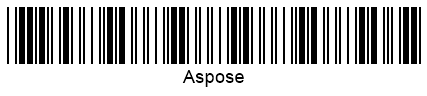

{}[Read](https://products.aspose.app/barcode/recognize/code39) and [Generate](https://products.aspose.app/barcode/generate/code39) Code 39 barcodes online. You can test the quality of ***Aspose.BarCode*** functionality and view results.{}

## **Overview**
Code 39 is a variable-length barcode specification introduced in 1974 by Intermec Corporation. It was the first symbology that allowed storing not only numerical digits but also alphabetic symbols. Its encoding set includes 43 symbols, i.e. uppercase English letters (A-Z), numerical digits, and several special characters. Each symbol gets encoded in a set of five bars and four spaces. It enables self-checking and thus it does not require obligatory checksum controls. Code 39 has been widely employed in various industries, including the LOGMARS system developed by the US military.

{}You can find additional information of classes and properties that are used in ***Aspose.BarCode for .NET*** for linear barcode generation and recognition:
- [**Specific Parameters for 1D barcodes**](https://docs.aspose.com/barcode/net/managing-different-barcode-settings/)

{} 

## **Features**
### **Encoding Character Set**
Code 39 enables encoding characters from the 43-character and 128-character ASCII sets, including uppercase English letters, numerical digits, and special symbols (space, '.', '-', '/', '%', '+', ' * ', and '$'). Symbol ' * ' serves to denote start and stop symbols.

### **Structure**
Each Code 39 data symbol is encoded using five bars and four spaces so that three of them are wide and six are narrow.  
The following structure is supported:
- Starting quiet zone
- Start symbol
- One or more pairs of characters (an optional check digit may be added)
- Stop symbol
- Ending quiet zone
- One-module wide spaces separating symbols within a barcode

### **Size Dimensions**
To scan Code 38 barcodes manually, it is recommended to set the minimum height to 5.0 mm or 15% of the width. The size of quiet zones should be 10 times wider than the current X dimension. This standard allows generating labels of different proportions, i.e. 2:1,0 or 3:1,0. The larger is the selected proportion, the larger gets the printed label; however, this also improves readability.

### **Encoding Capacity and Data Density**
Code 39 allows generating barcodes of variable length; its average data capacity varies from 20 to 23 alphanumerical characters. Even though it enables encoding the entire ASCII set including 128 symbols, this leads to limitations in terms of density. This happens because symbols from the full ASCII set need to be encoded in two digits and thus occupy a larger space. 

### **Checksum Controls**
Code 39 does not require setting obligatory checksum controls and thus does not provide high recognition precision. It allows adding an optional check digit computed using the modulo 43 algorithm.

## **Advantages and Limitations**
Code 39 can be applied to the majority of industrial needs. Such barcodes can be scanned and decoded by most scanners existing in the market.
This symbology provides quite low data density and does not allow verifying the correctness of recognition as it does not include default checksum controls. Low data density means that the greater is the amount of information to be encoded, the larger is the size of a barcode label. Code 39 is not applicable in situations when the space is limited. Like other 1D symbologies, Code 39 labels can be easily corrupted and become unreadable as a result of ink spread while printing.

## **Aspose Samples for Code 39 Generation and Recognition**
### **Generation Code Samples**






//generate Code39 Barcode
using (BarcodeGenerator gen = new BarcodeGenerator(EncodeTypes.Code39Extended, "Aspose"))
{
    gen.Parameters.Barcode.XDimension.Pixels = 2;
    gen.Save($"{path}Code39.png", BarCodeImageFormat.Png);
}






<!-->Insert Code<-->





<!-->Insert Code<-->





### **Recognition Code Samples**






//recognize Code39 Barcode
using (BarCodeReader read = new BarCodeReader($"{path}Code39.png", DecodeType.Code39Standard, DecodeType.Code39Extended))
    foreach (BarCodeResult result in read.ReadBarCodes())
    {
        Console.WriteLine($"CodeType:{result.CodeTypeName}");
        Console.WriteLine($"CodeText:{result.CodeText}");
    }






<!-->Insert Code<-->





<!-->Insert Code<-->




