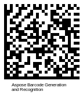

{}[Read](https://products.aspose.app/barcode/recognize/datamatrix) and [Generate](https://products.aspose.app/barcode/generate/datamatrix) Data Matrix barcodes online. You can test ***Aspose.BarCode*** functionality and view results.{}

## **Overview**
Data Matrix is a highly efficient two-dimensional (2D) barcode type that encodes information in graphical labels consisting of square black modules with a unique pattern on the border that facilitates detecting cell locations and decoding. It is a widely used industrial specification that allows encoding byte streams and character sets in square or rectangular images. Specifications for Data Matrix are provided in standards ISO/IEC 16022:2000 and [ISO/IEC 24720:2006]. It provides two groups of standards that are outlined below.  
This information card describes main properties of Data Matrix, its encoding set, structure, size dimensions, capacity, and the error correction mechanism. Code samples for generation and reading through the ***Aspose.BarCode*** library can be found [further](#asposesamples).
  
<p align="center"></p>
  
<details>  
<summary>Read more</summary>
  
|Data Matrix Standard|Overview|
|---|---|
|ECC 000-140|Legacy set of standards that allow generating square barcode labels only, rely on outdated encoding algorithms and enable convolutional error correction. These standards are currently used only for industrial tasks related to legacy requirements|
|ECC 200|Present standard that supports square and rectangular shapes, uses actual encoding approaches and enables Reed-Solomon error correction|
  
</details>

{}You can find additional information of classes and properties that are used in ***Aspose.BarCode*** for Data Matrix generation and recognition:
- [**Data Matrix Barcodes**](https://docs.aspose.com/barcode/net/datamatrix-barcode/)

{} 


## **Usage Scenarios**
This barcode type is widely applied to different fields, including healthcare, business, defense, finance, logistics, and many others. Given that Data Matrix barcodes have the smallest achievable size, they can be very useful when it is necessary to track small items. They are also used to mark printed documents, e.g. letters.

## **Characteristics**
### **Encoding Character Set**
Data Matrix can be used to encode textual information, numerical digits, and bytes of data, including ASCII and Extended Binary Coded Decimal Interchange Code (EBCDIC) symbols.  
Six encoding modes are supported: ASCII, C40, Text, EDIFACT, Base 256, and X12. The ASCII encoding is the most widely used mode.
  
<details>  
<summary>Read more</summary>

Data Matrix supports the following encoding sets: 
- ASCII: double numerical digits, ASCII symbols from 0 to 127, and Extended ASCII symbols from 128 to 255
- C40: upper-case English letters, numerical digits, and special symbols
- Text: lower-case English letters, numerical digits, and special symbols
- X12: ANSI X12 EDI set
- EDIFACT: ASCII symbols from 32 to 94
- Base 256: byte characters from 0 to 255

</details>

### **Barcode Structure**
Data Matrix labels consist of black and white cells grouped in square (or rectangular) patterns. The main structural elements are: finder pattern, alignment patterns, and quiet zones on four sides. The finder pattern (clock pattern) is represented as a sequence of black and white modules on the right and top borders and a solid line on the left and bottom borders. Scanners use these patterns to identify the area in which input information is encoded. This allows for barcode reading from any angle.

<details>  
<summary>Read more</summary>

Data Matrix barcodes include the following elements:
- Data region composed of square data modules
- Quiet zone that surrounds the barcode label on four sides. The minimum size of a quiet zone should equal to 10X where X is the [X-Dimension](/barcode/info-cards/x-dimension).
- Finder pattern that is placed between the data region and the quiet zone

</details>

### **Size Dimensions**
Data Matrix allows encoding fifty characters in a barcode with a size of 2 or 3 squared mm that remains scannable. The actual size of a label may vary according to the amount of information to be encoded. In the ECC 000-140 configuration, the size can range from 9x9 to 49x49 modules, having an odd number of rows and columns. If ECC 200 is applied, configurations from 10x10 to 144x144 modules are supported; they can contain only an even number of rows and columns. If the rectangular shape is required, ECC 200 allows setting the number of columns greater than the number of rows. The Data Matrix Rectangular Extension (DMRE) supports rectangular formats, e.g. 8x48 or 8x64.

<details>  
<summary>Read more</summary>

ECC 200 supports the following configurations:
- 24 square options ranging from 10x10 to 144x144 modules (excluding quiet zones);
- 6 rectangular variants, i.e., 8x18, 8x32, 12x26, 12x36, 16x36, and 16x48 modules (excluding quiet zones).
  
The actual size of a barcode can be estimated through multiplying the printable size of a module by the number of modules.  
For Data Matrix, the size of one module is 0.25 mm, thus:
- Configuration 10x10 modules has the size of 2.5x2.5 mm;
- Configuration 32x32 modules has the size of 8.0x8.0 mm;
- Configuration 8x18 modules has the size of 2.0x4.5 mm;
- and so on.

</details>

### **Encoding Capacity and Data Density**
In the maximum configuration, Data Matrix barcodes contain 144 rows and columns and can encode at most 3,116 numerical digits or 2,335 alphanumeric symbols or 1,555 bytes. Each module decodes a bit of information. The exact encoding capacity may vary depending on the size and structure of an input message due to the specifics of compression algorithms. The maximum capacity also depends on the printing area and printer resolution.
 
The amount of information stored in each barcode should be limited to 800 characters or less. In practice, the capacity of 2,335 alphanumeric symbols is unlikely to be achievable. In the majority of applications, the actual capacity is less due to switching between various types of symbols (numbers, upper case, lower case, and punctuation marks).
 
### **Error Correction**
Data Matrix allows storing additional information that serves for error correction to ensure barcode integrity and perform recovery. This approach allows restoring information from distorted or corrupted barcode labels at least in part. The ECC 200 standard supports Reed-Solomon error correction; ECC 000-140 specifications rely on a less advanced convolutional mechanism. Most modern applications are compatible with ECC 200 described in ISO/IEC 16022. Reed-Solomon error correction is capable of restoring two types of invalid codewords: unreadable or incorrectly scanned symbols and a falsely interpreted digit. 


## **Advantages and Limitations**
Data Matrix enables encoding large amounts of information in compact barcode labels that are roughly 30 times smaller compared with Code 39 for the same input message. It is suitable to send documents with barcodes through fax as it allows avoiding problems with resolution and scanning.  

<details>  
<summary>Read more</summary>
  
In the study directed by The Center of Automatic Identification at Ohio University, it has been stated that the statistical probability of incorrect recognition of a Data Matrix barcode is 1 across 10.5 million cases. This allows considering this barcode type as highly reliable compared with the Code 39 type that showed the probability of false reading being 1 in 1.7 million cases.

</details>

## **How to Generate and Read Data Matrix Barcodes**

<a name="asposesamples"></a>

### **Generation Code Samples**





```csharp

//generate Data Matrix Barcode
using (BarcodeGenerator gen = new BarcodeGenerator(EncodeTypes.DataMatrix, "Åspóse.Barcóde©"))
{
    gen.Parameters.Barcode.XDimension.Pixels = 4;
    //set DataMatrix Ecc to 200
    gen.Parameters.Barcode.DataMatrix.DataMatrixEcc = DataMatrixEccType.Ecc200;
    //set rows 22 columns 22
    gen.Parameters.Barcode.DataMatrix.Columns = 22;
    gen.Parameters.Barcode.DataMatrix.Rows = 22;
    gen.Save($"{path}DataMatrix.png", BarCodeImageFormat.Png);
}

```





```java

public void generateAndReadDataMatrix()
    {
        String filePath = Global.getTestDataFolder("cards") + "DataMatrix.png";//"path/to/image.png";
        //generate
        BarcodeGenerator bg = new BarcodeGenerator(EncodeTypes.DATA_MATRIX, "Åspóse.Barcóde©");
        {
            bg.getParameters().getBarcode().getXDimension().setPixels(4);
            bg.getParameters().getBarcode().getDataMatrix().setDataMatrixEcc(DataMatrixEccType.ECC_200);
            bg.getParameters().getBarcode().getDataMatrix().setColumns(22);
            bg.getParameters().getBarcode().getDataMatrix().setRows(22);
            try
            {
                bg.save(filePath, BarCodeImageFormat.PNG);
            }
            catch (IOException e)
            {
                e.printStackTrace();
            }
        }
    }

```





```cpp

    //generate Data Matrix Barcode        
    System::SharedPtr<BarcodeGenerator> gen = System::MakeObject<BarcodeGenerator>(EncodeTypes::DataMatrix, u"Åspóse.Barcóde©");
    gen->get_Parameters()->get_Barcode()->get_XDimension()->set_Pixels(4.0f);
    //set DataMatrix Ecc to 200
    gen->get_Parameters()->get_Barcode()->get_DataMatrix()->set_DataMatrixEcc(Aspose::BarCode::Generation::DataMatrixEccType::Ecc200);
    //set rows 22 columns 22
    gen->get_Parameters()->get_Barcode()->get_DataMatrix()->set_Columns(22);
    gen->get_Parameters()->get_Barcode()->get_DataMatrix()->set_Rows(22);
    gen->Save(path + u"DataMatrix.png", Aspose::BarCode::Generation::BarCodeImageFormat::Png);

```
    




### **Recognition Code Samples**







//recognize Data Matrix Barcode
using (BarCodeReader read = new BarCodeReader($"{path}DataMatrix.png", DecodeType.DataMatrix))
    foreach (BarCodeResult result in read.ReadBarCodes())
    {
        Console.WriteLine($"CodeType:{result.CodeTypeName}");
        Console.WriteLine($"CodeText:{result.CodeText}");
    }









public void generateAndReadDataMatrix()
    {
        String filePath = Global.getTestDataFolder("cards") + "DataMatrix.png";//"path/to/image.png";
        //recognize
        BarCodeReader br = new BarCodeReader(filePath, DecodeType.DATA_MATRIX);
        BarCodeResult[] barCodeResults = br.readBarCodes();
        for (BarCodeResult result : barCodeResults)
        {
            System.out.println("CodeType: " + result.getCodeTypeName());
            System.out.println("CodeText: " + result.getCodeText());
        }
    }

  







    //recognize Data Matrix Barcode
    System::SharedPtr<BarCodeReader> read = System::MakeObject<BarCodeReader>(path + u"DataMatrix.png", DecodeType::DataMatrix);
    for (System::SharedPtr<BarCodeResult> result : read->ReadBarCodes())
    {
        System::Console::WriteLine(System::String(u"CodeType:") + result->get_CodeTypeName());
        System::Console::WriteLine(System::String(u"CodeText:") + result->get_CodeText());
    }





