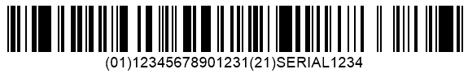

{}[Read](https://products.aspose.app/barcode/recognize/databar) and [Generate](https://products.aspose.app/barcode/generate/databar) DataBar barcodes online. You can check ***Aspose.BarCode*** functionality and view results.{}

## **Overview**
**[DataBar](/barcode/info-cards/databar-family) Expanded** is intended for use in applications that require storing supplementary information. Besides Global Trade Item Numbers (GTINs) or Global Coupon Numbers (GCNs), DataBar Expanded can encode additional application identifiers and information (attributes), e.g. expiration date, product weight, lot number, etc. This barcode type supports the Serial Shipping Container Code (SSCC-18) structure that uses "00" as an application identifier.  
  
**[DataBar](/barcode/info-cards/databar-family) Expanded Stacked** is a specification based on DataBar Expanded that allows generating barcodes divided into many rows with a separator pattern between them.
    
|Examples|DataBar Expanded|DataBar Expanded Stacked|
| :-: | :-: | :-: | 
| |||
  
## **Usage Scenarios**
These barcode types are applicable to retail point-of-sale operations as they support omnidirectional scanning. They are intended for use in cases when it is necessary to encode auxiliary information about products besides GTIN identifiers, such as the date of expiration, weight, batch number, sell-by date, etc. These barcodes are often utilized to facilitate the distribution and realization of supermarket coupons. 

## **Characteristics**
### **Encoding Character Set**
The following character sets are supported: 
- All numeric digits (0-9)
- All uppercase and lowercase letters (A-Z and a-z)
- Special function symbol (FNC1)
- Special symbols: !, ", %, &, ', opening and closing parenthesis, *, +, ,, -, ., /, :, ;, (<), (=), (>), (?), (_), and space.

### **Barcode Structure**
**DataBar Expanded**  
  
Barcodes consist of the following elements:
- Left guard pattern (narrow space, narrow bar)
- Check digit
- 1 to 11 triplet sequences composed of a finder pattern and two data characters (if the number of characters is odd, the last triplet sequence is reduced to two elements)
- Right guard pattern (narrow bar, narrow space)

The first digit is used as a flag to indicate whether this barcode will be a part of a composite barcode. The input message is divided into groups that comprise two data characters (17 modules each) and one finder pattern. Finder patterns have a width of 15 modules wide and include five bars and spaces in total.
  
**DataBar Expanded Stacked**  
  
The structure includes the following elements:

- Top row composed of the left guard pattern (narrow space, narrow bar), a check digit, an even number of data characters (with a finder pattern between each pair), and the right guard pattern (narrow bar, narrow space)
- Separator pattern
- Auxiliary rows and separator patterns
- Bottom row comprising the left guard pattern, at least two data characters with finder patterns, and the right guard pattern

Quiet zones are not needed.

### **Size Dimensions**
DataBar Expanded is a variable-length barcode type that allows varying the width of a barcode from 53 to 543 modules.  
  
DataBar Expanded Stacked barcodes can include from 2 to 11 rows. The height of each row is 34 modules, and the height of the separator pattern equals 3 modules. This configuration enables omnidirectional readability for such barcodes.

### **Encoding Capacity and Data Density**
At most 74 numerical digits or 41 alphanumeric characters can be encoded.

### **Checksum Controls**
Barcodes include check digits computed based on the modulo 211 algorithm.

## **Advantages and Limitations**
These barcode types enable omnidirectional reading and are suitable for use in retail point-of-sale applications. Unlike other DataBar types that can use only selected GTIN formats, Expanded DataBar specifications are compatible with any of them. The enhanced capacity results in creating larger barcodes thus being inferior in terms of compactness compared with DataBar Omnidirectional.

## **How to Generate and Read DataBar Expanded / Expanded Stacked**
### **DataBar Expanded Generation**






//generate DataBar Expanded Barcode
using (BarcodeGenerator gen = new BarcodeGenerator(EncodeTypes.DatabarExpanded, "(01)12345678901231(21)SERIAL1234"))
{
    gen.Parameters.Barcode.XDimension.Pixels = 2;
    gen.Parameters.Barcode.DataBar.IsAllowOnlyGS1Encoding = true;
    gen.Save($"{path}DataBarExpanded.png", BarCodeImageFormat.Png);
}






 





    
    //generate DataBar Expanded Barcode
    System::SharedPtr<BarcodeGenerator> gen = System::MakeObject<BarcodeGenerator>(EncodeTypes::DatabarExpanded, u"(01)12345678901231(21)SERIAL1234");
    gen->get_Parameters()->get_Barcode()->get_XDimension()->set_Pixels(2.0f);
    gen->get_Parameters()->get_Barcode()->get_DataBar()->set_IsAllowOnlyGS1Encoding(true);
    gen->Save(path + u"DataBarExpanded.png", Aspose::BarCode::Generation::BarCodeImageFormat::Png);
    





### **DataBar Expanded Recognition**






//recognize DataBar Expanded Barcode
using (BarCodeReader read = new BarCodeReader($"{path}DataBarExpanded.png", DecodeType.DatabarExpanded, DecodeType.DatabarExpandedStacked))
    foreach (BarCodeResult result in read.ReadBarCodes())
    {
        Console.WriteLine($"CodeType:{result.CodeTypeName}");
        Console.WriteLine($"CodeText:{result.CodeText}");
    }






 





    
    //recognize DataBar Expanded Barcode
    System::SharedPtr<BarCodeReader> read = System::MakeObject<BarCodeReader>(path + u"DataBarExpanded.png", System::MakeArray<System::SharedPtr<BaseDecodeType>>({DecodeType::DatabarExpanded, DecodeType::DatabarExpandedStacked}));
    for (System::SharedPtr<BarCodeResult> result : read->ReadBarCodes())
    {
        System::Console::WriteLine(System::String(u"CodeType:") + result->get_CodeTypeName());
        System::Console::WriteLine(System::String(u"CodeText:") + result->get_CodeText());
    }
    





### **DataBar Expanded Stacked Generation**






//generate DataBar Expanded Stacked Barcode
using (BarcodeGenerator gen = new BarcodeGenerator(EncodeTypes.DatabarExpandedStacked, "(01)12345678901231(21)SERIAL1234"))
{
    gen.Parameters.Barcode.XDimension.Pixels = 2;
    gen.Parameters.Barcode.DataBar.IsAllowOnlyGS1Encoding = true;
    //set 3 rows
    gen.Parameters.Barcode.DataBar.Rows = 3;
    gen.Save($"{path}DataBarExpandedStacked.png", BarCodeImageFormat.Png);
}






 





    
    //generate DataBar Expanded Stacked Barcode
    System::SharedPtr<BarcodeGenerator> gen = System::MakeObject<BarcodeGenerator>(EncodeTypes::DatabarExpandedStacked, u"(01)12345678901231(21)SERIAL1234");
    gen->get_Parameters()->get_Barcode()->get_XDimension()->set_Pixels(2.0f);
    gen->get_Parameters()->get_Barcode()->get_DataBar()->set_IsAllowOnlyGS1Encoding(true);
    //set 3 rows
    gen->get_Parameters()->get_Barcode()->get_DataBar()->set_Rows(3);
    gen->Save(path + u"DataBarExpandedStacked.png", Aspose::BarCode::Generation::BarCodeImageFormat::Png);
    





### **DataBar Expanded Stacked Recognition**






//recognize DataBar Expanded Stacked Barcode
using (BarCodeReader read = new BarCodeReader($"{path}DataBarExpandedStacked.png", DecodeType.DatabarExpanded, DecodeType.DatabarExpandedStacked))
    foreach (BarCodeResult result in read.ReadBarCodes())
    {
        Console.WriteLine($"CodeType:{result.CodeTypeName}");
        Console.WriteLine($"CodeText:{result.CodeText}");
    }






 





    
    //recognize DataBar Expanded Stacked Barcode
    System::SharedPtr<BarCodeReader> read = System::MakeObject<BarCodeReader>(path + u"DataBarExpandedStacked.png", System::MakeArray<System::SharedPtr<BaseDecodeType>>({DecodeType::DatabarExpanded, DecodeType::DatabarExpandedStacked}));
    for (System::SharedPtr<BarCodeResult> result : read->ReadBarCodes())
    {
        System::Console::WriteLine(System::String(u"CodeType:") + result->get_CodeTypeName());
        System::Console::WriteLine(System::String(u"CodeText:") + result->get_CodeText());
    }
    




