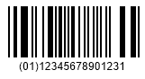

{}[Read](https://products.aspose.app/barcode/recognize/databar) and [Generate](https://products.aspose.app/barcode/generate/databar) DataBar barcodes online. You can test the quality of ***Aspose.BarCode*** functionality and view the results online.{}

## **Overview**
DataBar Limited is a fixed-length symbology that supports the encodation of Global Trade Item Numbers (GTINs) that begin with "0" or "1". It is used for applications where space is extremely limited and omnidirectional scanning is not required. Due to its compact size, this symbology is mainly used in the health care industry.

## **Features**
  
### **Encoding Character Set**
This symbology supports all numeric digits (0-9). 

### **Barcode Structure**
The symbol comprises the following elements:
- Left guard pattern (narrow space, narrow bar)
- Left data character
- Check digit
- Right data character
- Right guard pattern (narrow space, narrow bar, wide space)

A quiet zone is not required.

The first digit is a flag that indicates whether the barcode is part of a composite barcode, and the 13 digits that follow comprise the data characters. The height is at least 10 modules. There are two data characters, which are 26 modules wide with seven bars and seven spaces. Between them is a check character of 18 modules that also contains seven bars and seven spaces.

### **Size Dimentions**
DataBar Limited barcodes are composed of 46 bars and spaces, in a total, 74 modules.

### **Encoding Capacity and Data Density**

### **chesum Controls**
DataBar Limited contains a check digit that uses the modulo 89 algorithm.

## **Advantanges and Weaknesses**
This DataBar subtype is not intended for retail point-of-sale scanning.

## **Aspose Samples for DataBar Limited Barcodes**

### **DataBar Limited Generation Code Samples**





//GENERATE

//generate DataBar Limited Barcode
using (BarcodeGenerator gen = new BarcodeGenerator(EncodeTypes.DatabarLimited, "(01)12345678901231"))
{
    gen.Parameters.Barcode.XDimension.Pixels = 2;
    gen.Save($"{path}DataBarLimited.png", BarCodeImageFormat.Png);
}






<!-->Insert Code<-->





<!-->Insert Code<-->





### **DataBar Limited Recognition Code Samples**





//RECOGNIZE

//recognize DataBar Limited Barcode
using (BarCodeReader read = new BarCodeReader($"{path}DataBarLimited.png", DecodeType.DatabarLimited))
    foreach (BarCodeResult result in read.ReadBarCodes())
    {
        Console.WriteLine($"CodeType:{result.CodeTypeName}");
        Console.WriteLine($"CodeText:{result.CodeText}");
    }






<!-->Insert Code<-->





<!-->Insert Code<-->




