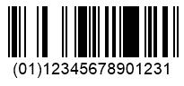
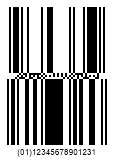

{}[Read](https://products.aspose.app/barcode/recognize/databar) and [Generate](https://products.aspose.app/barcode/generate/databar) DataBar barcodes online. You can test the quality of ***Aspose.BarCode*** functionality and view results online.{}

## **Overview**
DataBar Omnidirectional and DataBar Stacked Omnidirectional barcode types allow encoding 14-digit numerical data streams. They support encoding Global Coupon Number (GCN) and selected Global Trade Item Number (GTIN) formats, i.e., GTIN-8, GTIN-12, GTIN-13, and GTIN-14.  
  
If GCN or GTIN contains less than 14 digits, zeros are appended to the left side of the input message so that 14 characters are encoded in total.
   
|Examples|DataBar Omnidirectional|DataBar Omnidirectional Stacked|
| :-: | :-: | :-: | 
| |||
  
## **Features**
### **Encoding Character Set**
These barcode types allow encoding all numerical digits (0-9).  

### **Structure**
**DataBar Omnidirectional**  
  
Barcodes consist of the following elements:
- Left guard pattern (narrow space, narrow bar)
- Left pair of data characters with a finder pattern including a check digit between them
- Right guard pattern (narrow space, narrow bar)
- Right pair of data characters with a finder pattern in between including a check digit

The first digit serves as a flag that determines whether this barcode is a part of a composite barcode. The following 13 digits are intended to store information.     
The input message is divided into four segments placed between two finder patterns. Data characters in the left pair of characters have a width of 16 modules per character (4 bars and 4 spaces in total). Data characters in the right pair are composed of 15 modules each (4 bars and 4 spaces overall); finder patterns have the same width with the difference that the first one includes 3 spaces and 2 bars, and the second one comprises 2 spaces and 3 bars. Quiet zones are not needed.
    
**DataBar Stacked Omnidirectional**  
  
Barcodes have the following structure:
- Top row composed of the left half of a DataBar Omnidirectional barcode (left finder pattern, the first character, a finder pattern, the second character) combined with a finder pattern of a bar and a space
- Separator pattern
- Bottom row comprising a finder pattern and the right half of the code (the fourth character, a finder pattern, the third character, the right guard pattern)

Quiet zones are not necessary.  

### **Size Dimensions**
Each DataBar Omnidirectional barcode is composed of 46 bars and spaces including 96 modules in total. To enable omnidirectional readability, DataBar Stacked Omnidirectional must have the height of each row of at least 33 modules, and the height of the separator pattern must be at least 3 modules.

### **Encoding Capacity and Data Density**
These barcode types can be used to encode 14-digit numerical data streams.

### **Checksum Controls**
Check digits that are computed based on the modulo 79 algorithm are included in finder patterns.

## **Advantages and Weaknesses**
DataBar Omnidirectional and DataBar Omnidirectional Stacked have been introduced to manage retail point-of-sale operational tasks. Such barcodes can be scanned omnidirectionally.

## **Aspose Samples for DataBar Omnidirectional and Omnidirectional Stacked Barcodes**
### **DataBar Omnidirectional Generation Code Samples**






//generate DataBar OmniDirectional Barcode
using (BarcodeGenerator gen = new BarcodeGenerator(EncodeTypes.DatabarOmniDirectional, "(01)12345678901231"))
{
    gen.Parameters.Barcode.XDimension.Pixels = 2;
    gen.Save($"{path}DataBarOmniDirectional.png", BarCodeImageFormat.Png);
}






<!-->Insert Code<-->





<!-->Insert Code<-->





### **DataBar Omnidirectional Recognition Code Samples**






//recognize DataBar OmniDirectional Barcode
using (BarCodeReader read = new BarCodeReader($"{path}DataBarOmniDirectional.png", DecodeType.DatabarOmniDirectional, DecodeType.DatabarStackedOmniDirectional))
    foreach (BarCodeResult result in read.ReadBarCodes())
    {
        Console.WriteLine($"CodeType:{result.CodeTypeName}");
        Console.WriteLine($"CodeText:{result.CodeText}");
    }






<!-->Insert Code<-->





<!-->Insert Code<-->





### **DataBar Omnidirectional Stacked Generation Code Samples**






//generate DataBar OmniDirectional Stacked Barcode
using (BarcodeGenerator gen = new BarcodeGenerator(EncodeTypes.DatabarStackedOmniDirectional, "(01)12345678901231"))
{
    gen.Parameters.Barcode.XDimension.Pixels = 2;
    gen.Save($"{path}DataBarOmniDirectionalStacked.png", BarCodeImageFormat.Png);
}






<!-->Insert Code<-->





<!-->Insert Code<-->





### **DataBar Omnidirectional Stacked Recognition Code Samples**






//recognize DataBar OmniDirectional Stacked Barcode
using (BarCodeReader read = new BarCodeReader($"{path}DataBarOmniDirectionalStacked.png", DecodeType.DatabarOmniDirectional, DecodeType.DatabarStackedOmniDirectional))
    foreach (BarCodeResult result in read.ReadBarCodes())
    {
        Console.WriteLine($"CodeType:{result.CodeTypeName}");
        Console.WriteLine($"CodeText:{result.CodeText}");
    }






<!-->Insert Code<-->





<!-->Insert Code<-->





