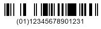
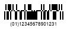

{}[Read](https://products.aspose.app/barcode/recognize/databar) and [Generate](https://products.aspose.app/barcode/generate/databar) DataBar barcodes online. You can test the quality of ***Aspose.BarCode*** functionality and view results.{}

## **Overview**
**DataBar Truncated** is based on the [GS1 DataBar specification](/barcode/info-cards/databar-family) and allows producing barcodes similar to [DataBar Omnidirectional](/barcode/info-cards/databar-omnidirectional) but decreased in height to 13 modules. It supports encoding the following Global Coupon Number (GCN) and selected Global Trade Item Number (GTIN) formats: GTIN-8, GTIN-12, GTIN-13, and GTIN-14.  
  
**DataBar Stacked** is a [GS1 DataBar type](/barcode/info-cards/databar-family) that uses DataBar Omnidirectional barcodes reduced in height and divided into two rows with a separator pattern between them. It has a specification similar to [DataBar Stacked Omnidirectional](/barcode/info-cards/databar-omnidirectional) with the difference that the overall height is reduced from 33 to 13 modules. 
  
|Examples|DataBar Truncated|DataBar Stacked|
| :-: | :-: | :-: | 
| |||

## **Usage Scenarios**
These barcode types are suitable for applications with strict limitations on space to place barcodes; e.g. they widely used in the healthcare field. However, they are not applicable to retail point-of-sale usage as they do not support omnidirectional scanning.

## **Characteristics**
### **Encoding Character Set**
Only numerical digits (0-9) are supported for encoding.

### **Barcode Structure**
**DataBar Truncated**  
  
Barcodes are composed of the following elements:
- Left guard pattern (narrow space, narrow bar)
- Left pair of data characters with a finder pattern in between including a check digit
- Right pair of data characters with a finder pattern in between including a check digit
- Right guard pattern (narrow space, narrow bar)

The first digit is used as a flag to denote whether this barcode will be processed as a part of a composite barcode, and the remaining 13 digits constitute data characters. Barcode contents are grouped in four segments that are placed between two finder patterns. The composition of bars and spaces is the same as in [DataBar Omnidirectional](/barcode/info-cards/databar-omnidirectional/) barcodes.
  
**DataBar Stacked**  
  
The barcode structure comprises the following elements:
- Top row composed of the left half of a DataBar Omnidirectional barcode (left guard pattern, first symbol character, finder pattern, second symbol character) followed by a guard pattern of a one-module bar and a one-module space
- Separator pattern
- Bottom row that includes a guard pattern followed by the right half of the code (fourth symbol character, finder pattern, third symbol character, right guard pattern)

The overall configuration is the same as in the stacked version of [DataBar Omnidirectional](/barcode/info-cards/databar-omnidirectional/) barcodes.  
Quiet zones are not necessary.

### **Size Dimensions**
DataBar Truncated barcodes contain 46 bars and spaces with 96 modules in total. In DataBar Stacked, to ensure that the overall height is limited to 13 modules, the top row has the height of five modules, and the height of the bottom row is 7 modules. The height of the separator pattern equals one module.

### **Encoding Capacity and Data Density**
Encoding of 14-digit numerical data streams is enabled.

### **Checksum Controls**
These barcode types include check digits in the finder patterns that are based on the modulo 79 (mod 79) algorithm.

## **Advantages and Limitations**
These DataBar specifications benefit from generating small and high-density barcode labels. Owing to their compact size, such barcodes are widely used in healthcare applications. The truncated form allows printing barcodes in two rows and thus is useful to produce narrower labels.  
DataBar Stacked includes the separator pattern between rows that serves to avoid cross-row reading inconsistencies. 
Due to the specifics of their configuration, DataBar Truncated and DataBar Stacked cannot be scanned omnidirectionally and must be detected using hand-held scanning devices. Thus, they are not intended for use in retail point-of-sale.

## **How to Generate and Read DataBar Truncated / Stacked Barcodes**
### **DataBar Truncated Generation**






//generate DataBar Truncated Barcode
using (BarcodeGenerator gen = new BarcodeGenerator(EncodeTypes.DatabarTruncated, "(01)12345678901231"))
{
    gen.Parameters.Barcode.XDimension.Pixels = 2;
    //minimum of 13X high
    gen.Parameters.Barcode.BarHeight.Pixels = 26;
    gen.Save($"{path}DataBarTruncated.png", BarCodeImageFormat.Png);
}






<!-->Insert Code<-->





<!-->Insert Code<-->





### **DataBar Truncated Recognition**






//recognize DataBar Truncated Barcode
using (BarCodeReader read = new BarCodeReader($"{path}DataBarTruncated.png", DecodeType.DatabarTruncated, DecodeType.DatabarStacked))
    foreach (BarCodeResult result in read.ReadBarCodes())
    {
        Console.WriteLine($"CodeType:{result.CodeTypeName}");
        Console.WriteLine($"CodeText:{result.CodeText}");
    }






<!-->Insert Code<-->





<!-->Insert Code<-->





### **DataBar Stacked Generation**






//generate DataBar Stacked Barcode
using (BarcodeGenerator gen = new BarcodeGenerator(EncodeTypes.DatabarStacked, "(01)12345678901231"))
{
    gen.Parameters.Barcode.XDimension.Pixels = 2;
    gen.Save($"{path}DataBarStacked.png", BarCodeImageFormat.Png);
}






<!-->Insert Code<-->





<!-->Insert Code<-->





### **DataBar Stacked Recognition**






//recognize DataBar Stacked Barcode
using (BarCodeReader read = new BarCodeReader($"{path}DataBarStacked.png", DecodeType.DatabarTruncated, DecodeType.DatabarStacked))
    foreach (BarCodeResult result in read.ReadBarCodes())
    {
        Console.WriteLine($"CodeType:{result.CodeTypeName}");
        Console.WriteLine($"CodeText:{result.CodeText}");
    }






<!-->Insert Code<-->





<!-->Insert Code<-->




