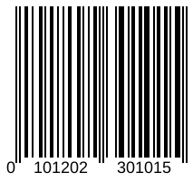

{}[Read](https://products.aspose.app/barcode/recognize/code39) and [Generate](https://products.aspose.app/barcode/generate/code39) EAN barcodes online. You can test the quality of ***Aspose.BarCode*** functionality and view results.{}

## **Overview**
EAN-13 is the most commonly recognized barcode in Europe, used in supermarkets and other retail establishments for basic product identification. It is the European equivalent of the UPC-A barcode in the United States.

<p align="center"></p>

{}You can find additional information of classes and properties that are used in ***Aspose.BarCode*** for linear barcode generation and recognition:
- [**Specific Parameters for 1D barcodes**](https://docs.aspose.com/barcode/net/managing-different-barcode-settings/)

{} 

## **Usage Scenarios**
The EAN-13 barcode type is used to denote consumer products that pass through a checkout point, or point-of-sale. The UPC barcode is used only in the US and Canada, while the EAN is used everywhere else. This owes to a previous assumption that products made in the USA and Canada would only be sold within these borders. However, with the rise of globalisation, the UPC and EAN have become somewhat interchangeable.
  
## **Characteristics**
### **Encoding Character Set**
Thi type encodes numerical digits from 0 to 9 only.
 
### **Barcode Structure**
EAN-13 barcodes store a total of 13 digits, as opposed to UPC-A codes, which store 12.

The value to encode by EAN-13 has the following structure:
- 2 or 3 digits for Number System or Country Code
- 5 or 4 digits for Manufacturer (Company) Code or prefix
- 5 digits for Product Code
- 1 check symbol

### **Size Dimensions**
A basic EAN-13 barcode includes the right and left quiet zone is 37.29mm wide by 25.93mm high. According to GS1 Australia and retailer standards, such barcodes should be printed out in the range of 80-200% depending on the application. In retail POS, it should be 80% - 200% (X-dimension 0.26mm - 0.66mm). The allowance for X-dimensions between 0.249 mm and 0.26 mm is only applicable to on-demand (e.g., thermal, laser) print processes.

General distribution can range from 150% - 200% (X-dimension 0.50mm – 0.66mm) for automated scanning. The height and quiet zones depend on the X-dimension.

### **Encoding Capacity and Data Density**

With four available printing widths for the bars and spaces instead of just two, EAN takes about half the number of bars and spaces relative to Interleaved 2 of 5 to represent each character. However, the use of the wider bars and spaces nullifies this space savings. Interleaved 2 of 5 codes pack data more densely than EAN does.

### **Checksum Controls**
A check digit is calcuulated using on the modulo 10 algorithm.  
Starting from the right the numbers are multiplied alternating with "3" and "1" and added up. The sum is integer divided by ten, the reminder (or modulo) is subtracted from ten which then yields the check digit.

## **Advantages and Limitations**
EAN-13 is popular, widely applied and useful for general day to day retail transactions, since it can be read by any barcode reader. The check number also helps ensure accuracy when entering in the code by hand. It combines numbers together mathematically in a certain way to get a specific, one-digit outcome. If the check digit does not match that outcome, then the code has been entered incorrectly.
The character limit on the EAN-13 barcode limits its potential uses. While it is applicable to general supermarket use, it cannot identify more complex items.
This type has the following specifics:
- Does not support attributes, e.g. use-by date and/or barcode identifiers
- Used for items you want to sell at retail POS
- Scanned by omni-directional scanners
- Can be read right-side-up or upside-down, making the EAN-13 an efficient barcode for high-volume scanning in supermarkets
- Can be used for both retail units (bottle of wine) and trade units (case of wine) sold in store
- Recognised globally, thanks to GS1 standards

## **How to Generate and Read EAN-13 Barcodes**
### **Generation Code Samples**





``` csharp
// Initialize barcode generator
using (var generator = new Aspose.BarCode.Generation.BarcodeGenerator(EncodeTypes.EAN13, "0101202301012024"))
{
  // Set parameters
  generator.Parameters.Barcode.XDimension.Millimeters *= 2;
  generator.Parameters.Barcode.CodeTextParameters.Location = CodeLocation.Below;

  // Generate image
  Bitmap res = generator.GenerateBarCodeImage();
}
```





``` java
// Create an instance of the BarcodeGenerator class
BarcodeGenerator generator = new BarcodeGenerator(EncodeTypes.EAN13);

// Specify barcode text
generator.setCodeText("0101202301012024");

// Specify the X-dimension 
// the smallest width of the unit of BarCode bars or spaces
generator.getParameters().getBarcode().getXDimension().setMillimeters(2);

// Set text position
generator.getParameters().getBarcode().getCodeTextParameters().setLocation(CodeLocation.Below);

// Generate a barcode image
generator.generateBarCodeImage();
```





``` csharp
// Initialize a BarcodeGenerator class object and set barcode text & symbology type
System::SharedPtr<BarcodeGenerator> generator = [&]
{
    auto tmp_0 = System::MakeObject<BarcodeGenerator>(EncodeTypes::EAN13, u"0101202301012024");
    // Set parameters
    tmp_0->get_Parameters()->get_Barcode()->get_XDimension()->set_Millimeters(2);
    tmp_0->get_Parameters()->get_Barcode()->get_CodeTextParameters()->set_Location(Aspose::BarCode::CodeLocation::Below);
    return tmp_0;
}();

// Generate a barcode image
System::SharedPtr<System::Drawing::Bitmap> lBmp = generator->GenerateBarCodeImage();
```





### **Recognition Code Samples**





``` csharp
// Initialize barcode reader
using (var reader = new Aspose.BarCode.BarCodeReader(<file name>, DecodeType.EAN))
{
    // Recognize barcodes in the image
    foreach (var barcode in reader.ReadBarCodes())
    {
        // Display the recognition result
        Console.WriteLine($"{barcode.CodeTypeName}: {barcode.CodeText}");
    }
}
```





```java
// initialize an instance of BarcodeReader passing the source image and expected type
BarCodeReader reader = new BarCodeReader(var reader = new Aspose.BarCode.BarCodeReader(<file name>, DecodeType.EAN);

// read the source barcode
while (reader.read()) {
    // print the barcode type and text
    System.out.println("Type: " + reader.getCodeType() + " Text: " + reader.getCodeText());
}
```




``` cpp
try
{
    // Create an instance of BarcodeGenerator class 
    System::SharedPtr<BarCodeReader> reader = System::MakeObject<BarCodeReader>(<file name>, DecodeType::EAN);
    while (reader->Read())
    {
        // Display barcode text and Symbology Type
        System::Console::WriteLine(System::String(u"CodeText: ") + reader->GetCodeText());
        System::Console::Write(System::String(u"Symbology Type: ") + reader->GetCodeType());
    }
    reader->Close();
}
catch (System::Exception& ex)
{
    System::Console::WriteLine(ex->get_Message());
}
```




