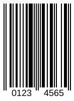

{}[Read](https://products.aspose.app/barcode/recognize/code39) and [Generate](https://products.aspose.app/barcode/generate/code39) EAN barcodes online. You can test the quality of ***Aspose.BarCode*** functionality and view results.{}

## **Overview**
The EAN-8 barcode is a omnidirectional, numeric 1D barcode with 8 digits, and is the condensed version of the EAN (European Article Number) barcode. EAN / UPC barcodes employ a 1-digit checksum as an error detection mechanism.  
The EAN-8 standard is described in "ISO/IEC 15420 Information technology - Automatic identification and data capture techniques - EAN/UPC barcode symbology" specification.

<p align="center"></p>

{}You can find additional information of classes and properties that are used in ***Aspose.BarCode*** for linear barcode generation and recognition:
- [**Specific Parameters for 1D barcodes**](https://docs.aspose.com/barcode/net/managing-different-barcode-settings/)

{} 

## **Usage Scenarios**
The EAN barcode is primarily used in supermarkets to identify product at the point of sales. The EAN-8 barcode is used to label small consumer products, that have reduced physical space for barcode placement, such as a lipstick. This type was developed to be used on small packages or items, such as cigarettes, pencils, or chewing gum packets. It was intended to substitute EAN-13 barcodes that would be not fit on such items due to large size.
Today, they are almost exclusively used as in-store barcodes, also known as Restricted Circulation Numbers. Those barcodes always start with a "0" or a "2" and are frequently found on chain store products which are not sold elsewhere under the same brand or name.
  
## **Characteristics**
### **Encoding Character Set**
EAN-8 encodes numerical digits from 0 to 9 only. 

### **Barcode Structure**
EAN-8 barcode's 8 digits are split into two sets of four each.  

The value to encode by EAN-8 has the following structure (a.k.a. GTIN-8):
- 2 or 3 digits for Number System or Country Code
- 5 or 4 digits for Product Code
- 1 digit for checksum

The symbol comprises the following elements:

- Leading quiet zone
- Guard bar pattern (start character)
- Four symbol characters
- Center guard bar pattern (center character)
- Four symbol characters, including check digit
- Guard bar pattern (stop character)
- Trailing quiet zone

### **Size Dimensions**
Most barcode types print bars and spaces in only two widths, but for EAN, four different widths are used. This enables each numeric character to be represented by using just two bars and two spaces, which is the fewest number of modules required per character of any type.
Similarly as for EAN-13, EAN-8 size formats are standardized, with a default module width of 0.33mm and a module height of 22.85mm.

### **Encoding Capacity and Data Density**
Such barcodes contain 8 digits in total, including seven numerical digits and a check symbol. Interleaved 2 of 5 codes pack data more densely than EAN does. The data digits in an EAN-8 symbol identify a particular product and manufacturer. Since a limited number of EAN-8 codes are available in each country, they are issued only for products with insufficient space for a normal EAN-13 symbol. For example, a 2-digit country code permits a total of only 100,000 item numbers.

### **Checksum Controls**
Checksum control is based on the modulo 10 method.  
Starting from the right the numbers are multiplied alternating with "3" and "1" and added up. The sum is integer divided by ten, the reminder is subtracted from ten which yields the check digit.

## **Advantages and Limitations**
With four available printing widths for the bars and spaces instead of just two, EAN takes about half the number of bars and spaces relative to Interleaved 2 of 5 to represent each character. However, the use of the wider bars and spaces nullifies this space savings.
The EAN-8 barcode saves space, providing an accurate identifying code for products such as candy, cigarettes, or other small or individually wrapped items. In addition, the check number helps ensure accuracy when entering in the code by hand. And the flag digits make the code ideal for international use, as opposed to UPC codes, which are limited to the United States.

Limiting the product identification to five data digits means that the product cannot be identified as specifically as the EAN-13, which has one set of digits to identify the manufacturer, and another set to identify the product. Also, while the flag digits can identify the country where the barcode was issued, that may not be the same as where the product itself was manufactured.

## **How to Generate and Read EAN-8 Barcodes**
### **Generation Code Samples**





``` csharp
// Initialize barcode generator
using (var generator = new Aspose.BarCode.Generation.BarcodeGenerator(EncodeTypes.EAN8, "0123456"))
{
  // Set parameters
  generator.Parameters.Barcode.XDimension.Millimeters *= 2;
  generator.Parameters.Barcode.CodeTextParameters.Location = CodeLocation.Below;

  // Generate image
  Bitmap res = generator.GenerateBarCodeImage();
}
```





```java
de to be executed - Java

// Create an instance of the BarcodeGenerator class
BarcodeGenerator generator = new BarcodeGenerator(EncodeTypes.EAN8);

// Specify the barcode text
generator.setCodeText("0123456");

// Specify the X-dimension 
// the smallest width of the unit of BarCode bars or spaces
generator.getParameters().getBarcode().getXDimension().setMillimeters(2);

// Set barcode text position
generator.getParameters().getBarcode().getCodeTextParameters().setLocation(CodeLocation.Below);

// Generate a barcode image
generator.generateBarCodeImage();
```





``` cpp
// Initialize a BarcodeGenerator class object and set barcode text and symbology type
System::SharedPtr<BarcodeGenerator> generator = [&]
{
    auto tmp_0 = System::MakeObject<BarcodeGenerator>(EncodeTypes::EAN8, u"0123456");
    // Set parameters
    tmp_0->get_Parameters()->get_Barcode()->get_XDimension()->set_Millimeters(2);
    tmp_0->get_Parameters()->get_Barcode()->get_CodeTextParameters()->set_Location(Aspose::BarCode::CodeLocation::Below);
    return tmp_0;
}();

// Generate image
System::SharedPtr<System::Drawing::Bitmap> lBmp = generator->GenerateBarCodeImage();
```





### **Recognition Code Samples**





``` csharp
// Initialize barcode reader
using (var reader = new Aspose.BarCode.BarCodeReader(<file name>, DecodeType.EAN))
{
    // Recognize barcodes in the image
    foreach (var barcode in reader.ReadBarCodes())
    {
        // Display the recognition result
        Console.WriteLine($"{barcode.CodeTypeName}: {barcode.CodeText}");
    }
}
```





```java
// initialize an instance of BarcodeReader passing the source image and expected type
BarCodeReader reader = new BarCodeReader(var reader = new Aspose.BarCode.BarCodeReader(<file name>, DecodeType.EAN);

// read the source barcode
while (reader.read()) {
    // print the barcode type and text
    System.out.println("Type: " + reader.getCodeType() + " Text: " + reader.getCodeText());
}
```





``` cpp
try
{
    // Create an instance of BarcodeGenerator class 
    System::SharedPtr<BarCodeReader> reader = System::MakeObject<BarCodeReader>(<file name>, DecodeType::EAN);
    while (reader->Read())
    {
        // Display barcode text and symbology type
        System::Console::WriteLine(System::String(u"CodeText: ") + reader->GetCodeText());
        System::Console::Write(System::String(u"Symbology Type: ") + reader->GetCodeType());
    }
    reader->Close();
}
catch (System::Exception& ex)
{
    System::Console::WriteLine(ex->get_Message());
}
```




