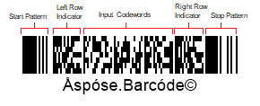

{}[Read](https://products.aspose.app/barcode/recognize/pdf417) and [Generate](https://products.aspose.app/barcode/generate/pdf417) PDF417 barcodes online. You can test the quality of ***Aspose.BarCode*** functionality and view results.{}

PDF417 (Portable Data File 417) is a family of 2D stacked barcode types introduced to store large amounts of information in relatively compact barcode labels. Here, "417" denotes the approach used to encode a single digit: 4 bars and 4 spaces constitute a 17-module pattern. This symbology can be used to encode both streams of bytes and Unicode symbols. PDF417 enables using the extended format of metadata that allows splitting the input message into several barcodes and then storing them in a document to reassemble later. PDF417 supports laser scanning for work with high-quality documentation. The PDF417 specification is summarized in the [ISO/IEC 15438](https://www.iso.org/standard/43816.html) document.

## **Overview**
Basic PDF417 is a high-density variable-length barcode type that supports error correction. It allows encoding textual data, numerical digits, files, and streams of bytes. PDF417 barcodes are composed of multiple linear rows stacked together thus increasing the amount of information that can be encoded compared to 1D types. PDF417 can be read by linear and raster laser scanners or special imaging devices. The shape of PDF417 barcode labels is rectangular. Their size can be customized according to specific business needs. It is important to maintain appropriate printing accuracy and suitable resolution to create high-quality barcode images. 
  
<p align="center"></p>
  
The PDF417 barcode family supports four specifications:

- [Basic PDF417](/barcode/info-cards/pdf417-family/)
- [Compact PDF417](/barcode/info-cards/compact-pdf417/)
- [Macro PDF417](/barcode/info-cards/macro-pdf417/)
- [Micro PDF417](/barcode/info-cards/micro-pdf417/)
    
In this article, the overview of Basic PDF417 is provided. This information card highlights its key parameters and describes its encoding supported character set, barcode structure, size dimensions, data capacity, and error correction capability. Code samples for barcode generation and recognition through the ***Aspose.BarCode*** library can be found [below](#asposesamples).

{}You can find the detailed description of classes and properties that are used in ***Aspose.BarCode for .NET*** for PDF417 generation and recognition:
- [**PDF417 in Aspose.BarCode for .NET**](/barcode/net/pdf417-and-macropdf417-barcode/)

{} 

## **Usage Scenarios**
PDF417 has various applications, including but not limited to: government ID cards (e.g. driver licenses), airline boarding passes, postage stamps, package labels, and many others. 

## **Characteristics**
### **Encoding Character Set**
PDF417 uses the base 929 encoding where each codeword represents a number from 0 to 928. Among 929 available codewords, 900 are used to encode the input message, and 29 correspond to special functions, such as shifting between major encoding modes. PDF417 enables encoding both byte streams and Unicode symbols. Thus it can be applied to encode all 256 ASCII characters and 8-bit binary information.  
PDF417 utilizes various data compaction schemes to improve encoding efficiency. The following modes are supported; it is possible to set different modes within one PDF417 barcode:
- Text compaction mode: encoding all printable ASCII symbols and selected special characters
- Byte compaction mode: encoding all 256 possible 8-bit byte values including all ASCII symbols with values from 0 to 127
- Numeric compaction mode: efficient encoding of numerical digits

<details>  
<summary>Read more</summary>

Three major encoding modes can be used to store different types of data and can be combined as necessary within a single barcode:

- Byte: each group of five codewords get encoded in 6 bytes. Additional bytes are encoded one per codeword
- Numeric: numerical digits are encoded in ⌊n/3⌋+1 codewords, up to a maximum of 44 digits in 15 codewords
- Text: each codeword is encoded in two digits
- Mixed: 0–9, &, CR, HT, comma, :, #, -, period, $, /, +, %, *, =, and ^
- Punctuation: ;, <, >, @, [, \, ], _, `, ~, !, CR, HT, comma, :, LF, -, period, $, /, ", |, *, (, ), ?, {, }, and '

</details>

### **Barcode Structure**
The layout of PDF417 barcodes includes rows and columns. PDF417 encodes input information in codewords that get stacked in columns to constitute machine-readable patterns. A PDF417 label is composed of several linear rows of stacked codewords. Such barcodes may contain from 3 to 90 rows so that each of them can be viewed as a linear barcode. All rows must have the same width; each row has to store the same number of codewords. Codewords are represented as patterns of black and white vertical lines. Each of these patterns includes four bars and four spaces. The total width is 17 times greater than the [X-dimension](/barcode/info-cards/x-dimension/). Each pattern is started with a bar and is finished with a space. The row height must be at least three times greater than the minimum width.

<p align="center"></p>

<details>  
<summary>Read more</summary>
 
Each symbol in a barcode comprises 17 modules arranged into a set of 4 bars and 4 spaces. The entire set of characters is divided into three mutually exclusive codeword combinations (clusters). Each cluster can be used to encode 929 supported values (codewords) creating patterns of bars and spaces so that one cluster can be clearly distinguished from another.  
  
Each row in a PDF417 barcode includes:
- Starting quiet zone
- Start pattern that determines the PDF417 format
- Left-row codeword that encodes information about the row (its number and the error correction level)
- Input message codewords (from 1 to 30) that store input information
- Right-row codeword that encodes additional data about the row
- Stop pattern
- Closing quiet zone
  
</details>

### **Size Dimensions**
The size of PDF417 barcodes may vary depending on the size of the input message to be encoded. The barcode height can range from 3 to 90 rows, and the row height can vary from 1X to 10X, where "X" is the [X-dimension](/barcode/info-cards/x-dimension/) value. The width can be from 90X to 583X. A minimum quiet zone of 2X is needed on four sides.  
In practice, PDF417 barcodes require space that is about four times larger than those of Data Matrix or QR Code. 

The number of rows can be adjusted, and rows can be of different lengths (i.e. contain a different number of columns). The proportion between height and width (aspect ratio) of PDF417 barcodes may vary to comply with spatial and printing limitations. The number of columns in all rows must be equal. 

<details>  
<summary>Read more</summary>

The value of [X-dimension](/barcode/info-cards/x-dimension/) must be constant within one PDF417 barcode. PDF417 labels are usually printed out setting the aspect ratio that may range from 1:2 to 1:5, with 1:3 being the most widely used value. The placement space can be saved considerably if the aspect ratio is decreased. However, some scanners do not support reading barcodes with aspect ratio values less than 1:3. 
  
</details>

### **Encoding Capacity and Data Density**
The basic PDF417 standard can encode at most 1,108 bytes or 1,850 alphanumeric symbols or 2,710 numerical digits in the maximum configuration comprising 30 columns and 90 rows.  
Due to data compression algorithms, the actual capacity may vary depending on the structure of the input message. It is recommended to limit the amount of information in each barcode to 800 characters or less, setting the configuration of 20 columns or less. 

<details>  
<summary>Read more</summary>

Capacity may vary depending on the type of information, the compaction type, the selected error correction level, and the limitations of a scanner. For example, in the text compaction mode, the extent of compaction varies due to mode switching between different types of symbols, i.e. numbers, upper case, lower case, and punctuation. In addition, many PDF417 scanners cannot accurately capture barcodes containing more than 850 characters, and the capability of particular scanners is limited to barcodes storing at most 300 symbols.  

</details>

### **Error Correction**
This symbology supports the Reed-Solomon algorithm, which enables barcode reading even when up to 50% of an image is corrupted. This mechanism requires including additional information for data recovery. Upon the generation of a PDF417 barcode, the error correction algorithm adds from 2 to 512 codewords. During the decoding process, the maximum number of adjustments that can be performed equals the number of codewords. The preferred error correction level can be selected between level 0 (error detection only) and level 8 (maximum restoring capacity). It is recommended to set the error correction levels from 2 to 5. The optimal choice should be done considering the size of the input message, the printing quality, and scanning capabilities.

<details>  
<summary>Read more</summary>

The error correction mechanism determines two types of errors: rejection errors (erasures) and substitution errors (errors). An erasure denotes a missing, unscanned, or unreadable symbol; its position is known and its value is absent. An error is an incorrectly interpreted or mislocated character; its position and value are unknown.  
  
</details>

## **Advantages and Limitations**
This barcode type allows encoding large amounts of textual and other information in a secure and efficient way. PDF417 barcodes can be scanned from left to right by simple linear scanners. PDF417 may serve as a means for low-cost data transmission in multiple applications. In addition to typical features of a 2D symbology, PDF417 provides the following benefits:
- Linking capability: PDF417 barcodes can be linked to other PDF417 labels and then scanned in a sequence, thus increasing the amount of information to be stored
- Customizable size dimensions: users can determine the narrowest vertical bar heigh ([X-dimension](/barcode/info-cards/x-dimension/)) and the highest row width (Y dimension) according to business needs
- Public domain format. This specification can be used without any license
  
## **How to Generate and Read PDF417 Barcodes**

<a name="asposesamples"></a>

### **Generation Code Samples**





```csharp

//generate PDF417 Basic Barcode
using (BarcodeGenerator gen = new BarcodeGenerator(EncodeTypes.Pdf417, "Åspóse.Barcóde©"))
{
    gen.Parameters.Barcode.XDimension.Pixels = 2;
    //set 3 columns
    gen.Parameters.Barcode.Pdf417.Columns = 3;
    //set error level 2
    gen.Parameters.Barcode.Pdf417.Pdf417ErrorLevel = Pdf417ErrorLevel.Level2;
    gen.Save($"{path}PDF417Basic.png", BarCodeImageFormat.Png);
}

```





```java

public void generateAndRead()
    {
        String filePath = Global.getTestDataFolder("cards") + "BasicPDF417.png";//"path/to/image.png";
        //generate
        BarcodeGenerator bg = new BarcodeGenerator(EncodeTypes.PDF_417, "Aspose");
        {
            bg.getParameters().getBarcode().getXDimension().setPixels(2);
            bg.getParameters().getBarcode().getPdf417().setColumns(3);
            //set error level 2
            bg.getParameters().getBarcode().getPdf417().setPdf417ErrorLevel(Pdf417ErrorLevel.LEVEL_2);
            try
            {
                bg.save(filePath, BarCodeImageFormat.PNG);
            }
            catch (IOException e)
            {
                e.printStackTrace();
            }
        }
    }

```





```cpp

    //generate PDF417 Basic Barcode
    System::SharedPtr<BarcodeGenerator> gen = System::MakeObject<BarcodeGenerator>(EncodeTypes::Pdf417, u"Åspóse.Barcóde©");
    gen->get_Parameters()->get_Barcode()->get_XDimension()->set_Pixels(2.0f);
    //set 3 columns
    gen->get_Parameters()->get_Barcode()->get_Pdf417()->set_Columns(3);
    //set error level 2
    gen->get_Parameters()->get_Barcode()->get_Pdf417()->set_Pdf417ErrorLevel(Aspose::BarCode::Generation::Pdf417ErrorLevel::Level2);
    gen->Save(path + u"PDF417Basic.png", Aspose::BarCode::Generation::BarCodeImageFormat::Png);
    
    
```



### **Recognition Code Samples**





```csharp

//recognize PDF417 Basic Barcode
using (BarCodeReader read = new BarCodeReader($"{path}PDF417Basic.png", DecodeType.Pdf417, DecodeType.CompactPdf417, DecodeType.MacroPdf417))
    foreach (BarCodeResult result in read.ReadBarCodes())
    {
        Console.WriteLine($"CodeType:{result.CodeTypeName}");
        Console.WriteLine($"CodeText:{result.CodeText}");
    }

```





```java

public void generateAndRead()
    {
        String filePath = Global.getTestDataFolder("cards") + "BasicPDF417.png";//"path/to/image.png";
        
        //recognize
        BarCodeReader br = new BarCodeReader(filePath, DecodeType.PDF_417,DecodeType.COMPACT_PDF_417,DecodeType.MACRO_PDF_417);
        BarCodeResult[] barCodeResults = br.readBarCodes();
        for (BarCodeResult result : barCodeResults)
        {
            System.out.println("CodeType: " + result.getCodeTypeName());
            System.out.println("CodeText: " + result.getCodeText());
        }
    }

```





```cpp

    //recognize PDF417 Basic Barcode
    System::SharedPtr<BarCodeReader> read = System::MakeObject<BarCodeReader>(path + u"PDF417Basic.png", System::MakeArray<System::SharedPtr<BaseDecodeType>>({DecodeType::Pdf417, DecodeType::CompactPdf417, DecodeType::MacroPdf417}));
    for (System::SharedPtr<BarCodeResult> result : read->ReadBarCodes())
    {
        System::Console::WriteLine(System::String(u"CodeType:") + result->get_CodeTypeName());
        System::Console::WriteLine(System::String(u"CodeText:") + result->get_CodeText());
    }

```




