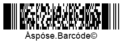

{}[Read](https://products.aspose.app/barcode/recognize/pdf417) and [Generate](https://products.aspose.app/barcode/generate/pdf417) PDF417 barcodes online. You can test the quality of ***Aspose.BarCode*** functionality and view the results online.{}

PDF417 (Portable Data File 417) is a family of 2D stacked barcodes developed to encode large amounts of information in relatively small barcode labels. Here, 417 indicates the way of encoding a single digit in a barcode: 4 bars and 4 spaces composing a 17-module pattern. The key specificity of PDF417 symbologies is the capability of laser scanning for high-quality documents. PDF417 barcodes allow encoding both byte streams and Unicode symbols. PDF417 barcodes support the extended format of encoding metadata in such a way that one portion of information can be split into separate barcodes and then included in a printed document. The PDF417 specification is summarized in the [ISO/IEC 15438](https://www.iso.org/standard/43816.html) document.

## Overview
**Basic PDF417** is a high-density variable-length barcode type with error correction. This symbology allows encoding textual information, numerical digits, files, and streams of bytes. PDF417 uses a technique that stacks multiple linear rows together which dramatically increases the amount of data that can be encoded compared to linear symbologies. PDF417 can be scanned by linear scanners, raster laser scanners, or two-dimensional imaging devices. The overall shape of a PDF417 is rectangular. The size of the symbol can be modified by the user. Printing accuracy and a suitable printer resolution are important to provide high-quality PDF417 barcodes. 
  

## Features
  
### Encoding Character Set
The PDF417 specification uses the base 929 encoding in which each codeword represents a number from 0 to 928. Among 929 available codewords, 900 are intended for data, and 29 for special functions, such as shifting between major modes. PDF417 standards enable encoding both byte streams and Unicode symbols. This symbology supports all 256 ASCII characters and 8-bit binary data.
PDF417 employs data compaction schemes to improve encoding efficiency. The following modes are supported to create correspondences between input information and codeword sequences; it is possible to switch between modes within one PDF417 barcode:
- Text Compaction mode - allows encoding all printable ASCII characters and selected special characters
- Byte Compaction mode - enables encoding all 256 possible 8-bit byte values including all ASCII characters with values from 0 to 127
- Numeric Compaction mode - permits efficient encoding of numeric data

### Barcode Structure
The layout of PDF417 barcodes includes rows and columns. PDF417 barcodes encode information in codewords that are stacked in columns to compose machine-readable patterns. As such, a PDF417 printed label includes several linear rows of stacked codewords.  

PDF417 barcodes may include from 3 to 90 rows, each of which is like a small linear bar code. All rows are the same width; each row has the same number of codewords. The codewords are represented by patterns of dark (bar) and light (space) regions. Each of these patterns contains four bars and four spaces (where the 4 in the name comes from). The total width is 17 times the width of the narrowest allowed vertical bar (the X dimension); this is where the 17 in the name comes from. Each pattern starts with a bar and ends with a space. The row height must be at least 3 times the minimum width: Y ≥ 3 X.

  

Read more

 
A PDF417 symbol character consists of 17 modules arranged into four bars and four spaces. The entire set of characters is divided into three mutually exclusive codeword sets (clusters). Each cluster encodes 929 supported character values (codewords) with distinct bar-space patterns so that one cluster can be clearly distinguished from another.  
  
Each row in a PDF417 barcode includes:
- Starting quiet zone
- Start pattern that defines the PDF417 format
- Left-row codeword that encodes data about the row (its number and the error correction level)
- Data codewords (from 1 to 30) that store input barcode data
- Right-row codeword that encodes additional data about the row
- Stop pattern
- Closing quiet zone
  

### Size Dimentions
The size of a PDF417 barcode depends on the amount of information to be encoded. The height of any PDF417 symbol can range from 3 to 90 rows, and the row height can range from 1X to 10X, where "X" is the current X dimension. The width of a symbol can range from 90X to 583X. A minimum quiet zone of 2X is required on all sides.
In practice, a PDF417 symbol takes about four times the placement space of a DataMatrix or a QR Code. 

As the number of rows can change, and rows themselves are variable in length (the number of character "columns"), the height/width proportion (aspect ratio) of a PDF417 barcode can vary to comply with spatial printing limitations. However, the number of symbol characters in all rows of a PDF417 barcode must be equal. 

  

Read more

The X dimension is the width of the narrowest bar in a printed codeword. The Y dimension is the height of each row within a PDF417 barcode. The X dimension must be constant within a single PDF417 barcode. PDF417 labels are usually printed out with the aspect ratio that may range from 1:2 to 1:5, with 1:3 being the most widely used. Significant space can be saved as a result of decreasing the aspect ratio; however, some scanners do not support reading barcodes with aspect ratios of less than 1:3. 
  

### Encoding Capacity and Data Density
The basic PDF417 standard can encode up to 1,108 bytes or 1,850 alphanumeric (2,710 numerical) symbols in up to 30 columns and 90 rows.  
Due to internal data compression algorithms, the exact data capacity depends on the structure of information to be encoded. It is recommended to limit the amount of data in each PDF417 barcode symbol to 800 characters or less, using 20 columns or less. 

  

Read more

The amount of data that can be encoded will vary depending upon the type of data, the compaction type, the error correction level chosen and the limitation of the scanner being used. For example, in the text compaction mode, the amount of compaction varies due to mode switching between different types of characters, such as between numbers, upper case, lower case and punctuation. In addition, many PDF417 scanners cannot accurately read more than 850 characters, and some scanners are limited to only 300 characters.  

### Error Correction
PDF417 barcodes use the Reed-Solomon algorithm, which enables the code to be read even if up to 50% of it is damaged. PDF417 barcodes include additional information for data recovery through Reed-Solomon error correction. When the PDF417 symbol is created, from 2 to 512 error detection and correction codewords are added. When the symbol is scanned, the maximum number of corrections that can be made is equal to the number of codewords added, but the standard recommends that two codewords be held back to ensure reliability of the corrected information. The error correction level is adjustable by the user between level 0 (just error detection) and level 8 (maximum error correction). Recommended error correction levels are between level 2 and 5, but the optimal value depends on amount of data, printing quality of the PDF417 symbol and decoding capabilities.

  

Read more

Error correction identifies two types of errors: 1) rejection errors (so-called erasures) and 2) substitution errors (so-called errors). An erasure is a missing, unscanned, or unreadable character where the position of a character is known but not its value. An error is an incorrectly decoded or mislocated symbol character where both the position and value of a character is unknown.  
  

## Advantages and Weaknesses
In PDF417 barcodes, large amounts of text and information can be encoded securely and efficiently. PDF417 barcodes can be read from left to right in a linear order by simple linear scanners. PDF417 provides a means for low-cost data transmission in a wide variety of applications. In addition to typical features of 2D barcodes, PDF417 provides the following benefits:
- Linking. PDF417 barcodes can be linked to other PDF labels and then scanned in a sequence increasing the amount of information to be stored
- User-specified dimensions. Users can determine the required the narrowest vertical bar heigh (X-dimension) the highest row width (Y dimension)
- Public domain format. This specification can be implemented without any license
  
PDF417 has many applications, such as: government-issued identification cards (such as driver licenses), airline boarding passes, postage stamps, package labels, and many others. 

## Aspose Samples for Basic PDF417 Generation and Recognition
### **Basic PDF417 Generation Code Samples**





Insert Code





<!-->Insert Code<-->





<!-->Insert Code<-->





### **Basic PDF417 Recognition Code Samples**





Insert Code





<!-->Insert Code<-->





<!-->Insert Code<-->





  

Code Sample for Basic PDF417 Generation

//GENERATE

//generate PDF417 Basic Barcode
using (BarcodeGenerator gen = new BarcodeGenerator(EncodeTypes.Pdf417, "Åspóse.Barcóde©"))
{
    gen.Parameters.Barcode.XDimension.Pixels = 2;
    //set 3 columns
    gen.Parameters.Barcode.Pdf417.Columns = 3;
    //set error level 2
    gen.Parameters.Barcode.Pdf417.Pdf417ErrorLevel = Pdf417ErrorLevel.Level2;
    gen.Save($"{path}PDF417Basic.png", BarCodeImageFormat.Png);
}


  

  

Code Sample for Basic PDF417 Recognition

//RECOGNIZE

//recognize PDF417 Basic Barcode
using (BarCodeReader read = new BarCodeReader($"{path}PDF417Basic.png", DecodeType.Pdf417, DecodeType.CompactPdf417, DecodeType.MacroPdf417))
    foreach (BarCodeResult result in read.ReadBarCodes())
    {
        Console.WriteLine($"CodeType:{result.CodeTypeName}");
        Console.WriteLine($"CodeText:{result.CodeText}");
    }


  
  
### Aspose.BarCode for Java

  

Code Sample for PDF417 Generation

  

  

Code Sample for PDF417 Recognition

  

### Aspose.BarCode for C++

  

Code Sample for PDF417 Generation

  

  

Code Sample for PDF417 Recognition

  
