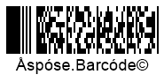

{}[Read](https://products.aspose.app/barcode/recognize/pdf417) and [Generate](https://products.aspose.app/barcode/generate/pdf417) PDF417 barcode online. You can test the quality of ***Aspose.BarCode*** functionality and view results.{}

## **Overview**
Compact PDF417 (also known as Truncated PDF417) has the same features as the PDF417 standard. However, Compact PDF417 may be used where space considerations are a primary concern and symbol damage is unlikely. In an environment where label damage is unlikely (e.g. an office), the right row indicators may be omitted and the stop pattern may be reduced to one module width bar. This procedure reduces the non-data overhead from 4 codewords per row to 2 codewords per row, with some trade-off in decode performance and robustness, or the ability to withstand noise, damage, degradation, dust, etc.

## **Features**
  
### **Encoding Character Set**
Compact PDF417 allows encoding both byte streams and Unicode symbols. 

### **Structure**
Compact PDF417 has the structure similar to that of Basic PDF417:
- Starting quiet zone
- Start pattern that determines the PDF417 format
- Left-row codeword that encodes information about the row (its number and the error correction level)
- Data codewords (from 1 to 30) that store input data
- Stop pattern
- Finishing quiet zone

The main difference between Compact PDF417 and Basic PDF417 is that the former contains the stop character pattern that is reduced to a single narrow bar. 

### **Size Dimentions**
Compact PDF417 barcodes require less area compared with Basic PDF417 as the right hand side is removed (or truncated). 

### **Encoding Capacity and Data Density**
Compact PDF417 can encode up to 1,108 bytes or 1,850 alphanumeric characters or 2,710 numerical digits in up to 30 columns and 90 rows.

### **Error Correction**
Error correction capability of this symbology is reduced compared with Basic PDF417 due to specifics of its design.

## **Advantanges and Weaknesses**
Compact PDF417 should be utilized primarily in a clean environment, since it is more susceptible to damage. Compact PDF417 can be useful when space considerations are a main concern and symbol damage is unlikely. 

## **Aspose Samples for Compact PDF417 Generation and Recognition**
### **Compact PDF417 Generation Code Samples**





//GENERATE

//generate Compact PDF417 Barcode
using (BarcodeGenerator gen = new BarcodeGenerator(EncodeTypes.Pdf417, "Åspóse.Barcóde©"))
{
    gen.Parameters.Barcode.XDimension.Pixels = 2;
    //set Pdf417 truncated or Compact Pdf417
    gen.Parameters.Barcode.Pdf417.Pdf417Truncate = true;
    //set 3 columns
    gen.Parameters.Barcode.Pdf417.Columns = 3;
    //set error level 2
    gen.Parameters.Barcode.Pdf417.Pdf417ErrorLevel = Pdf417ErrorLevel.Level2;
    gen.Save($"{path}CompactPDF417.png", BarCodeImageFormat.Png);
}






<!-->Insert Code<-->





<!-->Insert Code<-->





### **Compact PDF417 Recognition Code Samples**





//RECOGNIZE

//recognize Compact PDF417 Barcode
using (BarCodeReader read = new BarCodeReader($"{path}CompactPDF417.png", DecodeType.Pdf417, DecodeType.CompactPdf417, DecodeType.MacroPdf417))
    foreach (BarCodeResult result in read.ReadBarCodes())
    {
        Console.WriteLine($"CodeType:{result.CodeTypeName}");
        Console.WriteLine($"CodeText:{result.CodeText}");
    }






<!-->Insert Code<-->





<!-->Insert Code<-->




