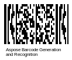

{}[Read](https://products.aspose.app/barcode/recognize/pdf417) and [Generate](https://products.aspose.app/barcode/generate/pdf417) PDF417 barcodes online. You can test the quality of ***Aspose.BarCode*** functionality and view results.{}

## **Overview**
Micro PDF417 is a two-dimensional, variable-length stacked symbology that is designed to encode a moderate amount of data in a very small space when minimizing the barcode label size is the main goal. It is based on PDF417 and shares some of its features. 

Micro PDF417 is similar to PDF417 in terms of its encodation modes, error correction method, and symbol character sets. However, Micro PDF417 replaces PDF417’s 17-module-wide start/stop patterns and left/right row indicators with a unique set of 10-module-wide Row Address Patterns, which were designed to reduce overall symbol width and to facilitate linear scanning at row heights as low as 2X. Unlike PDF417, Micro PDF417 may only be printed in certain pre-defined combinations of number of rows, number of columns, and number of error correction codewords, up to a maximum of four data columns by 44 rows. It is designed for applications requiring improved area efficiency, but lower data capacity than PDF417, and is used for Composite Codes in GS1 DataBar.

Micro PDF417 is defined in standard ISO/IEC 24728.

## **Features**
  
### **Encoding Character Set**
This symbology supports all 256 ASCII characters and 8-bit binary data.

MicroPDF417 uses data compaction schemes to enhance encoding efficiency. The following modes are used to map between user-defined data and codeword sequences:
- Text Compaction mode
- Byte Compaction mode
- Numeric Compaction mode

### **Structure**
Each Micro PDF417 barcode contains between 4 and 44 rows and from one to four columns. Only certain combinations of rows and columns are allowed (see below). Each codeword consists of four bars and four spaces made up of 17 rectangular modules in one row. Row height is variable and adjustable. For a list of the available codewords, see the ISO/IEC 24728 standard. You can include Macro 05 and Macro 06 characters in a Micro PDF417 barcode to abbreviate an industry-specific prefix and suffix into one character to reduce the number of characters that you need to encode data. Unlike Basic PDF417, Micro PDF417 does not include start/stop characters. Thus, it is deemed to be a more efficient representation of information.

|Number of columns|Allowed Number of Rows|
|---|---|
|1|11, 14, 17, 20, 24, 28|
|2|8, 11, 14, 17, 20, 23, 26|
|3|6, 8, 10, 12, 15, 20, 26, 32, 38, 44|
|4|4, 6, 8, 10, 12, 15, 20, 26, 32, 38, 44|

The symbol comprises the following elements per row:

- Leading quiet zone
- Left row address pattern
- Data codewords and center row patterns as follows, depending on the version:
    - One-column version: One codeword
    - Two-column version: Two codewords
    - Three-column version: One codeword, a center row address pattern, two codewords
    - Four-column version: Two codewords, a center row address pattern, two codewords
- Right row address pattern
- Stop bar
- Closing quiet zone

### **Size Dimentions**
Micro PDF417 symbol dimensions depend on the amount of data that is entered. The height of any Micro PDF417 symbol can range from 4 to 44 rows, and the row height can range from 1X to 10X, where "X" is the current X dimension. The width of a symbol can range from 40X to 101X. A minimum quiet zone of 1X is required on all sides.

### **Encoding Capacity and Data Density**
Micro PDF417 is capable of encoding at most 150 bytes of data or 266 alphanumeric characters or 366 numerical digits in configurations including up to 4 columns and 44 rows.

### **Error Correction**
Micro PDF417 uses the Reed-Solomon algorithm for error correction. The number of error correction codewords is fixed for each symbol version.

## **Advantanges and Weaknesses**
This barcode type is used for composite codes in the GS1 DataBar family. Because of its ability to encode significant amounts of information across a very small space, it is often used in food industry applications where packaging space is at a premium and codes must be quickly and easily read by hand-scanners to track origin, processing, and shipping information.

## **Aspose Code Samples for Micro PDF417 Generation and Recognition**
### **Micro PDF417 Generation Code Samples**





//GENERATE

//generate Micro PDF417 Barcode
using (BarcodeGenerator gen = new BarcodeGenerator(EncodeTypes.MicroPdf417, "Aspose"))
{
    gen.Parameters.Barcode.XDimension.Pixels = 2;
    gen.Save($"{path}MicroPDF417.png", BarCodeImageFormat.Png);
}






<!-->Insert Code<-->





<!-->Insert Code<-->





### **Micro PDF417 Recognition Samples**





//RECOGNIZE

//recognize Micro PDF417 Barcode
using (BarCodeReader read = new BarCodeReader($"{path}MicroPDF417.png", DecodeType.MicroPdf417))
    foreach (BarCodeResult result in read.ReadBarCodes())
    {
        Console.WriteLine($"CodeType:{result.CodeTypeName}");
        Console.WriteLine($"CodeText:{result.CodeText}");
    }






<!-->Insert Code<-->





<!-->Insert Code<-->




