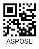

{}[Read](https://products.aspose.app/barcode/recognize/qr) and [Generate](https://products.aspose.app/barcode/generate/qr) QR Codes online. You can test the quality of ***Aspose.BarCode*** functionality and view results.{}
  
{}[Generate Wi-Fi QR Codes](https://products.aspose.app/barcode/wifi-qr) online for free: share Wi-Fi password in QR Codes{}

## **Overview**
QR (Quick Response) Codes are machine-readable labels with patterns composed of black and white squares that can be easily scanned by smartphones and other devices equipped with digital image sensors. The idea has been proposed as an improvement of conventional linear barcode types to adress the need to store much larger amounts of information. This barcode type provides a very high recognition speed and increased encoding capacity. Conceptually, a QR Code can be considered as a means to store information digitally, like flash drives that keep digital data physically. The operations of scanning and decoding can be executed using smartphone cameras and special scanner applications (mobile tagging) that are usually embedded into modern mobile devices. After capturing a QR label, a special application converts it into readable text or more often, into an URL link. 
  
Apart from 40 basic configurations, this standard supports a special option called [Micro QR Code](/barcode/info-cards/micro-qr-code/) that is useful to address space limitations in applications in which the capacity of 35 characters or less is sufficient. Additionally, the standard includes [Rectangular Micro QR Code](/barcode/info-cards/rect-micro-qr-code/), which provides a more compact rectangular shape. This variant is particularly suitable for applications with constrained printing areas. The specification for these barcode types has been published in [ISO/IEC 18004:2015](https://www.iso.org/standard/62021.html).

<p align="center"></p>
  
{}You can find the detailed description of classes and properties used in ***Aspose.BarCode*** for QR Code generation and recognition:
- [**QR Code in Aspose.BarCode for .NET**](/barcode/net/qr-and-micro-qr-barcode/)

{} 

## **Usage Scenarios**
At present, QR Code has multiple applications in various spheres, including E-Commerce, marketing and advertisement (e.g. loyalty programs and coupon distribution), documentation management, item tracking, digital payments, digitalization of vaccination certificates, supply chain management, and many others.

## **Characteristics**
### **Encoding Character Set**
This barcode type can be used to encode various data types, including numeric and alphabetic characters, Unicode symbols, Kanji, and special characters.  
It allows encoding the following characters using four encoding modes:
- Numerical: all numerical digits (0-9)
- Alphanumeric: all numeric digits (0-9), uppercase English letters (A-Z), and special characters
- 8-bit byte/binary: input information is encoded at 8 bits per character
- Kanji: Kanji characters are encoded as specified in the Japanese Industrial Standard (JIS) 

<details>  
<summary>Read more</summary>
  
As an optional encoding feature, QR Code supports the Extended Channel Interpretation (ECI) protocol that allows interpreting output data streams using character sets different from the default one. It also enables using alternative modes of barcode interpretation or supporting industry-specific encoding requirements. The ECI mode supports nearly 30 different encodings, including both standard and extended Unicode sets.

</details>

### **Barcode Structure**
Each QR Code label contains the following elements: square modules, finder patterns, timing patterns, one alignment pattern, input data modules, error correction modules, and quiet zones. It encodes information as binary data in modules (square dots). Black and white modules correspond to binaries 1 and 0.  

The key elements include the following:   
- Finder (position detection) patterns - square bull's eye signs in three corners of a QR label. These patterns facilitate accurate and fast scanning at any orientation angle
- Alignment pattern - this element is added in QR versions only starting from Version 2 and higher and is intended to improve scanning in case of minor distortions of a QR image. It is a small square bull's eye sign placed inside the input information modules
- Timing patterns - one row and one column of black and white modules that encode the symbol version and density
- Quiet zone space - an empty area around four barcode sides that is required for scanning and facilitates barcode detection. Four or more empty cells are required to compose a quiet zone

### **Size Dimensions**
Basic QR Code supports configurations that range from Version 1 to Version 40. The minimal size of a barcode image is 21 x 21 modules (Version 1) or 5.25 mm x 5.25 mm excluding the quiet zone. The maximal size (Version 40) equals to 177 x 177 modules. Each higher version contains four additional modules per side and has its own module configuration. To ensure successful scanning by most smartphones, QR labels should have a size of at least 2 cm x 2 cm (0.8 x 0.8 inches).  
  
|QR Code Version 5|Micro QR Code Version 4|Rectangular Micro QR Code Version R7x43|
| :-: | :-: | :-: |
||||
  
<details>  
<summary>Read more</summary>
  
Modules are black and white dots that constitute QR Code labels. Module configuration is determined by the number of modules stored in a barcode. The size of one module is 0.25 mm x 0.25 mm. Accordingly, the size of a barcode image depends on the number of modules and the amount of information to be encoded. The greater is the input message, the larger is the size of a QR Code image.  

The practically achievable minimal size is 10 mm or 0.4 inches (according to the scanning standard compliant with ISO 18004). The general recommendation is to determine the size considering the intended scanning distance (the distance-to-size ratio of 10:1 is usually preferred), the resolution of a printer, scanning equipment (smartphones or industrial scanners), and the error correction level. 
   
</details>

### **Encoding Capacity and Data Density**
This 2D type provides very high density. Each QR version has its own maximum capacity. The actual capacity may vary according to the amount of information to be encoded, encoding type, and the error correction level. QR Codes can store up to 3 KB of data, i.e., 2,953 bytes or 7,089 numerical digits or 4,296 letters, or 1,817 Japanese Kanji symbols. 

<details>  
<summary>Read more</summary>
  
For example, a 101 x 101 QR Code with high-level error correction can store at most 406 bytes, while a QR Code with the 177 x 177 grid can encode from 1,273 to 2,953 bytes depending on the selected error correction level.
  
</details>

### **Error Correction**
QR Code supports Reed-Solomon error correction capability to recover input information if an image is distorted, dirty, or damaged. It provides four error correction levels (L, M, Q, and H) that should be selected depending on the operating environment. These four error correction levels allow achieving the recovery capacity from 7% to 30% at most.

QR Code provides four error correction levels, as specified below.
  
|<p align="center">**Error Correction**</p>|<p align="center">**Recovery Capacity**</p>|
| :-: | :-: |
|Level L| 7% |
|Level M| 15% |
|Level Q| 25% |
|Level H| 30% |

<details>  
<summary>Read more</summary>
      
Increasing the error correction level allows improving recovery capability but also enlarges the size of the resulting barcode image as more additional error correction data needs to be encoded together with the input message. To select a suitable error correction level, it is necessary to consider various factors, such as the operating environment and the desired QR label size.  
    
Levels Q or H may be preferred in industrial environments where the probability of QR Code images getting corrupted or dirty is high, while Level L may be appropriate in cases when it is needed to store a large amount of information in safe environments. Level M (15%) is the most widely used option.  
  
</details>
  
## **Advantages and Limitations**
 
The key advantages of this barcode type are the following:
- very high reading speed
- scanning capability through mobile devices
- simple creation procedure
- readability from any angle
- reading capability under severe distortions 
- encoding byte streams of data
- encoding Unicode symbols through ECI
- high encoding density
- customizable error correction mechanism that allows recovering up to 30% of the encoded information at the maximal level H 
  
However, QR Codes are sensitive to substantial damage to the target pattern as it can prevent from correct scanning and recognition.

## **How to Generate and Read QR Codes**

### **Generation Code Samples**





```csharp

//generate QR Code
using (BarcodeGenerator gen = new BarcodeGenerator(EncodeTypes.QR, "Aspose常に先を行く"))
{
    gen.Parameters.Barcode.XDimension.Pixels = 4;
    //set error correction level 7%
    gen.Parameters.Barcode.QR.QrErrorLevel = QRErrorLevel.LevelL;
    //set ECI encoding UTF8
    gen.Parameters.Barcode.QR.QrEncodeMode = QREncodeMode.ECIEncoding;
    gen.Parameters.Barcode.QR.QrECIEncoding = ECIEncodings.UTF8;
    //set version 5 can be Auto
    gen.Parameters.Barcode.QR.QrVersion = QRVersion.Version05;
    gen.Save($"{path}QR.png", BarCodeImageFormat.Png);
}

```





```java

public void generateAndRead()
    {
        String filePath = Global.getTestDataFolder("cards") + "qr.png";//"path/to/image.png";
        //generate
        BarcodeGenerator bg = new BarcodeGenerator(EncodeTypes.QR, "Aspose常に先を行く");
        {
            bg.getParameters().getBarcode().getXDimension().setPixels(4);
            bg.getParameters().getBarcode().getQR().setQrEncodeMode(QREncodeMode.ECI_ENCODING);
            bg.getParameters().getBarcode().getQR().setQrErrorLevel(QRErrorLevel.LEVEL_L);
            bg.getParameters().getBarcode().getQR().setQrECIEncoding(ECIEncodings.UTF8);
            bg.getParameters().getBarcode().getQR().setQrVersion(QRVersion.VERSION_05);
            try
            {
                bg.save(filePath, BarCodeImageFormat.PNG);
            }
            catch (IOException e)
            {
                e.printStackTrace();
            }
        }
    }

```





```cpp

//generate QR Barcode
System::SharedPtr<BarcodeGenerator> gen = System::MakeObject<BarcodeGenerator>(EncodeTypes::QR, u"Aspose常に先を行く");
gen->get_Parameters()->get_Barcode()->get_XDimension()->set_Pixels(4.0f);
//set error correction level 7%
gen->get_Parameters()->get_Barcode()->get_QR()->set_QrErrorLevel(Aspose::BarCode::Generation::QRErrorLevel::LevelL);
//set ECI encoding UTF8
gen->get_Parameters()->get_Barcode()->get_QR()->set_QrEncodeMode(Aspose::BarCode::Generation::QREncodeMode::ECIEncoding);
gen->get_Parameters()->get_Barcode()->get_QR()->set_QrECIEncoding(Aspose::BarCode::Generation::ECIEncodings::UTF8);
//set version 5 can be Auto
gen->get_Parameters()->get_Barcode()->get_QR()->set_QrVersion(Aspose::BarCode::Generation::QRVersion::Version05);
gen->Save(path + u"QR.png", Aspose::BarCode::Generation::BarCodeImageFormat::Png);

```
    




### **Recognition Code Samples**





```csharp

//Read QR Code
using (BarCodeReader read = new BarCodeReader($"{path}QR.png", DecodeType.QR))
    foreach (BarCodeResult result in read.ReadBarCodes())
    {
        Console.WriteLine($"CodeType:{result.CodeTypeName}");
        Console.WriteLine($"CodeText:{result.CodeText}");
    }

```





```java

public void generateAndRead()
    {
        String filePath = Global.getTestDataFolder("cards") + "qr.png";//"path/to/image.png";
    
        //recognize
        BarCodeReader br = new BarCodeReader(filePath, DecodeType.QR);
        BarCodeResult[] barCodeResults = br.readBarCodes();
        for(BarCodeResult result : barCodeResults)
        {
            System.out.println("CodeType: " + result.getCodeTypeName());
            System.out.println("CodeText: " + result.getCodeText());
        }
    }

```





```cpp

//recognize QR Code
System::SharedPtr<BarCodeReader> read = System::MakeObject<BarCodeReader>(path + u"QR.png", DecodeType::QR);
for (System::SharedPtr<BarCodeResult> result : read->ReadBarCodes())
    {
        System::Console::WriteLine(System::String(u"CodeType:") + result->get_CodeTypeName());
        System::Console::WriteLine(System::String(u"CodeText:") + result->get_CodeText());
    }

```




