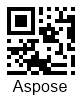

{}[Read](https://products.aspose.app/barcode/recognize/qr) and [Generate](https://products.aspose.app/barcode/generate/qr) QR Codes online. You can test the quality of ***Aspose.BarCode*** functionality and view the results online.{}

## **Overview**
Micro QR (Quick Response) code is a variant of [QR Code](/barcode/info-cards/qr-code) that has been introduced to save printing space by further reducing the size of QR Code labels.

<p align="center"></p>

{}You can find the detailed description of classes and properties that are used in ***Aspose.BarCode*** for Micro QR Code generation and recognition:
- [**QR Code in Aspose.BarCode for .NET**](/barcode/net/qr-and-micro-qr-barcode/)

{} 

## **Usage Scenarios**
Micro QR Codes are intended for use in cases when 35 digits would be sufficient to encode the input message and there is a strong need to reduce space occupied by QR Code labels. One of the applications is to mark printed circuit boards and various electrical components.

## **Characteristics**
### **Encoding Character Set**
Micro QR Code allows encoding the same data types as [QR Codes](/barcode/info-cards/qr-code/): numeric and alphabetic characters, Unicode symbols, Kanji, and special characters.  
Micro QR Code supports the following standard encoding modes:
- Numerical: all numerical digits (0-9)
- Alphanumeric: all numeric digits (0-9), uppercase English letters (A-Z), and special symbols
- 8-bit byte/binary: information gets encoded at 8 bits per symbol
- Kanji: Kanji characters according to the Japanese Industrial Standard (JIS) 
  
### **Barcode Structure**
Micro QR Codes have a structure similar to that of basic QR Code labels. It includes square modules, timing patterns, input information, error correction data, and quiet zones. However, it has only one orientation (finder) pattern and does not contain the alignment pattern to reduce the label size so that it can be printed taking tiny space. The least possible number of modules is 11 x 11. Micro QR Code encodes input information as binary data in modules (square dots) in the same way as defined in the basic QR Code specification.  

<details>
<summary>Read more</summary>

The key elements of Micro QR Codes are:   
- One finder (position detection) pattern - a square bull's eye sign in a corner of a label that allows for accurate and fast scanning at any orientation angle
- Timing patterns that consist of one row and one column of black and white modules used to denote symbol version and density
- Quiet zone: a margin space that is required for successful scanning

</details>

### **Size Dimensions**
Micro QR Code versions range from M1 to M4. Each version has its own module configuration. The size can range from 11x11 modules or 2.75 mm x 2.75 mm excluding margins to 17x17 modules.
     
### **Encoding Capacity and Data Density**
Micro QR Codes can encode up to 35 numerical digits or 21 alphabetical characters or 15 bytes. 

### **Error Correction**
[QR Code](/barcode/info-cards/qr-code) provides the error correction capability to restore data if the image has become dirty or damaged. It supports Reed-Solomon error correction and enables four error correction levels with a recovery capacity from 7% to 30%. In the Micro QR Code specification, error correction level H is not available. For Version M1, the Reed-Solomon capacity is limited to error detection only.
  
This barcode type supports three error correction levels, as listed below.
   
|<p align="center">**Error Correction Level**</p>|<p align="center">**Recovery Capacity**</p>|
| :-: | :-: |
|Level L| 7% |
|Level M| 15% |
|Level Q| 25% |

## **Advantages and Limitations**
The key advantages of Micro QR codes are summarized below:
- compactness
- high decoding speed
- readability from any angle 
- reading capability under severe 3D distortions 
- encoding byte streams of data
- high data encoding density
- customizable error correction
  
Micro QR Code provides improved density and encode data more efficiently compared with [QR Code](/barcode/info-cards/qr-code). However, Micro QR Codes are sensitive to substantial damage to the target pattern as it can hinder barcode detection in the scanned image. This type provides very limited capacity so it can be applied only to special cases that do not require encoding large input messages. 

## **How to Generate and Read Micro QR Codes**
### **Generation Code Samples**





```csharp

//generate Micro QR Barcode
using (BarcodeGenerator gen = new BarcodeGenerator(EncodeTypes.QR, "Aspose"))
{
    gen.Parameters.Barcode.XDimension.Pixels = 4;
    //encode data as MicroQR
    gen.Parameters.Barcode.QR.QrEncodeType = QREncodeType.ForceMicroQR;
    //set error correction level 7%
    gen.Parameters.Barcode.QR.QrErrorLevel = QRErrorLevel.LevelL;
    //set version M4 can be Auto
    gen.Parameters.Barcode.QR.QrVersion = QRVersion.VersionM4;
    gen.Save($"{path}MicroQR.png", BarCodeImageFormat.Png);
}

```





```java

public void generateAndRead()
    {
        String filePath = Global.getTestDataFolder("cards") + "MicroQRCode.png";//"path/to/image.png";
        //generate
        BarcodeGenerator bg = new BarcodeGenerator(EncodeTypes.QR, "Aspose");
        {
            bg.getParameters().getBarcode().getXDimension().setPixels(4);
            bg.getParameters().getBarcode().getQR().setQrEncodeType(QREncodeType.FORCE_MICRO_QR);
            bg.getParameters().getBarcode().getQR().setQrErrorLevel(QRErrorLevel.LEVEL_L);
            bg.getParameters().getBarcode().getQR().setQrECIEncoding(ECIEncodings.UTF8);
            bg.getParameters().getBarcode().getQR().setQrVersion(QRVersion.VERSION_M4);
            try
            {
                bg.save(filePath, BarCodeImageFormat.PNG);
            }
            catch (IOException e)
            {
                e.printStackTrace();
            }
        }
    }
 
```





```cpp

//generate Micro QR Code
System::SharedPtr<BarcodeGenerator> gen = System::MakeObject<BarcodeGenerator>(EncodeTypes::QR, u"Aspose");
gen->get_Parameters()->get_Barcode()->get_XDimension()->set_Pixels(4.0f);
//encode data as MicroQR
gen->get_Parameters()->get_Barcode()->get_QR()->set_QrEncodeType(Aspose::BarCode::Generation::QREncodeType::ForceMicroQR);
//set error correction level 7%
gen->get_Parameters()->get_Barcode()->get_QR()->set_QrErrorLevel(Aspose::BarCode::Generation::QRErrorLevel::LevelL);
//set version M4 can be Auto
gen->get_Parameters()->get_Barcode()->get_QR()->set_QrVersion(Aspose::BarCode::Generation::QRVersion::VersionM4);
gen->Save(path + u"MicroQR.png", Aspose::BarCode::Generation::BarCodeImageFormat::Png);
    
```





### **Recognition Code Samples**





```csharp

//read Micro QR Code
using (BarCodeReader read = new BarCodeReader($"{path}MicroQR.png", DecodeType.MicroQR))
    foreach (BarCodeResult result in read.ReadBarCodes())
    {
        Console.WriteLine($"CodeType:{result.CodeTypeName}");
        Console.WriteLine($"CodeText:{result.CodeText}");
    }

```





```java

public void generateAndRead()
    {
        String filePath = Global.getTestDataFolder("cards") + "MicroQRCode.png";//"path/to/image.png";
        //recognize
        BarCodeReader br = new BarCodeReader(filePath, DecodeType.MICRO_QR);
        BarCodeResult[] barCodeResults = br.readBarCodes();
        for(BarCodeResult result : barCodeResults)
        {
            System.out.println("CodeType: " + result.getCodeTypeName());
            System.out.println("CodeText: " + result.getCodeText());
        }
    }
 
```





```cpp

//recognize Micro QR Code
System::SharedPtr<BarCodeReader> read = System::MakeObject<BarCodeReader>(path + u"MicroQR.png", DecodeType::MicroQR);
for (System::SharedPtr<BarCodeResult> result : read->ReadBarCodes())
    {
        System::Console::WriteLine(System::String(u"CodeType:") + result->get_CodeTypeName());
        System::Console::WriteLine(System::String(u"CodeText:") + result->get_CodeText());
    }

```




