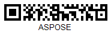

{}[Read](https://products.aspose.app/barcode/recognize/qr) and [Generate](https://products.aspose.app/barcode/generate/qr) QR Codes online. You can test the quality of ***Aspose.BarCode*** functionality and view the results online.{}

## **Overview**
Rectangular Micro QR (rMQR) code is a variant of [QR Code](/barcode/info-cards/qr-code), which provides a more compact rectangular shape by further reducing the size of QR Code labels.

<p align="center"></p>

{}You can find the detailed description of classes and properties that are used in ***Aspose.BarCode*** for Rectangular Micro QR Code generation and recognition:
- [**QR Code in Aspose.BarCode for .NET**](/barcode/net/qr-micro-qr-and-rmqr/)

{} 

## **Usage Scenarios**
Rectangular Micro QR Codes are designed for scenarios where there is a critical need to minimize the physical footprint of the code while adapting to elongated or narrow surfaces. Their rectangular is ideal for applications such as labeling thin cables, microchips, or elongated components on industrial equipment. 

## **Characteristics**
### **Encoding Character Set**
Rectangular Micro QR Code allows encoding the same data types as [QR Codes](/barcode/info-cards/qr-code/): numeric and alphabetic characters, Unicode symbols, Kanji, and special characters.  
Rectangular Micro QR Code supports the following standard encoding modes:
- Numerical: all numerical digits (0-9)
- Alphanumeric: all numeric digits (0-9), uppercase English letters (A-Z), and special symbols
- 8-bit byte/binary: information gets encoded at 8 bits per symbol
- Kanji: Kanji characters according to the Japanese Industrial Standard (JIS) 
  
### **Barcode Structure**
Rectangular Micro QR Codes have a structure similar to that of basic QR Code labels. It includes square modules, timing patterns, input information, error correction data, and quiet zones. However, it has only one orientation (finder) pattern, one finder sub pattern and several alignment patterns. The least possible number of modules is 7 x 43 Rectangular Micro QR Code encodes input information as binary data in modules (square dots) in the same way as defined in the basic QR Code specification.  

<details>
<summary>Read more</summary>

The key elements of Rectangular Micro QR Codes are:   
- One finder (position detection) pattern - a square bull's eye sign in a left top corner of a label that allows for accurate and fast scanning at any orientation angle
- One finder sub pattern - a small square bull's eye sign in a right bottom corner of a label that allows for accurate and fast scanning at any orientation angle
- The horizontal and vertical timing patterns that consist of one-module wide row or column of black and white modules used to denote symbol version and density
- Alignment pattern - this element is added in versions only with 43 or more horizontal modules and is intended to improve scanning in case of minor distortions of a Rectangular Micro QR. It is a small square bull's eye sign placed on the borders of symbol
- The corner finder pattern which is located at the upper right and the lower left of rMQR symbol
- Quiet zone: a margin space that is required for successful scanning

</details>

### **Size Dimensions**
Rectangular Micro QR Code versions range from R7x43 to R7x139.
     
### **Encoding Capacity and Data Density**
Rectangular Micro QR Codes can encode up to 361 numerical digits or 219 alphabetical characters or 150 bytes. 

### **Error Correction**
[QR Code](/barcode/info-cards/qr-code) provides the error correction capability to restore data if the image has become dirty or damaged. It supports Reed-Solomon error correction and enables four error correction levels with a recovery capacity from 7% to 30%. In the Rectangular Micro QR Code specification, only M and H error correction levels are available.
  
This barcode type supports three error correction levels, as listed below.
   
|<p align="center">**Error Correction Level**</p>|<p align="center">**Recovery Capacity**</p>|
| :-: | :-: |
|Level M| 15% |
|Level H| 30% |

## **Advantages and Limitations**
The key advantages of Rectangular Micro QR codes are summarized below:
- compactness
- high decoding speed
- readability from any angle 
- reading capability under severe 3D distortions 
- encoding byte streams of data
- high data encoding density
- customizable error correction
  
Rectangular Micro QR Code provides improved density and encode data more efficiently compared with [QR Code](/barcode/info-cards/qr-code). However, Rectangular Micro QR Codes are sensitive to substantial damage to the target pattern as it can hinder barcode detection in the scanned image. This type provides very limited capacity so it can be applied only to special cases that do not require encoding large input messages. 

## **How to Generate and Read Rectangular Micro QR Codes**
### **Generation Code Samples**





```csharp

//generate Rectangular Micro QR Barcode
using (BarcodeGenerator gen = new BarcodeGenerator(EncodeTypes.RectMicroQR, "Aspose"))
{
    gen.Parameters.Barcode.XDimension.Pixels = 4;
    //set error correction level 15%
    gen.Parameters.Barcode.QR.QrErrorLevel = QRErrorLevel.LevelM;
    //set version R7x43 can be Auto
    gen.Parameters.Barcode.QR.RectMicroQrVersion = RectMicroQRVersion.R7x43;
    gen.Save($"{path}MicroQR.png", BarCodeImageFormat.Png);
}

```





```java

public void generateAndRead()
    {
        String filePath = Global.getTestDataFolder("cards") + "MicroQRCode.png";//"path/to/image.png";
        //generate
        BarcodeGenerator bg = new BarcodeGenerator(EncodeTypes.RectMicroQR, "Aspose");
        {
            bg.getParameters().getBarcode().getXDimension().setPixels(4);
            bg.getParameters().getBarcode().getQR().setQrErrorLevel(QRErrorLevel.LEVEL_M);
            bg.getParameters().getBarcode().getQR().setQrECIEncoding(ECIEncodings.UTF8);
            bg.getParameters().getBarcode().getQR().setRectMicroQrVersion(RectMicroQRVersion.R7x43);
            try
            {
                bg.save(filePath, BarCodeImageFormat.PNG);
            }
            catch (IOException e)
            {
                e.printStackTrace();
            }
        }
    }
 
```





```cpp

//generate Rectangular Micro QR Code
System::SharedPtr<BarcodeGenerator> gen = System::MakeObject<BarcodeGenerator>(EncodeTypes::RectMicroQR, u"Aspose");
gen->get_Parameters()->get_Barcode()->get_XDimension()->set_Pixels(4.0f);
//set error correction level 7%
gen->get_Parameters()->get_Barcode()->get_QR()->set_QrErrorLevel(Aspose::BarCode::Generation::QRErrorLevel::LevelM);
//set version M4 can be Auto
gen->get_Parameters()->get_Barcode()->get_QR()->set_RectMicroQrVersion(Aspose::BarCode::Generation::RectMicroQRVersion::R7x43);
gen->Save(path + u"MicroQR.png", Aspose::BarCode::Generation::BarCodeImageFormat::Png);
    
```





### **Recognition Code Samples**





```csharp

//read Rectangular Micro QR Code
using (BarCodeReader read = new BarCodeReader($"{path}RectMicroQRCode.png", DecodeType.RectMicroQR))
    foreach (BarCodeResult result in read.ReadBarCodes())
    {
        Console.WriteLine($"CodeType:{result.CodeTypeName}");
        Console.WriteLine($"CodeText:{result.CodeText}");
    }

```





```java

public void generateAndRead()
    {
        String filePath = Global.getTestDataFolder("cards") + "RectMicroQRCode.png";//"path/to/RectMicroQRCode.png";
        //recognize
        BarCodeReader br = new BarCodeReader(filePath, DecodeType.RECT_MICRO_QR);
        BarCodeResult[] barCodeResults = br.readBarCodes();
        for(BarCodeResult result : barCodeResults)
        {
            System.out.println("CodeType: " + result.getCodeTypeName());
            System.out.println("CodeText: " + result.getCodeText());
        }
    }
 
```





```cpp

//recognize Rectangular Micro QR Code
System::SharedPtr<BarCodeReader> read = System::MakeObject<BarCodeReader>(path + u"RectMicroQRCode.png", DecodeType::RectMicroQR);
for (System::SharedPtr<BarCodeResult> result : read->ReadBarCodes())
    {
        System::Console::WriteLine(System::String(u"CodeType:") + result->get_CodeTypeName());
        System::Console::WriteLine(System::String(u"CodeText:") + result->get_CodeText());
    }

```




