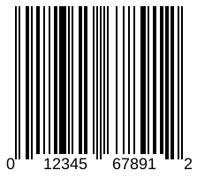

{}[Read](https://products.aspose.app/barcode/recognize/code39) and [Generate](https://products.aspose.app/barcode/generate/code39) Code 39 barcodes online. You can test the quality of ***Aspose.BarCode*** functionality and view results.{}

## **Overview**
The UPC-A barcode is the most common type in the United States, and the most widely recognized. 

<p align="center"></p>

{}You can find additional information of classes and properties that are used in ***Aspose.BarCode*** for linear barcode generation and recognition:
- [**Specific Parameters for 1D barcodes**](https://docs.aspose.com/barcode/net/managing-different-barcode-settings/)

{} 

## **Usage Scenarios**
UPC (Universal Product Code) barcodes are used in a variety of settings to identify and track products. They are most commonly found on the packaging of retail products and are used to facilitate the checkout process in stores. When a product with a UPC-A barcode is scanned at the checkout counter, the UPC-A barcode is read and used to look up the price and other information about the product in a database. In addition to being used in retail settings, UPC barcodes are also used in a variety of other settings, including:
- Warehouses and distribution centers: UPC barcodes are used to track inventory and manage the distribution of products.
- Manufacturing: UPC barcodes are used to identify and track products as they move through the manufacturing process.
- Healthcare: UPC barcodes are used to identify and track medical supplies, pharmaceuticals, and other healthcare products.
- Libraries: UPC barcodes are used to identify and track books and other materials in libraries.
- Postal services: UPC barcodes are used to track packages and other mail items as they move through the postal system.

Overall, UPC-A barcodes are used in a wide range of settings to identify and track products for the purpose of efficient inventory management, supply chain management, and point-of-sale transactions.
  
## **Characteristics**
### **Encoding Character Set**
This barcode type supports all numeric digits (0-9).

### **Barcode Structure**
Each UPC-A symbol comprises the following elements:

- Leading quiet zone
- Guard pattern (start character)
- Six symbol characters
- Center guard pattern (center character)
- Six symbol characters, including check digit
- Guard pattern (stop character)
- Trailing quiet zone

### **Size Dimensions**
According to the UPC-A specification published by GS1, the minimum size for a UPC-A barcode on a package or label is 0.75 inches (19.05 mm) tall and 0.25 inches (6.35 mm) wide. The maximum size for a UPC-A barcode is 1.5 inches (38.1 mm) tall and 1.25 inches (31.75 mm) wide. In practice, the size of a UPC-A barcode may vary depending on the specific needs of the product or packaging. For example, if a product has a large surface area, the UPC-A barcode may need to be larger to be easily scanned. Similarly, if a product has a small surface area, the UPC-A barcode may need to be smaller to fit on the packaging.  
Overall, the size of a UPC-A barcode should be chosen based on the size and type of the product, as well as the size of the packaging, to ensure that the barcode can be easily scanned and read.

### **Encoding Capacity and Data Density**
A UPC-A barcode consists of 12 digits. It begins with a single digit number system character, which designates how the code should be classified: as a regular product, a weighted item, pharmaceuticals, coupons, etc. After that is a five digit manufacturer's number, followed by a five digit product number, and finally a check digit. Each digit is represented by a uniquely identifiable pattern of two bars and two spaces of varying width. No letters or other special characters aside from numbers may be used.  
  
With four available printing widths for the bars and spaces instead of just two, UPC-A takes about half the number of bars and spaces relative to Interleaved 2 of 5 to represent each character. However, the use of the wider bars and spaces nullifies this space savings. Interleaved 2 of 5 codes pack data more densely than UPC-A does.

### **Checksum Controls**
UPC-A contains a check digit that is based on the modulo 10 (mod 10) algorithm.

## **Advantages and Limitations**
UPC-A barcodes are simple, short, popular, and can be read by just about any standard barcode reader. In addition, the check digit guards against accidental errors, especially when entering in the code by hand. A mathematical formula computes the first 11 digits together in a certain way to get the final digit. So if the check digit does not match the digit generated by the other numbers, you know immediately that there is an error.
The 12 digit system of a UPC-A barcode provides for small, limited encoding, which makes it ideal for supermarket and retail use, but less suited for other scanning and identification purposes.  
Most barcode types print bars and spaces in only two widths, but UPC uses four different widths. This allows representing each numeric character by just two bars and two spaces, which is the fewest number of modules required per character of any barcode type.

## **How to Generate and Read UPC-A Barcodes**
### **Generation Code Samples**





``` csharp
// Initialize barcode generator
using (var generator = new Aspose.BarCode.Generation.BarcodeGenerator(EncodeTypes.UPCA, "01234567891"))
{
  // Set parameters
  generator.Parameters.Barcode.XDimension.Millimeters *= 2;
  generator.Parameters.Barcode.CodeTextParameters.Location = CodeLocation.Below;

  // Generate image
  Bitmap res = generator.GenerateBarCodeImage();
}
```





```java
// Create an instance of the BarcodeGenerator class
BarcodeGenerator generator = new BarcodeGenerator(EncodeTypes.UPCA);

// Specify the barcode text
generator.setCodeText("01234567891");

// Specify the X-dimension 
// the smallest width of the unit of BarCode bars or spaces
generator.getParameters().getBarcode().getXDimension().setMillimeters(2);

// Set barcode text position
generator.getParameters().getBarcode().getCodeTextParameters().setLocation(CodeLocation.Below);

// Generate a barcode image
generator.generateBarCodeImage();
```





```cpp
// Initialize a BarcodeGenerator class object and set barcode text and symbology type
System::SharedPtr<BarcodeGenerator> generator = [&]
{
    auto tmp_0 = System::MakeObject<BarcodeGenerator>(EncodeTypes::UPCA, u"01234567891");
    // Set parameters
    tmp_0->get_Parameters()->get_Barcode()->get_XDimension()->set_Millimeters(2);
    tmp_0->get_Parameters()->get_Barcode()->get_CodeTextParameters()->set_Location(Aspose::BarCode::CodeLocation::Below);
    return tmp_0;
}();

// Generate a barcode image
System::SharedPtr<System::Drawing::Bitmap> lBmp = generator->GenerateBarCodeImage();
```





### **Recognition Code Samples**





``` csharp
// Initialize barcode reader
using (var reader = new Aspose.BarCode.BarCodeReader(<file name>, DecodeType.UPC))
{
    // Recognize barcodes in the image
    foreach (var barcode in reader.ReadBarCodes())
    {
        // Display the recognition result
        Console.WriteLine($"{barcode.CodeTypeName}: {barcode.CodeText}");
    }
}





```java
// initialize an instance of BarcodeReader passing the source image and expected type
BarCodeReader reader = new BarCodeReader(var reader = new Aspose.BarCode.BarCodeReader(<file name>, DecodeType.UPC);

// read the source barcode
while (reader.read()) {
    // print the code type & text
    System.out.println("Type: " + reader.getCodeType() + " Text: " + reader.getCodeText());
}
```





``` cpp
try
{
    // Create an instance of BarcodeGenerator class 
    System::SharedPtr<BarCodeReader> reader = System::MakeObject<BarCodeReader>(<file name>, DecodeType::UPC);
    while (reader->Read())
    {
        // Display barcode text and symbology type
        System::Console::WriteLine(System::String(u"CodeText: ") + reader->GetCodeText());
        System::Console::Write(System::String(u"Symbology Type: ") + reader->GetCodeType());
    }
    reader->Close();
}
catch (System::Exception& ex)
{
    System::Console::WriteLine(ex->get_Message());
}
```




