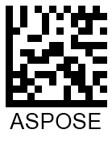

This article provides all necessary information about adjusting barcode appearance-related properties, including image size, rotation angle, paddings, and borders.

{}*If you need any clarifications, feel free to reach out [Aspose Technical Support](/barcode/cpp/technical-support/): ask your questions at [Aspose.Barcode Forum](https://forum.aspose.com/c/barcode/13) or contact [Aspose Paid Support Helpdesk](https://helpdesk.aspose.com/).*{}

## **Overview**
In ***Aspose.BarCode for C++***, class [*BarcodeGenerator*](https://reference.aspose.com/barcode/cpp/class/aspose.bar_code.generation.barcode_generator/) allows creating barcode labels according to the specified scenario where each element has the fixed position relative to other elements in a barcode image, as shown in the scheme below. A barcode image may include the following elements: barcode bars, borders, paddings, top and bottom captions, and barcode text. All elements besides the barcode label itself are optional.
  
<p align="center"></p>
 
## **Set Barcode Sizing Mode**

In the general case, ***Aspose.BarCode for C++*** adjusts the size of a barcode image (width and height) automatically. However, it is possible to customize the image size settings manually by specifying the height and width of a barcode image using *ImageHeight* and *ImageWidth* properties of class [*BaseGenerationParameters*](https://reference.aspose.com/barcode/cpp/class/aspose.bar_code.generation.base_generation_parameters/).  
  
The size of a barcode image can be managed according to different sizing modes that can be set by initializing the *AutoSizeMode* property of class [*BaseGenerationParameters*](https://reference.aspose.com/barcode/cpp/class/aspose.bar_code.generation.base_generation_parameters/). This parameter can take the following values: *Interpolation*, *Nearest*, and *None*. The *Interpolation* and *Nearest* modes imply that barcode image size gets adjusted according to the required values of width and height while most of the other parameters are ignored. In contrast, the *None* mode defines the size of a barcode image ignoring width and height but considers other parameters, for example, such as *XDimension*. By default, *AutoSizeMode* is set to "*None*".  
   
Below, the available barcode sizing modes are described in detail along with sample barcode labels and code snippets.

### **AutoSizeMode.None** 
As mentioned previously, when the *None* mode is set, the size of the generated barcode image is based on various parameters while the values of width and height are not taken into consideration. The main parameter used to define barcode size is the *XDimension* property. It specifies the minimum size value of bars for 1D barcodes or cells for 2D ones. Then, this value is used to calculate most of the other barcode parameters.  
  
Barcode symbologies usually specify the minimum value (*XDimension*) to ensure compatibility between scanning and printing equipment used in open systems (barcode labels need to be readable by scanners utilized in different companies). *X-Dimension* determines the density of a symbology, in other words, defines the amount of information that can be stored in a barcode. When *X-Dimension* is small, the area required to display each character in a barcode label is less compared with the case when *X-Dimension* is large; thus a barcode can store more information per linear inch and is considered to be of higher density. Otherwise, increasing the width of the narrowest element (*X-Dimension*) enlarges the space required for each character and reduces the number of characters per inch.  
    
The barcode image provided below has been created in the *None* mode.

<p align="center"></p>
   
### **AutoSizeMode.Interpolation**
When the *AutoSizeMode* property is set to "*Interpolation*", only the values of *ImageHeight* and *ImageWidth* are taken into account. This sizing mode prescribes to adjust barcode image size to the specified height and width precisely even though it may lead to the distortion of barcode proportions and accordingly, to the loss of barcode readability for side scanners. The *Interpolation* mode is suitable to generate barcode images with the resolution of 300 dpi or higher as in this case proportion distortion will be negligible and will not affect barcode readability.  
  
The sample barcode image created using the *Interpolation* mode is shown below.  

<p align="center"></p> 
  
### **AutoSizeMode.Nearest** 
The *Nearest* mode uses only the values of *ImageHeight* and *ImageWidth* to set the size of the resulting barcode image similarly to *Interpolation*. However, in this case, [*BarcodeGenerator*](https://reference.aspose.com/barcode/cpp/class/aspose.bar_code.generation.barcode_generator/) seeks to specify the most appropriate image size to avoid distorting barcode proportions and deteriorating its readability.  
  
The resulting barcode image generated using the *Nearest* mode is demonstrated below.
  
<p align="center"></p>
    
## **Set Barcode Rotation Angle**
***Aspose.BarCode for C++*** enables barcode image rotation that can be performed by initializing the *RotationAngle* property of class [*BaseGenerationParameters*](https://reference.aspose.com/barcode/cpp/class/aspose.bar_code.generation.base_generation_parameters/). Setting this property to a value in degrees results in generating a barcode image rotated according to the required angle clockwise or counterclockwise.  
  
The sample barcode images rotated by different angles are represented below.
  
|Rotation Angle|Is Set to +90°|Is Set to -90°|Is Set to +45°|Is Set to -45°|Is Set to 180°| 
| :-: | :-: | :-: | :-: | :-: | :-: | 
| ||||||
  
```cpp
// The path to the documents directory.
System::String dataDir = RunExamples::GetDataDir_ManageBarCodesImages();

// Instantiate barcode object and set CodeText, Barcode Symbology and  hide code text
System::SharedPtr<BarcodeGenerator> generator = System::MakeObject<BarcodeGenerator>(EncodeTypes::QR, u"1234567890");

generator->get_Parameters()->get_Barcode()->get_CodeTextParameters()->set_Location(CodeLocation::None);
generator->get_Parameters()->set_RotationAngle(90);

generator->Save(dataDir + u"QR-rotate_out.jpeg", Aspose::BarCode::BarCodeImageFormat::Jpeg);
System::Console::WriteLine(System::Environment::get_NewLine() + u"Barcode saved at " + dataDir);
```


## **Customize Barcode Borders and Padding**
***Aspose.BarCode for C++*** enables adjusting barcode borders and paddings during barcode generation. By default, borders are placed tightly to image edges; then, corresponding paddings may be specified.
  
### **Border Settings**
According to the default settings, a barcode image is generated without borders; however, they can be specified explicitly according to five different styles: solid, dashed, dotted, dash-dot, and dash dot dot. Border appearance can be adjusted using the *Border* property of class [*BaseGenerationParameters*](https://reference.aspose.com/barcode/cpp/class/aspose.bar_code.generation.base_generation_parameters/). In turn, this property gets an instance of class [*BorderParameters*](https://reference.aspose.com/barcode/cpp/class/aspose.bar_code.generation.border_parameters/) that contains all barcode configuration settings. In addition, this class enables adjusting border thickness (that can be defined in any supported units) and color by initializing the *Width* and *Color* properties, respectively.  

```cpp
// The path to the documents directory.
System::String dataDir = RunExamples::GetDataDir_ManageBarCodesImages();

// Instantiate barcode object and set different properties
System::SharedPtr<BarcodeGenerator> generator = System::MakeObject<BarcodeGenerator>(EncodeTypes::Code93Standard);

generator->get_Parameters()->get_Border()->set_DashStyle(Aspose::BarCode::BorderDashStyle::Solid);
generator->get_Parameters()->get_Barcode()->get_Padding()->get_Top()->set_Millimeters(2.f);
generator->get_Parameters()->get_Barcode()->get_Padding()->get_Left()->set_Millimeters(2.f);
generator->get_Parameters()->get_Barcode()->get_Padding()->get_Right()->set_Millimeters(2.f);
generator->get_Parameters()->get_Barcode()->get_Padding()->get_Bottom()->set_Millimeters(2.f);
generator->get_Parameters()->get_Border()->get_Width()->set_Millimeters(0.5f);
generator->get_Parameters()->get_Border()->set_Visible(true);

generator->Save(dataDir + u"barcodeImageborders_out.jpeg", BarCodeImageFormat::Jpeg);
System::Console::WriteLine(System::Environment::get_NewLine() + u"Barcode saved at " + dataDir);
```
  
Barcode images provided below are the sample barcode labels generated using different border styles. The border style can be customized by initializing the *DashStyle* property of class [*BorderParameters*](https://reference.aspose.com/barcode/cpp/class/aspose.bar_code.generation.border_parameters/).
  
|Border Style|Solid|Dashed|Dotted|Dash Dot|Dash Dot Dot| 
| :-: | :-: | :-: | :-: | :-: | :-: | 
| ||||||
  

```cpp
// The path to the documents directory.
System::String dataDir = RunExamples::GetDataDir_ManageBarCodes();

// Instantiate barcode object and set differnt barcode properties
System::SharedPtr<BarcodeGenerator> generator = System::MakeObject<BarcodeGenerator>(EncodeTypes::Code128, u"1234567"); 
						
generator->get_Parameters()->get_Border()->set_DashStyle(Aspose::BarCode::BorderDashStyle::Solid);
generator->get_Parameters()->get_Border()->get_Width()->set_Millimeters(1.0f);
generator->get_Parameters()->get_Border()->set_Visible(true);

// Save the image to your system and set its image format to Jpeg
generator->Save(dataDir + u"barcode_border_style_out.jpg", BarCodeImageFormat::Jpeg);
System::Console::WriteLine(System::Environment::get_NewLine() + u"Barcode saved at " + dataDir + u"barcode_border_style_out.jpg");
```

### **Paddings**
The border paddings from the edges of a barcode image or its borders can be set in four directions by initializing the *Padding* property of class [*BarcodeParameters*](https://reference.aspose.com/barcode/cpp/class/aspose.bar_code.generation.barcode_parameters/). The *Padding* property creates an instance of class [Aspose.BarCode.Generation.Padding](https://reference.aspose.com/barcode/cpp/class/aspose.bar_code.generation.padding/) that specifies the *Left*, *Right*, *Top*, and *Bottom* padding settings. The default values are set to 5 points in all directions.
  
|Padding|Millimeters|Pixels|  
| :-: | :-: | :-: |  
| ||| 
  
```cpp
// The path to the documents directory.
System::String dataDir = RunExamples::GetDataDir_ManageBarCodesImages();

// Instantiate barcode object and set CodeText & Barcode Symbology
System::SharedPtr<BarcodeGenerator> generator = System::MakeObject<BarcodeGenerator>(EncodeTypes::ITF14, u"00850006000227"); 
						
// Set Different properties
generator->get_Parameters()->get_Barcode()->set_AutoSizeMode(AutoSizeMode::Nearest);
generator->get_Parameters()->get_Barcode()->get_ITF()->set_ItfBorderType(ITF14BorderType::FrameOut);
generator->get_Parameters()->get_Barcode()->get_CodeTextParameters()->get_Font()->set_FamilyName(u"OCR B Std");
generator->get_Parameters()->get_Barcode()->get_CodeTextParameters()->get_Font()->get_Size()->set_Point(8);
generator->get_Parameters()->get_Barcode()->get_XDimension()->set_Millimeters(0.495f);
generator->get_Parameters()->get_Barcode()->get_BarHeight()->set_Millimeters(12.7f);
generator->get_Parameters()->get_Barcode()->get_CodeTextParameters()->get_Space()->set_Millimeters(0.5f);

generator->Save(dataDir + u"ITF14_Border_Type_FrameOut_out.png", BarCodeImageFormat::Png);
System::Console::WriteLine(System::Environment::get_NewLine() + u"Barcode saved at " + dataDir);
```

```cpp
// The path to the documents directory.
System::String dataDir = RunExamples::GetDataDir_ManageBarCodesImages();

// Instantiate barcode object and different properties
System::SharedPtr<BarcodeGenerator> generator = System::MakeObject<BarcodeGenerator>(EncodeTypes::Code128, u"1234567890"); 

generator->get_Parameters()->get_Barcode()->get_Padding()->get_Left()->set_Millimeters(0.5f);
generator->get_Parameters()->get_Barcode()->get_Padding()->get_Right()->set_Millimeters(0.f);
generator->get_Parameters()->get_Barcode()->get_Padding()->get_Top()->set_Millimeters(0.f);
generator->get_Parameters()->get_Barcode()->get_Padding()->get_Bottom()->set_Millimeters(0.f);
						
generator->Save(dataDir + u"barcode-image-margins_out.jpeg", BarCodeImageFormat::Jpeg);
System::Console::WriteLine(System::Environment::get_NewLine() + u"Barcode saved at " + dataDir);
```  

## **Bar Width Reduction**
The width of bars in a barcode is an important parameter that requires to be set with high precision to ensure proper barcode scanning. Depending on the way of barcode printing, the initially specified width of bars may increase after printing out barcode labels due to ink floating. This effect is common in commercial printing where conventional printing presses are widely used. Therefore, to ensure that printed barcode labels have acceptable bar width, it may be necessary to set an appropriate bar width reduction value.  
  
Bar width reduction (BWR) is a method to adjust a graphic design file of a barcode aiming to compensate for ink floating. ***Aspose.BarCode for C++*** allows adjusting the width of bars in generated barcodes by setting the *BarWidthReduction* property of class [*BarcodeParameters*](https://reference.aspose.com/barcode/cpp/class/aspose.bar_code.generation.barcode_parameters/). Initializing this property with the required value results in decreasing the width of bars or the size of cells in 1D and 2D barcodes, respectively. The BWR value for a particular printer is defined by printer manufacturers and can be found in dedicated tables. Note that adjusting this parameter does not have any impact in the case of laser printers.  
  
The sample barcodes shown below have been generated with and without applying bar width reduction.
  
|Barcode Type|Bar Width Reduction 0|Bar Width Reduction 3|  
| :-: | :-: | :-: |  
|**Code 128**||| 
|**Data Matrix**|||
  
