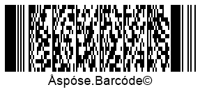

 
## **Overview**
In ***Aspose.BarCode for C++***, it is possible to perform the serialization of the barcode generation state and import it from XML using the specific functionality of class [*BarcodeGenerator*](https://reference.aspose.com/barcode/net/aspose.barcode.generation/barcodegenerator). The serialization of a [*BarcodeGenerator*](https://reference.aspose.com/barcode/net/aspose.barcode.generation/barcodegenerator) instance can be executed in two ways: saving it to an XML-file using the [*ExportToXml(String)*](https://reference.aspose.com/barcode/net/aspose.barcode.generation.barcodegenerator/exporttoxml/methods/1) or to a stream through the [*ExportToXml(Stream)*](https://reference.aspose.com/barcode/net/aspose.barcode.generation/barcodegenerator/methods/exporttoxml) method.  
  
Similarly, loading the barcode generation state from XML can be performed from a file using the [*ImportFromXml(String)*](https://reference.aspose.com/barcode/net/aspose.barcode.generation.barcodegenerator/importfromxml/methods/1) method or a stream through the [*ImportFromXml(Stream)*](https://reference.aspose.com/barcode/net/aspose.barcode.generation/barcodegenerator/methods/importfromxml) method.
  
{}*If you need any clarifications, feel free to reach out to [Aspose Technical Support](/barcode/net/technical-support/): ask your questions at [Aspose.Barcode Forum](https://forum.aspose.com/c/barcode/13) or contact [Aspose Paid Support Helpdesk](https://helpdesk.aspose.com/).*{}

## **Export Barcode Generation State to XML**
As previously mentioned, there are two ways to save the current state of class [*BarcodeGenerator*](https://reference.aspose.com/barcode/net/aspose.barcode.generation/barcodegenerator): to an XML file through the [*ExportToXml(String)*](https://reference.aspose.com/barcode/net/aspose.barcode.generation.barcodegenerator/exporttoxml/methods/1) function or to a stream using the [*ExportToXml(Stream)*](https://reference.aspose.com/barcode/net/aspose.barcode.generation/barcodegenerator/methods/exporttoxml) function. The code snippet below illustrates how to implement the serialization of a [*BarcodeGenerator*](https://reference.aspose.com/barcode/net/aspose.barcode.generation/barcodegenerator) instance to an XML file.   

## **Import Barcode Generation State from XML**
The current state of class [*BarcodeGenerator*](https://reference.aspose.com/barcode/net/aspose.barcode.generation/barcodegenerator) can be imported from an XML file using the [*ImportFromXml(String)*](https://reference.aspose.com/barcode/net/aspose.barcode.generation.barcodegenerator/importfromxml/methods/1) function or from a stream through the [*ImportFromXml(Stream)*](https://reference.aspose.com/barcode/net/aspose.barcode.generation/barcodegenerator/methods/importfromxml) function. The code sample provided below explains how to import the barcode generation state from an XML file.   

## **Save and Load Barcode Generation State from Stream**
The code snippet given below demonstrates how to save and load the barcode generation state from streams using two corresponding methods: [*ExportToXml(Stream)*](https://reference.aspose.com/barcode/net/aspose.barcode.generation/barcodegenerator/methods/exporttoxml) and [*ImportFromXml(Stream)*](https://reference.aspose.com/barcode/net/aspose.barcode.generation/barcodegenerator/methods/importfromxml). 

