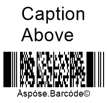
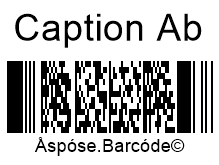

In the present article, you can find detailed information about how to manage text that can be placed onto barcode labels. To customize appearance-related parameters of barcode text in ***Aspose.BarCode for C++***, developers can adjust various settings, such as visibility, location, font, spacings, and wrapping modes.

{}*If you need any clarifications, feel free to reach out [Aspose Technical Support](/barcode/cpp/technical-support/): ask your questions at [Aspose.Barcode Forum](https://forum.aspose.com/c/barcode/13) or contact [Aspose Paid Support Helpdesk](https://helpdesk.aspose.com/).*{}

## **Overview**
Besides a barcode label itself, ***Aspose.BarCode for C++*** enables the possibility to place human-readable text onto generated barcode images. This text information may include three fields as shown in the scheme below: main text, top caption, and bottom caption; any of these elements can be hidden.
    
<p align="center"></p>
   
## **Barcode Text Settings**
Main barcode text represents short text information that is separated from the barcode label itself by some spacing. It can be placed on a barcode label in six different positions as shown in the scheme provided below: top left, top center, top right, bottom left, bottom center, or bottom right.
  
<p align="center"></p>

```cpp
// The path to the documents directory.
System::String dataDir = RunExamples::GetDataDir_ManageBarCodesImages();

// Instantiate barcode object set codeText and location
System::SharedPtr<BarcodeGenerator> generator = [&] { auto tmp_0 = System::MakeObject<BarcodeGenerator>(EncodeTypes::Code128); tmp_0->set_CodeText(u"1234567"); tmp_0->get_Parameters()->get_Barcode()->get_CodeTextParameters()->set_Location(CodeLocation::Above); return tmp_0; }();
generator->Save(dataDir + u"barcode-SetCodetextLocation_out.jpeg", BarCodeImageFormat::Jpeg);
System::Console::WriteLine(System::Environment::get_NewLine() + u"Barcode saved at " + dataDir);
```
   
### **Set Text Visibility**

In ***Aspose.BarCode for C++***, developers can decide whether barcode text needs to be displayed or not. In case, when there is no necessity to place additional text on a barcode image, it can be hidden as in the barcode sample image shown below.
  
<p align="center"></p>  
  
### **Set Text Positioning**
Barcode text can be adjusted on a barcode image in terms of its positioning, namely, location and alignment. To manage these parameters, it is necessary to initialize *Location* and *Alignment* properties of class [CodetextParameters]().
  
**Location**
  
The *Location* property is used to adjust the vertical position of barcode text: above or below the barcode label, as demonstrated in the figures below. By default, it is set to "Below". 
  
|Text Location|Above Barcode|Below Barcode|
| :-: | :-: | :-: |
| |||
    
**Alignment**
  
The *Alignment* property allows modifying the horizontal position of barcode text: on the left, in the center, or on the right, as demonstrated in the figures below. By default, it is set to "Center". 
  
|Text Alignment|Left|Center|Right|
| :-: | :-: | :-: | :-: |
| ||||
  
```cpp
// The path to the documents directory.
System::String dataDir = RunExamples::GetDataDir_ManageBarCodesImages();

// Instantiate barcode object and set differnt Properties
System::SharedPtr<BarcodeGenerator> generator = System::MakeObject<BarcodeGenerator>(EncodeTypes::Code128);

generator->set_CodeText(u"1234567");
generator->get_Parameters()->get_Barcode()->get_CodeTextParameters()->set_Alignment(TextAlignment::Center);

generator->Save(dataDir + u"barcode-SetCodeAlignment_out.jpg", BarCodeImageFormat::Jpeg);
```
  
### **Set Spacing between Barcode and Text**
By default, the spacing (gap) between a barcode label and text is rather small (2pt). Developers can increase or decrease this spacing by setting the *Space* property of class [*CodetextParameters*](https://reference.aspose.com/barcode/cpp/class/aspose.bar_code.generation.codetext_parameters/). This property is used to manage the spacing between barcode text and the barcode label from above or below depending on the barcode text position. It cannot be initialized for several symbologies, such as EAN8, EAN13, UPC E, UPC A, ISBN, ISMN, ISSN, and UpcaGs1DatabarCoupon.  
The images provided below illustrate the barcodes generated with different spacing settings, namely, five and forty pixels.
  
|Text Spacing|Is Set to 5 Pixels|Is Set to 40 Pixels|
| :-: | :-: | :-: |
| |||
    

```cpp
// The path to the documents directory.
System::String dataDir = RunExamples::GetDataDir_ManageBarCodes();
System::String dst = dataDir + u"codetext-appearence_out.jpg";

// Set the symbology type to Code128
System::SharedPtr<BarcodeGenerator> generator = System::MakeObject<BarcodeGenerator>(EncodeTypes::Code128, u"1234567");
generator->get_Parameters()->get_Barcode()->get_CodeTextParameters()->set_Alignment(TextAlignment::Center);
generator->get_Parameters()->get_Barcode()->get_CodeTextParameters()->set_Location(CodeLocation::Above);
generator->get_Parameters()->get_Barcode()->get_CodeTextParameters()->set_Color(System::Drawing::Color::get_Red());
generator->get_Parameters()->get_Barcode()->get_CodeTextParameters()->get_Space()->set_Millimeters(1.0f);

generator->Save(dst, BarCodeImageFormat::Jpeg);
System::Console::WriteLine(System::Environment::get_NewLine() + u"Barcode saved at " + dataDir);
```
### **Set Text Font**
To customize the font of barcode text, *Font* and *FontMode* properties of class [*CodetextParameters*](https://reference.aspose.com/barcode/cpp/class/aspose.bar_code.generation.codetext_parameters/) need to be initialized. By default, the *Font* property is set to Arial 5pt regular; it is ignored in the case when the *Auto* mode is set in the *FontMode* property.  
The *FontMode* property allows adjusting the font size of barcode text. If *FontMode* is set to "*Auto*", font size is calculated automatically based on the value of *xDimension* so that the text should preferably fit into a single line. In contrast, the *Manual* mode implies setting font size by hand. It is recommended to use *FontMode.Auto* especially when the *AutoSize* property is set to *AutoSizeMode.Nearest* or *AutoSizeMode.Interpolation*. Other parameters, such as font style, are initialized similarly in both *Auto* and *Manual* modes.  
  
The sample barcode images shown below have been generated using different font modes. 
    
|Font Setting Mode|Auto|Manual|
| :-: | :-: | :-: |
| |||
  

```cpp
// The path to the documents directory.
System::String dataDir = RunExamples::GetDataDir_ManageBarCodesImages();

// Instantiate barcode object and Set Code text font's type and size
System::SharedPtr<BarcodeGenerator> generator = System::MakeObject<BarcodeGenerator>(EncodeTypes::Code128);
generator->set_CodeText(u"Text");
generator->get_Parameters()->get_Barcode()->get_CodeTextParameters()->get_Font()->set_FamilyName(u"Verdana");
generator->get_Parameters()->get_Barcode()->get_CodeTextParameters()->get_Font()->get_Size()->set_Point(12.f);
						
generator->Save(dataDir + u"SetCodeTextFontFamilyNameAndSize_out.bmp", BarCodeImageFormat::Bmp);
System::Console::WriteLine(System::Environment::get_NewLine() + u"Barcode saved at " + dataDir);
```
<!--**Auto Mode**
  
The following code sample illustrates how to set barcode text font in the *Auto* mode.
  
``` csharp

BarcodeGenerator gen = new BarcodeGenerator(EncodeTypes.Pdf417, "Åspóse.Barcóde©");
gen.Parameters.Barcode.Pdf417.Rows = 12;
gen.Parameters.Barcode.XDimension.Pixels = 2;
//automatic font set
gen.Parameters.Barcode.CodeTextParameters.FontMode = FontMode.Auto;
gen.Parameters.Barcode.CodeTextParameters.Font.FamilyName = "Lucida Handwriting";
gen.Parameters.Barcode.CodeTextParameters.Font.Style = FontStyle.Underline;
//font size is ignored
gen.Parameters.Barcode.CodeTextParameters.Font.Size.Point = 10;
gen.Save($"{path}CodetextFontModeAuto.png", BarCodeImageFormat.Png);

``` 
  
**Manual Mode**
  
The code snippet provided below explains how to set barcode text font in the *Manual* mode.
    
``` csharp

BarcodeGenerator gen = new BarcodeGenerator(EncodeTypes.Pdf417, "Åspóse.Barcóde©");
gen.Parameters.Barcode.Pdf417.Rows = 12;
gen.Parameters.Barcode.XDimension.Pixels = 2;
//manual font set
gen.Parameters.Barcode.CodeTextParameters.FontMode = FontMode.Manual;
gen.Parameters.Barcode.CodeTextParameters.Font.FamilyName = "Lucida Handwriting";
gen.Parameters.Barcode.CodeTextParameters.Font.Style = FontStyle.Underline;
//font size is set
gen.Parameters.Barcode.CodeTextParameters.Font.Size.Point = 10;
gen.Save($"{path}CodetextFontModeManual.png", BarCodeImageFormat.Png);

``` 
-->

### **Set NoWrap Mode for Text**
The *NoWrap* property of class [*CodetextParameters*](https://reference.aspose.com/barcode/cpp/class/aspose.bar_code.generation.codetext_parameters/) is used to disable line breaks within the text when it is too long for a single row. If *NoWrap* is set to "*True*", barcode text is always displayed in one row. By default, the property is set to "*False*". 
The figures below illustrate the difference in resulting barcode images in cases when the *NoWrap* property is set to *True* and *False*.

|Text Wrapping Mode|***Wrap*** Mode|***NoWrap*** Mode|
| :-: | :-: | :-: |
| |||
  
 
## **Replace Barcode Text in 2D Barcodes**
In case when it is necessary to replace the barcode text for 2D barcodes with some other text with better readability without changing the barcode itself, developers can initialize the *TwoDDisplayText* property of class [*CodetextParameters*](https://reference.aspose.com/barcode/cpp/class/aspose.bar_code.generation.codetext_parameters/) by inserting new text to be displayed. This solution applies to the following 2D symbologies: Aztec Code, PDF417, Data Matrix, QR Code, MaxiCode, and DotCode.  
  
The following barcode image has been generated with barcode text replaced by initializing the *TwoDDisplayText* property.
  
<p align="center"></p>
  
  
## **Barcode Caption Settings**  
In some cases, it may be necessary to display additional text information on a barcode image. To address such a need, ***Aspose.BarCode for C++*** enables the possibility to place captions above and below the barcode label. As shown in the scheme below, captions have a property called *Padding* that is used to specify the size of spacings for all sides between a caption and the nearest element (barcode label itself, barcode text, or border). By default, both captions are hidden; they can be displayed by one or both at the same time.
     
<p align="center"></p>
  
### **Set Caption Visibility**

As previously mentioned, both captions, *CaptionAbove* and *CaptionBelow* contained in class [*BaseGenerationParameters*](https://reference.aspose.com/barcode/cpp/class/aspose.bar_code.generation.base_generation_parameters/), are hidden by default. To display any of them or both, it is required to initialize the *Visible* property of class [*CaptionParameters*](https://reference.aspose.com/barcode/cpp/class/aspose.bar_code.generation.caption_parameters/) and enter some text information in the *Text* property of the same class. Top and bottom captions can be placed on a barcode image independently from each other and barcode elements. If required, a caption can replace barcode text for 1D barcodes by setting the former visible and hiding the latter. The figures provided below illustrate how captions can be placed on generated barcode images.
  
|Caption Visibility|Above|Below|
| :-: | :-: | :-: |
| |||
  
    
### **Set Caption Positioning**
The *Alignment* property is used to adjust the horizontal positioning of captions in three ways: on the left, in the center, or on the right. By default, captions are placed in the center position. The figures below represent the barcode images generated with the top caption aligned in three ways.
  
|Caption Alignment|Left|Center|Right|
| :-: | :-: | :-: | :-: |
| ||||
  
   
### **Set Caption Padding**
The *Padding* property allows setting spacings for top and bottom captions. The default value is set to {5pt; 5pt; 0; 5pt} for *CaptionAbove* and to {0; 5pt; 5pt; 5pt} for *CaptionBelow* accoroding to the standard Windows Rectangle properties {Top, Left, Bottom, Right}. In the case of setting captions invisible this property is ignored. The sample barcode images provided below have been created adjusting the value of the *Padding* property for captions to five and forty pixels.
  
|Caption Padding|Is Set to 5 Pixels|Is Set to 40 Pixels|
| :-: | :-: | :-: |
| |||
  

### **Set Caption Font**
***Aspose.BarCode for C++*** does not provide the possibility to enable automatic font size adjustment depending on the size of a barcode label. Therefore, this parameter needs to be set manually. For top and bottom captions, it is possible to set the font, its style, and size independently. Caption font parameters can be adjusted using the *Font* property of class [*CaptionParameters*](https://reference.aspose.com/barcode/cpp/class/aspose.bar_code.generation.caption_parameters/). By default, this property is set to Arial 8pt regular. 
The barcode image below illustrates how the caption font can be displayed according to the desired settings.
   
<p align="center"></p>
  

### **Set NoWrap Mode for Caption**

The *NoWrap* property of class [*CaptionParameters*](https://reference.aspose.com/barcode/cpp/class/aspose.bar_code.generation.caption_parameters/) is intended to disable text line breaks in the case when a text string is too long to fit in a single line. When this property is set to "*True*", caption text is always displayed in a single line. The following barcode images show the difference in resulting barcode images in cases when the *NoWrap* property is initialized as *True* and *False*.
  
|Caption Wrapping|Is Set to *Wrap*|Is Set to *No Wrap*|
| :-: | :-: | :-: |
| |||
  
