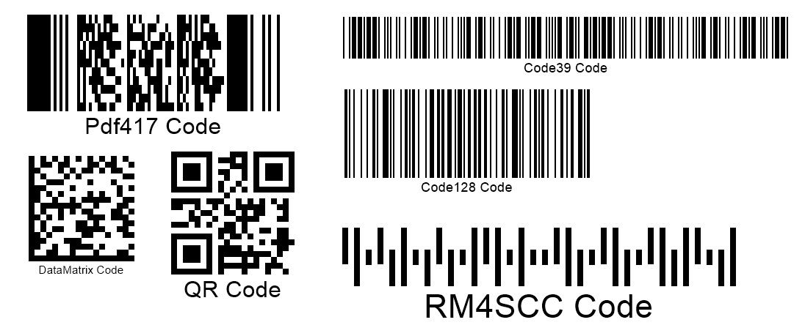

{}[Read Barcodes Online](https://products.aspose.app/barcode/recognize): You can test the quality of ***Aspose.BarCode*** recognition functionality and view the results online.{}

## **Overview**
***Aspose.BarCode for C++*** provides class [*BarCodeReader*](https://reference.aspose.com/barcode/cpp/class/aspose.bar_code.bar_code_recognition.bar_code_reader/) that enables barcode recognition from given images for more than 60 symbologies. In general, to perform barcode reading, first, it is necessary to specify the source of an image with barcodes to be detected as a file, a bitmap object, or a stream. Then, it is required to set target symbologies in the *DecodeType* parameter; otherwise, barcode recognition will take more time, as using the default setting *DecodeType.AllSupportedTypes* implies looking over all supported symbologies to check for their presence in the source barcode image. In addition, developers can explicitly set the target region/regions in an image for barcode reading. It can be done using a *Rectangle* object and allows avoiding the unnecessary search for barcodes in the image areas with no barcodes presented by default.

{}*If you need any clarifications, feel free to reach out to [Aspose Technical Support](/barcode/cpp/technical-support/): ask your questions at [Aspose.Barcode Forum](https://forum.aspose.com/c/barcode/13) or contact [Aspose Paid Support Helpdesk](https://helpdesk.aspose.com/).*{}

## **Basic Recognition Parameters**
To read barcodes presented in an image using ***Aspose.BarCode for C++***, the following steps need to be taken:
-	Specify the source to read barcodes (from an image file, a stream, or a bitmap), e.g. set the path to a source image
-	Select target symbologies for barcode recognition. By default, the *DecodeType* property is set to *DecodeType.AllSupportedTypes*; in this way, the barcode reading procedure will cover all supported barcode types. Such an approach leads to extra time costs required to complete barcode recognition.  
  
In ***Aspose.BarCode for C++***, barcode recognition is performed through the *ReadBarCodes* method that returns recognition results in an array of the *BarCodeResult* type.  
  

  

## **Get Recognition Results**
To get barcode recognition results, it is necessary to call the *ReadBarCodes* method that will output an array of the *BarCodeResult* type. At the same time, it is possible to get access to the current barcode reading output by using the *FoundBarCodes* property that stores recognition results or the *FoundCount* parameter that returns the number of barcodes that have been processed.  
  

## **Manual and Timeout Methods of Recognition Abortion**
Class [*BarCodeReader*](https://reference.aspose.com/barcode/cpp/class/aspose.bar_code.bar_code_recognition.bar_code_reader/) allows aborting the recognition process in case it is not further feasible. It can be done in two ways. The first option is to use the *TimeOut* property to interrupt the recognition process in case of exceeding the timeout value. By default, *TimeOut* is set to 0.  
  
The second way is to call the *Abort* method in case the recognition process has been launched in the other stream. This method does not block the entire process and returns control immediately.  
  
Both recognition abortion ways result in throwing an exception called *RecognitionAbortedException* in the case when the recognition process has not been completed.
  
