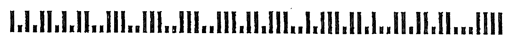
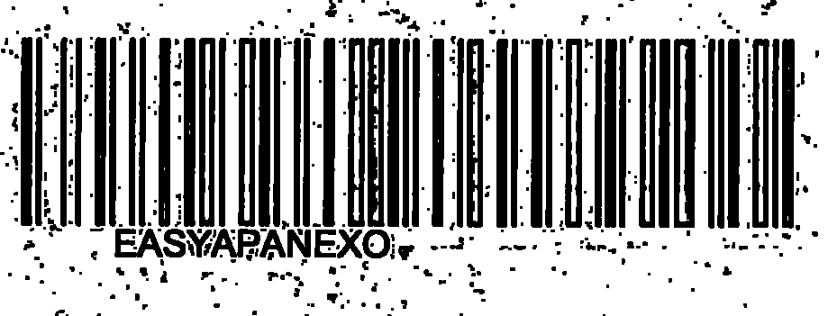
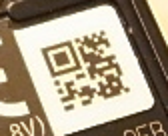

 
## **Read Barcode Images with Gaussian Noise**
Gaussian noise is one of the most frequent distortions that may affect the quality of barcode images. The most crucial problems arise in cases when barcode images are monochrome or when the distortion grain is much larger than the minimal barcode element. To mitigate such negative effects, it may be useful to apply median filtering methods that are suitable for both 1D and 2D barcodes. Although median filtering methods also introduce distortions by eliminating barcode elements together with noise, they still may be succeed in improving readability of key barcode modules.
  
{}*If you need any clarifications, feel free to reach out to [Aspose Technical Support](/barcode/cpp/technical-support/): ask your questions at [Aspose.Barcode Forum](https://forum.aspose.com/c/barcode/13) or contact [Aspose Paid Support Helpdesk](https://helpdesk.aspose.com/).*{}

### **Median Filtering for 2D Barcodes**
In ***Aspose.BarCode for C++***, median filtering can be implemented using a special property called [*AllowMedianSmoothing*](https://reference.aspose.com/barcode/net/aspose.barcode.barcoderecognition/qualitysettings/properties/allowmediansmoothing) and setting the median filtering window in the [*MedianSmoothingWindowSize*](https://reference.aspose.com/barcode/net/aspose.barcode.barcoderecognition/qualitysettings/properties/mediansmoothingwindowsize) parameter. Unlike 1D barcodes, automated selection of a suitable median filtering window is not supported for 2D symbologies.  
  
### **Median Filtering for 1D Barcodes**
One-dimensional filtering for linear barcodes can be set using a parameter called [*AllowSaltAndPaperFiltering*](https://reference.aspose.com/barcode/net/aspose.barcode.barcoderecognition/qualitysettings/properties/allowsaltandpaperfiltering). In this case, the filtering window size is selected automatically.  
  

### **Median Filtering for Postal Barcodes**
One-dimensional median filtering for postal symbologies can be performed using the [*AllowMicroWhiteSpotsRemoving*](https://reference.aspose.com/barcode/net/aspose.barcode.barcoderecognition/qualitysettings/properties/allowmicrowhitespotsremoving) property. The size of the filtering window is set automatically.  
  

### **Filter Out White Spots**
The presence of white spots in barcode images is a frequent problem that appears while sending documents with barcodes through fax transmission.  To mitigate this issue in ***Aspose.BarCode for C++***, it is possible to use a special setting called [*AllowWhiteSpotsRemoving*](https://reference.aspose.com/barcode/net/aspose.barcode.barcoderecognition/qualitysettings/properties/allowwhitespotsremoving) that allows filtering out not all Gaussian noise but only white spots.  
  

## **Reduce Barcode Image Size to Eliminate Visual Artifacts**
In some cases, distortions caused by excessive scaling of a barcode image can be mitigated by reducing the scale space. In ***Aspose.BarCode for C++***, it can be done using a special setting called [*AllowDecreasedImage*](https://reference.aspose.com/barcode/net/aspose.barcode.barcoderecognition/qualitysettings/properties/allowdecreasedimage). Its purpose is to reduce the size of an image and in this way, to facilitate barcode reading by eliminating visual artifacts.   
  

## **Read Barcodes with Erased or Displaced Bars**
While scanning or sending barcode images using fax transmission, the problem of displaced or erased bars in 1D barcode labels often appears, especially, in those printed out using ink-jet printers. To resolve this issue, ***Aspose.BarCode for C++*** provides two settings called [*AllowOneDWipedBarsRestoration*](https://reference.aspose.com/barcode/net/aspose.barcode.barcoderecognition/qualitysettings/properties/allowonedwipedbarsrestoration) and [*CheckMore1DVariants*](https://reference.aspose.com/barcode/net/aspose.barcode.barcoderecognition/qualitysettings/properties/checkmore1dvariants) that allow selecting the most suitable recognition option according to the checksum value and other barcode elements. However, it should be noted that enabling these settings may result in incorrect recognition of 1D barcodes.  
  

## **Read Evidently Incorrect Barcodes**
In cases when it is necessary just to detect the presence of barcodes regardless of their validity and corresponding recognition correctness, it is possible to enable two special settings called [*AllowIncorrectBarcodes*](https://reference.aspose.com/barcode/net/aspose.barcode.barcoderecognition/qualitysettings/properties/allowincorrectbarcodes) and [*ReadTinyBarcodes*](https://reference.aspose.com/barcode/net/aspose.barcode.barcoderecognition/qualitysettings/properties/readtinybarcodes). The first one is used to attempt performing partial barcode recognition even if the reading process has provided incorrect results; in this case, the barcode data is decoded with the [*Confidence*](https://reference.aspose.com/barcode/net/aspose.barcode.barcoderecognition/barcoderesult/properties/confidence) level being *None*, which means that the correctness of recognition is not guaranteed.  
  
The [*ReadTinyBarcodes*](https://reference.aspose.com/barcode/net/aspose.barcode.barcoderecognition/qualitysettings/properties/readtinybarcodes) option facilitates reading small barcode labels in large images. It is ignored if [*AllowIncorrectBarcodes*](https://reference.aspose.com/barcode/net/aspose.barcode.barcoderecognition/qualitysettings/properties/allowincorrectbarcodes) is set to *True*. However, enabling this parameter may result in recognizing false barcodes in place of actual text or tables.  
  

## **Read Severely Distorted QR Codes and Micro QR Codes**
***Aspose.BarCode for C++*** allows reading severely corrupted *QR Code* and *Micro QR Code* labels. This can be enabled by setting the [*AllowQRMicroQrRestoration*](https://reference.aspose.com/barcode/net/aspose.barcode.barcoderecognition/qualitysettings/properties/allowqrmicroqrrestoration) parameter. 

