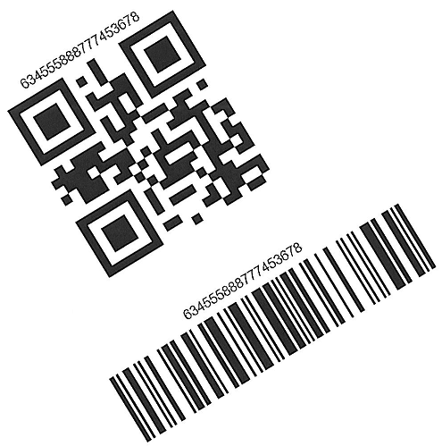

---
title: Get Barcode Placement Region and Orientation Angle
linktitle: Get Placement Region and Orientation
type: docs
description: "This article describes how to read barcode parameters"
keywords: "Read Barcode, Read Barcode from Stream, Scan Barcode from Image, Many Barcodes in One Image, Read PDF417 Barcode, Read PDF417 Metadata, Read Qr Code, Read QR Code Metadata, QR Code Structured Append, Aspose.BarCode, Read Barcode C++"
weight: 20
url: /cpp/get-placement-and-orientation/
---  
  
In some cases, developers may need to get information about the placement region of a source barcode and its orientation angle. To enable such a possibility, ***Aspose.BarCode for C++*** provides a group of properties called [*RegionParameters*](https://reference.aspose.com/barcode/net/aspose.barcode.barcoderecognition/barcoderegionparameters) that stores the following information:
-	Quadrangle – a quadrangle object that bounds a barcode
-	Rectangle - a rectangle object that bounds a barcode
-	Points – an array of points constituting a barcode
-	Angle – an orientation angle in degrees
  

