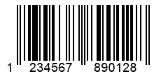

## **Read Metadata from PDF417 and Macro PDF417 Barcodes**

To read metadata from *PDF417* barcodes, ***Aspose.BarCode for C++*** provides a group of properties called [*Pdf417ExtendedParameters*](https://reference.aspose.com/barcode/net/aspose.barcode.barcoderecognition/pdf417extendedparameters) that includes various fields as listed in the table below.
  
|PDF417 Metadata Field|Description|
|---|---|
|[*Pdf417MacroFileID*](https://reference.aspose.com/barcode/net/aspose.barcode.generation/pdf417parameters/properties/pdf417macrofileid)|Unique identifier of a barcode series or PDF417 file|
|[*Pdf417MacroSegmentID*](https://reference.aspose.com/barcode/net/aspose.barcode.generation/pdf417parameters/properties/pdf417macrosegmentid)|Current segment identifier|
|[*Pdf417MacroSegmentsCount*](https://reference.aspose.com/barcode/net/aspose.barcode.generation/pdf417parameters/properties/pdf417macrosegmentscount)|Number of barcodes in a series|
|[*Pdf417MacroFileName*](https://reference.aspose.com/barcode/net/aspose.barcode.generation/pdf417parameters/properties/pdf417macrofilename)|Name of a file|
|[*Pdf417MacroChecksum*](https://reference.aspose.com/barcode/net/aspose.barcode.generation/pdf417parameters/properties/pdf417macrochecksum)|Checksum of a file that is calculated using CCITT-16 polynomial|
|[*Pdf417MacroFileSize*](https://reference.aspose.com/barcode/net/aspose.barcode.generation/pdf417parameters/properties/pdf417macrofilesize)|Total size of bytes in a series|
|[*Pdf417MacroTimeStamp*](https://reference.aspose.com/barcode/net/aspose.barcode.generation/pdf417parameters/properties/pdf417macrotimestamp)|Time of creating/sending the file|
|[*Pdf417MacroAddressee*](https://reference.aspose.com/barcode/net/aspose.barcode.generation/pdf417parameters/properties/pdf417macroaddressee)|Address of the file sender|
|[*Pdf417MacroSender*](https://reference.aspose.com/barcode/net/aspose.barcode.generation/pdf417parameters/properties/pdf417macrosender)|Name of the file sender|
  
  

  

## **Read Metadata from QR Code with Structured Append**
To read metadata from *QR Code* barcodes, it is necessary to use a group of properties called [*QrExtendedParameters*](https://reference.aspose.com/barcode/net/aspose.barcode.barcoderecognition/qrextendedparameters). These properties enable reading the information about *QR Code* barcodes with structured append that allows combining several *QR Code* labels into one. This information includes the following fields:

- [*QRStructuredAppendModeBarCodeIndex*](https://reference.aspose.com/barcode/net/aspose.barcode.barcoderecognition/qrextendedparameters/properties/qrstructuredappendmodebarcodeindex) - the sequence number of the current barcode (starting from 0)
- [*QRStructuredAppendModeBarCodesQuantity*](https://reference.aspose.com/barcode/net/aspose.barcode.barcoderecognition/qrextendedparameters/properties/qrstructuredappendmodebarcodesquantity) - the number of barcodes in a composite *QR Code* image (can take values from 2 to 16)
- [*QRStructuredAppendModeParityData*](https://reference.aspose.com/barcode/net/aspose.barcode.barcoderecognition/qrextendedparameters/properties/qrstructuredappendmodeparitydata) - a byte that serves as a checksum identifier. In the general case, it is calculated as *XOR* of all bytes in which UTF16BE symbols are encoded using two bytes  
  

  
## **Read Metadata from DataBar Barcodes with 2D Components**
To read metadata from *DataBar* barcodes with 2D components, the library provides a group of properties called [*DataBarExtendedParameters*](https://reference.aspose.com/barcode/net/aspose.barcode.barcoderecognition/databarextendedparameters). This property group includes a special parameter called [*Is2DCompositeComponent*](https://reference.aspose.com/barcode/net/aspose.barcode.barcoderecognition/databarextendedparameters/properties/is2dcompositecomponent) that is used to enable or disable a 2D component in *DataBar* barcodes.  
  

## **Read Metadata from 1D Barcodes**
For some 1D symbologies, such as, for example, *EAN 13*, it is possible to separate the decoded barcode data into barcode information itself and the checksum value. This can be done using a group of properties called [*OneDExtendedParameters*](https://reference.aspose.com/barcode/net/aspose.barcode.barcoderecognition/onedextendedparameters) that provides the following fields: [*Value*](https://reference.aspose.com/barcode/net/aspose.barcode.barcoderecognition/onedextendedparameters/properties/value) that stores the decoded 1D barcode text and [*CheckSum*](https://reference.aspose.com/barcode/net/aspose.barcode.barcoderecognition/onedextendedparameters/properties/checksum) that contains the result of checksum calculation.
  

  
## **Get Raw Data from Code 128 Barcodes**
The input data in *Code 128* barcodes can be encoded in three different modes: A, B, or C. The library provides a group of properties called [*Code128ExtendedParameters*](https://reference.aspose.com/barcode/net/aspose.barcode.barcoderecognition/code128extendedparameters) with a special field called [*Code128DataPortions*](https://reference.aspose.com/barcode/net/aspose.barcode.barcoderecognition/code128extendedparameters/properties/code128dataportions
) that stores decoded parts of the input data together with information about their encoding mode.

