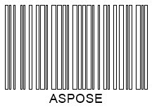
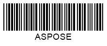

## **Overview**
**One-dimensional (1D)**, or linear, barcodes represent data by varying the width and spacing of parallel lines. In general, a linear barcode is composed of a leading margin, start character, message characters, check character (if any), stop character, and a trailing margin. Based on this framework, all known symbologies define their own encoding principles. In 1D barcodes, bars represent the binary digits, 0 and 1, that may constitute various sequences to encode numbers and then get processed by a digital unit.  

***Aspose.BarCode for C++*** enables customizing various parameters that are specific for 1D barcode generation. Particularly for 1D barcode standards, developers can adjust the following display properties: the height of bars, the mode of bar filling, the wide-to-narrow ratio, and the automatic correction of invalid barcode text.  
This article describes how to manage these properties using specified classes and properties of the library.  

{}*If you need any clarifications, feel free to reach out [Aspose Technical Support](/barcode/cpp/technical-support/): ask your questions at [Aspose.Barcode Forum](https://forum.aspose.com/c/barcode/13) or contact [Aspose Paid Support Helpdesk](https://helpdesk.aspose.com/).*{}

## **Bar Height Settings**
***Aspose.BarCode for C++*** allows adjusting the height of bars for 1D single-row barcodes. This can be done only when the barcode size property, [*AutoSizeMode*](https://reference.aspose.com/barcode/net/aspose.barcode.generation/basegenerationparameters/properties/autosizemode), is set to *AutoSizeMode.None* (see more information about this property [here](/barcode/net/image-formatting-and-display-settings/)). In this case, regardless of the value specified in the [*XDimension*](https://reference.aspose.com/barcode/net/aspose.barcode.generation/barcodeparameters/properties/xdimension) property, the bar height can be regulated using the [*BarHeight*](https://reference.aspose.com/barcode/net/aspose.barcode.generation/barcodeparameters/properties/barheight) property of class [*BarcodeParameters*](https://reference.aspose.com/barcode/net/aspose.barcode.generation/barcodeparameters). This property cannot be set for multiple-row barcodes and 2D barcodes.
  
|
**Bar Height**
|
**Is Set to 40 Pixels**
|
**Is Set to 80 Pixels**
|
| :-: | :-: | :-: |
| |||
  
  
## **Bar Filling Modes**
For 1D barcodes, ***Aspose.BarCode for C++*** provides a specific mode to generate barcodes with empty bars instead of filled ones. Such a modification can be done using the [*FilledBars*](https://reference.aspose.com/barcode/net/aspose.barcode.generation/barcodeparameters/properties/filledbars) property of class [*BarcodeParameters*](https://reference.aspose.com/barcode/net/aspose.barcode.generation/barcodeparameters). This property is set to *True* by default and is valid only for 1D barcodes. 
  
|
**Bar Filling**
|
**Filled**
|
**Empty**
|
| :-: | :-: | :-: |
| |||
  

## **Wide-to-Narrow Ratio**
Two-width 1D barcodes are based on the binary code principle, meaning that information is encoded using bars and spaces with two options of width: wide and narrow. Two-width barcode symbologies include the following: *Codabar*, *Code 11*, *Code 32*, *Code 39*, *DataLogic 2-of-5*, *IATA 2-of-5*, *Interleaved 2-of-5*, *ITF 6*, *ITF 14*, *Matrix 2-of-5*, *MSI*, *OPC*, *PZN*, *Standard 2-of-5*, and *VIN*.  
  
In ***Aspose.BarCode for C++***, the **wide-to-narrow ratio** defines the relation between the width of wide and narrow elements. It can be set in the [*WideNarrowRatio*](https://reference.aspose.com/barcode/net/aspose.barcode.generation/barcodeparameters/properties/widenarrowratio) property of class [*BarcodeParameters*](https://reference.aspose.com/barcode/net/aspose.barcode.generation/barcodeparameters). The larger if the value of the wide-to-narrow ratio, the larger is the width of the generated barcode. However, the readability also improves with an increase in this parameter. By default, *WideNarrowRatio* is set to 3.  
  
|
**Wide-to-Narrow Ratio**
|
**Is Set to 2**
|
**Is Set to 5**
|
| :-: | :-: | :-: |
| |||
  
  
## **Handle Exceptions on Incorrect Barcode Text**
In case when a barcode has not been created correctly due to invalid barcode text, by default, the library can generate additional dummy data to bring the barcode into line with the standard or delete conflicting characters. Thereafter barcode generation is considered successful.  
  
Developers can change this behaviour by setting the [*ThrowExceptionWhenCodeTextIncorrect*](https://reference.aspose.com/barcode/net/aspose.barcode.generation/barcodeparameters/properties/throwexceptionwhencodetextincorrect) property of [*BarcodeParameters*](https://reference.aspose.com/barcode/net/aspose.barcode.generation/barcodeparameters) class. When this property is enabled, an exception is thrown if the barcode text has been found incorrect or incomplete.
  
|
**Barcode Text Correctness**
|
**Correct with Valid Barcode Text**
|
**Adjusted with Invalid Barcode Text**
|
| :-: | :-: | :-: |
| |||
  
