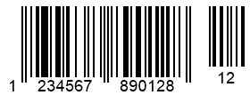

{}[Generate Barcodes Online](https://products.aspose.app/barcode/generate): You can check the quality of ***Aspose.BarCode*** barcode generation and view the results online.{}

## **Overview**
***Aspose.BarCode for C++*** enables the generation of *EAN 2* and *EAN 5* barcode types but only as supplements for the following symbologies: *EAN 13*, *EAN 8*, *Interleaved 2-of-5*, *ISBN*, *ISMN*, *ISSN*, *Standard 2-of-5*, *UPC-A*, and *UPC-E*. Supplement barcodes may be used to encode two or five complementary digits in addition to the main barcode and have their own checksum. The use of such barcodes is reserved in various industries; however, in production, they can also be applied to encode additional information, for example, about an item or its price. 
  
{}*If you need any clarifications, feel free to reach out [Aspose Technical Support](/barcode/cpp/technical-support/): ask your questions at [Aspose.Barcode Forum](https://forum.aspose.com/c/barcode/13) or contact [Aspose Paid Support Helpdesk](https://helpdesk.aspose.com/).*{}
  
## **Supplement Barcode Settings**
The main information about a product or an item needs to be encoded in the primary barcode. To insert additional (supplement) information, ***Aspose.BarCode for C++*** provides a specific property that is called *SupplementData* and is defined in class *SupplementParameters* corresponding to the *Supplement* property group. The *SupplementData* property is initialized by inputting 2 or 5 additional numerical digits for *EAN 2* or *EAN 5*, respectively. Then, the required barcode type is defined automatically according to the specified number of digits. Then, the size of a supplement barcode is calculated automatically depending on the main barcode parameters.  
  
Barcode labels provided below have been generated with *EAN 2* and *EAN 5* supplement data settings enabled for *EAN 13* barcodes.

|
**Supplement Barcode**
|
**EAN 2**
|
**EAN 5**
|
| :-: | :-: | :-: |
| |||
  

## **Adjust Spacing Between Main and Supplement Barcodes**
To define the size of a gap between the main and supplement barcodes, the library provides the *SupplementSpace* property of class *SupplementParameters*.  
  
Barcode samples demonstrated below have been generated with different gap settings.  
  
|
**Supplement Spacing**
|
**Is Set to 20 Pixels**
|
**Is Set to 40 Pixels**
|
| :-: | :-: | :-: |
| |||
  
