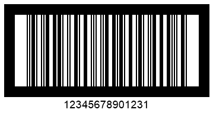
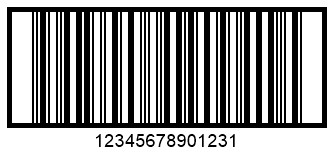

{}[Generate ITF Barcodes Online](https://products.aspose.app/barcode/generate/itf): You can check the quality of ***Aspose.BarCode*** generation for ITF barcodes and view the results online.{}

## **Overview**
The *ITF 14* type has been introduced by GS1 based on the *Interleaved 2-of-5* standard to encode trade identifiers defined as Global Trade Item Numbers (GTIN). This barcode type allows encoding a set of 14 digits where the last one is a check digit. The *ITF 6* symbology is mainly used as an addition to *ITF 14* to encode the quantity or weight of a trade item. *ITF* barcode labels usually have borders or frames of different types with a quiet zone. Such appearance-related settings may vary depending on particular industrial needs. In ***Aspose.BarCode for C++***, parameters of generated *ITF* barcodes can be adjusted using the [*ITF*](https://reference.aspose.com/barcode/net/aspose.barcode.generation/barcodeparameters/properties/itf) property group of class [*BarcodeParameters*](https://reference.aspose.com/barcode/net/aspose.barcode.generation/barcodeparameters). Further in the article, these properties are discussed in detail along with the instructions on their use and corresponding code samples.
  
{}*If you need any clarifications, feel free to reach out [Aspose Technical Support](/barcode/cpp/technical-support/): ask your questions at [Aspose.Barcode Forum](https://forum.aspose.com/c/barcode/13) or contact [Aspose Paid Support Helpdesk](https://helpdesk.aspose.com/).*{}

## **Frame Settings**
As mentioned above, *ITF* barcode labels may have frames of different types depending on industrial needs. ***Aspose.BarCode for C++*** allows customizing the appearance of *ITF* barcode frames according to specific requirements. Namely, it is possible to adjust frame style and thickness, as explained below.
 
### **Frame Style for ITF 14 and ITF 6**
In ***Aspose.BarCode for C++***, developers can set five different styles for *ITF* barcode frames, including the absence of such. It can be done by using the [*ItfBorderType*](https://reference.aspose.com/barcode/net/aspose.barcode.generation/itf14bordertype) enumeration that provides the following options: *None*, *Frame*, *Bar*, *FrameOut*, and *BarOut*. Note that *FrameOut* and *BarOut* allow placing the frame outside a barcode image without affecting its original height. 
  
Sample barcode labels provided below illustrate how the appearance of barcode frames will change depending on particular settings. 
  
|Frame Style|No Borders (*None*)|Normal Frame (*Frame*)|Horizontal Lines (*Bar*)|Outside Frame (*FrameOut*)|Outside Lines (*BarOut*)|
| :-: | :-: | :-: | :-: | :-: | :-: |
| ||||||
  
  
### **Border Thickness**
Depending on specific industrial requirements, the library enables adjusting border thickness for *ITF* barcodes by initializing the [*ItfBorderThickness*](https://reference.aspose.com/barcode/net/aspose.barcode.generation/itfparameters/properties/itfborderthickness) property of class [*ITFParameters*](https://reference.aspose.com/barcode/net/aspose.barcode.generation/itfparameters). By default, this property is set to 12 pt.
  
*ITF 14* barcode labels shown below have been generated with different border thickness settings.
  
|Border Thickness|Is Set to 5 Pixels|Is Set to 15 Pixels|
| :-: | :-: | :-: |
| |||
  
  
## **Quiet Zone Settings**
In ***Aspose.BarCode for C++***, developers can customize the size of the quiet zone in *ITF* barcodes by setting the [*QuietZoneCoef*](https://reference.aspose.com/barcode/net/aspose.barcode.generation/itfparameters/properties/quietzonecoef) property of class [*ITFParameters*](https://reference.aspose.com/barcode/net/aspose.barcode.generation/itfparameters). This property is defined as a relative coefficient to the [*XDimension*](https://reference.aspose.com/barcode/net/aspose.barcode.generation/barcodeparameters/properties/xdimension) parameter.  
  
*ITF 14* barcode images demonstrated below as examples have been generated using different settings for the quiet zone. 
  
|Quiet Zone Coefficient|Is Set to 10|Is Set to 30|
| :-: | :-: | :-: |
| |||
  
