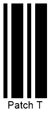

{}[Generate Patch Code Barcodes Online](https://products.aspose.app/barcode/generate/patchcode): You can check the quality of ***Aspose.BarCode*** generation for PatchCode barcodes and view the results online.{}

## **Overview**
*Patch Code* has been developed by Kodak to facilitate task management for automatic multi-page document scanning. Such barcodes do not encode any data; instead, a barcode pattern indicates an action to be performed. ***Aspose.BarCode for C++*** supports six main *Patch Code* patterns and allows generating barcodes in two modes: as separate barcode images to be placed on a page manually; as a complete A4 or US Letter page with the required resolution. *Patch Code* barcode labels are printed on four sides of a document; however, it is sufficient to read only one of them to complete scanning. This feature allows reading barcodes successfully even if pages are rotated.
  
{}*If you need any clarifications, feel free to reach out [Aspose Technical Support](/barcode/net/technical-support/): ask your questions at [Aspose.Barcode Forum](https://forum.aspose.com/c/barcode/13) or contact [Aspose Paid Support Helpdesk](https://helpdesk.aspose.com/).*{}

## **Supported Patterns**
***Aspose.BarCode for C++*** enables generating the main *Patch Code* set that consists of six patterns. The extended set of patterns introduced by Kodak later on and not standardized yet is not supported by the library. The main pattern set includes the following options: *Patch I*, *Patch II*, *Patch III*, *Patch IV*, *Patch T*, and *Patch VI*.  
  
Sample barcode labels provided below illustrate six basic *Patch Code* barcode types.
  
|
**PatchCode Standards**
|
**Patch I**
|
**Patch II**
|
**Patch III**
|
**Patch IV**
|
**Patch T**
|
**Patch VI**
|  
| :-: | :-: | :-: | :-: | :-: | :-: | :-: |
| |||||||
  
## **Generation Modes**
***Aspose.BarCode for C++*** enables different modes of generating *Patch Code* barcodes: as separate images or as A4 or US Letter pages with portrait or landscape orientation. Moreover, the library allows adding an optional complementary *QR Code* as a source of supplement information that may be required to process scanning tasks. Setting other barcode types as complementary barcodes is not supported.  
  
**Setting Generation Format** 
  
To set the format of *Patch Code* barcodes to be generated, it is necessary to initialize the [*PatchFormat*](https://reference.aspose.com/barcode/net/aspose.barcode.generation/patchcodeparameters/properties/patchformat) property of class [*PatchCodeParameters*](https://reference.aspose.com/barcode/net/aspose.barcode.generation/patchcodeparameters). This property can take the following values: 
- *PatchOnly* - basic *Patch Code* barcode images are generated. This value is used by default. 
- *A4* - A4 pages with portrait orientation are outputted having *Patch Code* barcodes on page borders and an optional QR code in the center.
- *A4_LANDSCAPE* - A4 pages with landscape orientation are created with *Patch Code* barcodes on page borders and an optional QR code in the center. 
- *US_Letter* - US Letter pages with portrait orientation are generated with *Patch Code* barcodes set on page borders and an optional QR code in the center.
- *US_Letter_LANDSCAPE* - US pages with landscape orientation are created with *Patch Code* barcodes placed on page borders and an optional QR code in the center.

**Adding Complementary QR Code**  
  
To add a complementary QR code to a *Patch Code* barcode page (A4 or US Letter), it is necessary to enter any text value into the [*ExtraBarcodeText*](https://reference.aspose.com/barcode/net/aspose.barcode.generation/patchcodeparameters/properties/extrabarcodetext) property of class [*PatchCodeParameters*](https://reference.aspose.com/barcode/net/aspose.barcode.generation/patchcodeparameters) and then set the [*Location*](https://reference.aspose.com/barcode/net/aspose.barcode.generation/codetextparameters/properties/location) property of class [*CodeTextParameters*](https://reference.aspose.com/barcode/net/aspose.barcode.generation/codetextparameters) to "*CodeLocation.None*".  
  
Images below illustrate the *Patch Code* barcode pages generated with and without adding complementary *QR Code* labels.
  
|
**Complementary QR Code**
|
**Is Disabled**
|
**Is Enabled**
|
| :-: | :-: | :-: |
| |<a href="patchcodea4withoutqr.png"> 

</a>|<a href="patchcodea4withqr.png"> 

</a>|
  
