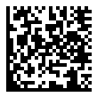
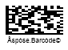

{}[Generate Data Matrix Barcodes Online](https://products.aspose.app/barcode/generate/datamatrix): You can test the quality of ***Aspose.BarCode*** generation for DataMatrix barcodes and get the results online.{}

## **Overview**
*Data Matrix* is a 2D matrix barcode type that allows generating barcodes of rectangular and square shapes. It is a widely used industrial barcode standard that enables encoding both sets of characters and byte streams. In the maximal configuration, *Data Matrix* barcodes include 144 rows and columns and contain up to 1,555 bytes or 3,116 numerical (2,335 ASCII) symbols. Moreover, *Data Matrix* implies including additional recovery information that is used for data integrity check and error correction so that even severely damaged barcodes can be recognized. This symbology supports two main standards that are described below.  
   
|
**Data Matrix Standard**
|
**Description**
|
|---|---|
|*ECC 000-140*|A set of the outdated standards that support only square-shaped configuration, rely on obsolete encoding methods, and enable error correction based on convolutional codes. They are not recommended for use and are currently applied only to work with industrial tasks based on outdated instructions|
|*ECC 200*|The actual standard that supports both square and rectangular barcodes, enables modern encoding methods, and provides Reed-Solomon error correction. It is recommended for use in all up-to-date applications|
  

### **Data Matrix Rectangular Extension**

Data Matrix Rectangular Extension (DMRE) has been introduced as a part of the Data Matrix standard to enable the creation of rectangular symbols. This subtype supports all capabilities of *ECC 200* and uses the Reed-Solomon error correction algorithm to detect and fix recognition errors. To generate DMRE barcodes, it is necessary to initialize the *DataMatrixVersion* parameter using the values from DMRE_8x48 to DMRE_26x64.

{}*If you need any clarifications, feel free to reach out [Aspose Technical Support](/barcode/cpp/technical-support/): ask your questions at [Aspose.Barcode Forum](https://forum.aspose.com/c/barcode/13) or contact [Aspose Paid Support Helpdesk](https://helpdesk.aspose.com/).*{}

## **Data Matrix ECC Standard Settings**
To select the required *Data Matrix* standard for barcode generation, ***Aspose.BarCode for C++*** provides the *DataMatrixEcc* property in class *DataMatrixParameters*. This property can be used to set one of the following standards: *ECC 000-140* (a set of the outdated standards) and *ECC 200* (the new universal standard). By default, *DataMatrixEcc* is set to *DataMatrixEccType.Ecc200*.
  
### ***ECC 200***
To enable the *ECC 200* standard explicitly, it is required to set the *DataMatrixEcc* property to *EccAuto* or *Ecc200*. This standard supports all data encoding modes defined in *DataMatrixEncodeMode*, including the possibility to work with Unicode characters using *CodeTextEncoding*. Recovery capacity values for error correction are strictly specified in the standard for barcodes of different sizes.  
  
 

  
  
### ***ECC 000-140***  
*ECC 000-140* standards are supported only by the following encoding modes specified in *DataMatrixEncodeMode*: *Auto*, *ASCII*, and *Bytes*; other encoding modes in this case are automatically processed as *Bytes*. *CodeTextEncoding*, *ECIEncoding*, *StructuredAppend*, *MacroCharacters*, and *IsReaderProgramming* properties are not supported in these standards. *ECC 000-140* standards have barcode layout settings that differ from those of *ECC 200*. Among each other, they vary only in terms of damaged data recovery percentage for different error correction levels, as outlined below. 
  
|Error Correction Level|Damage Recovery Capacity|
| :-: | :-: |
|**Ecc000**|Only error detection|
|**Ecc050**|2.8%|
|**Ecc080**|5.5%|
|**Ecc100**|12.6%|
|**Ecc140**|25%| 
  
<!--The following code sample shows how to enable the *ECC 140* standard.
  

BarcodeGenerator gen = new BarcodeGenerator(EncodeTypes.DataMatrix, "Åspóse.Barcóde©");
gen.Parameters.Barcode.XDimension.Pixels = 4;
//set DataMatrix ECC to 140
gen.Parameters.Barcode.DataMatrix.DataMatrixEcc = DataMatrixEccType.Ecc140;
gen.Save($"{path}DatamatrixEcc000140Basic.png", BarCodeImageFormat.Png);

-->

  
## **Encoding Mode Settings**
In ***Aspose.BarCode for C++***, developers can enable different encoding modes by initializing the *DataMatrixEncodeMode* property of class *DataMatrixParameters*. The library supports nine different encoding modes that are listed below. By default, the *Auto* encoding mode is set.
  
|Encoding Mode|Description|
|---|---|
|*Auto*|Similar to the *ASCII* encoding mode|
|*ASCII*|Allows encoding both ASCII symbols and byte streams, but the characters from 128 to 255 are encoded using 2 bytes. To encode an arbitrary byte stream, it is recommended to use the *Full* mode|
|*Bytes*|Encodes any character in 8 bits. This mode is the most suitable for encoding byte streams|
|*C40*, *Text*, *EDIFACT*, and *ANSIX12*|Encode only predefined character sets using the specialized industrial encodings, such as C40, Text, EDIFACT, and ANSI X12|
|*ExtendedCodetext*|Provides flexible encoding controls and the possibility to manually specify the required encoding for a part of *Codetext*|
  
If an input message to be encoded contains a Unicode character (any symbol with a value greater than 255), the entire message is processed using the encoding specified in *CodeTextEncoding*. This feature is valid for all encoding modes besides *Custom* in which the specified encoding is always enabled. The *Custom* mode is supported only for the *ECC 200* standard. 

### ***Auto* Encoding Modes**

The *Auto* mode enables automatic switching between different encoding modes to reach the smallest possible barcode size. In this mode, the data gets processed using the encoding specified in the *ECIEncoding* property. By default, ISO-8859-1 is set.  
  

   

### ***ASCII* Encoding Mode**
The *ASCII* encoding mode enables both encoding ASCII symbols and byte streams; however, encoding the characters from 128 to 255 requires 2 bytes.  
  
  

 

### ***Bytes* Mode**
The *Bytes* mode is intended to work with byte streams; each byte is encoded using 8 bits. 

 

### **Extended Encoding Controls in *ExtendedCodetext***
The *Extended Codetext* mode enables adding special control characters to the main barcode text. They serve to set extended control over data encoding and allow manually switching between different encoding schemes and ECI modes within a single barcode. To generate barcodes in this mode, it is recommended to use class *DataMatrixExtCodetextBuilder*.

<!--The following code snippet explains how to work with the *ExtendedCodetext* mode.  
  

//create barcode text
DataMatrixExtCodetextBuilder codetextBuilder = new DataMatrixExtCodetextBuilder();
codetextBuilder.AddECICodetext(ECIEncodings.UTF8, "犬Right狗");
codetextBuilder.AddECICodetextWithEncodeMode(ECIEncodings.UTF8, DataMatrixEncodeMode.C40, "ABCDE");
codetextBuilder.AddPlainCodetext("test");
codetextBuilder.AddCodetextWithEncodeMode(DataMatrixEncodeMode.Text, "abcde");

//generate barcode text
string codetext = codetextBuilder.GetExtendedCodetext();

//generate a Data Matrix barcode
using (var generator = new BarcodeGenerator(EncodeTypes.DataMatrix, codetext))
{
    generator.Parameters.Barcode.XDimension.Pixels = 4;
    generator.Parameters.Barcode.CodeTextParameters.TwoDDisplayText = "Extended Codetext";
    //set encode mode to ExtendedCodetext
    generator.Parameters.Barcode.DataMatrix.DataMatrixEncodeMode = DataMatrixEncodeMode.ExtendedCodetext;

    generator.Save($"{path}DatamatrixExtendedCodetext.png", BarCodeImageFormat.Png);

    //attempt to recognize the generated barcode
    using (var reader = new BarCodeReader(generator.GenerateBarCodeImage(), DecodeType.DataMatrix))
    {
        foreach (BarCodeResult result in reader.ReadBarCodes())
            Console.WriteLine("DatamatrixExtendedCodetext:" + result.CodeText);
    }
}

-->
  

 
  
### **Industrial Encoding Modes: *C40*, *Text*, *EDIFACT*, and *ANSIX12***
*C40*, *Text*, *EDIFACT*, and *ANSIX12* encoding modes can be used to encode information using specialized industrial encodings. These modes are intended for specific industrial tasks only.  
  
<!--The following code sample explains how to set the *C40* encoding mode.
  

BarcodeGenerator gen = new BarcodeGenerator(EncodeTypes.DataMatrix, "ASPOSE.BARCODE");
gen.Parameters.Barcode.XDimension.Pixels = 6;
//set encode mode to C40
gen.Parameters.Barcode.DataMatrix.DataMatrixEncodeMode = DataMatrixEncodeMode.C40;
gen.Save($"{path}DatamatrixEncodeModeC40.png", BarCodeImageFormat.Png);

-->
  

 
  
## **Layout Settings**
Data Matrix enables different layout variants, which can be set to generate barcodes with required size parameters. To set a layout, it is necessary to initialize the *DataMatrixVersion* property of class *DataMatrixParameters*. It can take the following values:
-	*Auto*. The barcode size will be selected automatically depending on the amount of data to be encoded.
-	Values from *ECC000_9x9* to *ECC000_140_49x49*. These options can be used to set the barcode size manually for standards *ECC000-140*. If the amount of input data does not fit to the selected format, an exception will be thrown.
-	Values from *ECC200_10x10* to *ECC200_144x144*, from *ECC200_8x18* to *ECC200_16x48*, as well as from *DMRE_8x48* to DMRE_26x64. These settings allow selecting the barcode size manually for standard *ECC200*. If the amount of input data does not fit to the selected format, an exception will be thrown.
  
|Layout Settings|*ECC 200 Mode* 12 Rows 64 Columns 64|*ECC 200 Mode* 22 Rows and 22 Columns|*ECC 140 Mode* 29 Rows and 29 Columns|
| :-: | :-: | :-: | :-: |
| ||||
  
<!--
using (BarcodeGenerator gen = new BarcodeGenerator(EncodeTypes.DataMatrix, "Åspóse.Barcóde©"))
{
    gen.Parameters.Barcode.XDimension.Pixels = 4;
    //set ECC type to Ecc200
    gen.Parameters.Barcode.DataMatrix.DataMatrixEcc = DataMatrixEccType.Ecc200;
    //set rows 22 columns 22
    gen.Parameters.Barcode.DataMatrix.DataMatrixVersion = DataMatrixVersion.ECC200_22x22;
    gen.Save($"{path}DatamatrixRows22Columns22Ecc200.png", BarCodeImageFormat.Png);
    //set rows 12 columns 64
    gen.Parameters.Barcode.DataMatrix.DataMatrixVersion = DataMatrixVersion.DMRE_12x64;
    gen.Save($"{path}DatamatrixRows12Columns64Ecc200.png", BarCodeImageFormat.Png);

    //set ECC type to Ecc140
    gen.Parameters.Barcode.DataMatrix.DataMatrixEcc = DataMatrixEccType.Ecc140;
    //set rows 23 columns 23
    gen.Parameters.Barcode.DataMatrix.DataMatrixVersion = DataMatrixVersion.ECC000_140_29x29;
    gen.Save($"{path}DatamatrixRows29Columns29Ecc140.png", BarCodeImageFormat.Png);
}
-->

## **Using Macro Characters**
In ***Aspose.BarCode for C++***, developers can use so-called macro characters for *Data Matrix* barcode generation. *Data Matrix* enables abbreviating industry-specific headers and trailers in one character. This feature allows reducing the number of characters required to encode data using specific structured formats and can be enabled to address some specific industrial requirements. A macro character needs to be placed be in the first character position.
  

 
  
## **Aspect Ratio Settings**
*Aspect Ratio* is the ratio between the width and height of a barcode. In ***Aspose.BarCode for C++***, developers can use the *AspectRatio* property of class *DataMatrixParameters* to adjust barcode proportions according to the X and Y coordinates. This parameter is defined as a relative coefficient to the value of *XDimension*. In general, the *Aspect Ratio* value should be set to 1.
  
|
**Aspect Ratio**
|
**Is Set to 1**
|
**Is Set to 0.5**
|
| :-: | :-: | :-: |
| |||
  

## **Structured Append**
*Structured Append* is a special mode, which allows combining together up to 16 Data Matrix symbols. To enable this mode, it is required to initialize three parameters described below:
-	*StructuredAppendBarcodesCount* - the number of barcodes (from 2 to 16)
-	*StructuredAppendBarcodeId* - the position of a barcode in a set (from 1 to *StructuredAppendBarcodesCount*)
-	*StructuredAppendFileId* - the identifier of a file (from 1 to 64516)

 

## **Hardware Reader Initialization**
To encode a special flag denoting that barcode data is intended to initialize a hardware barcode reader, it is required to set the *IsReaderProgramming* property. 
  

   