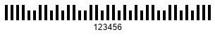
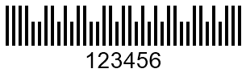
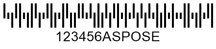
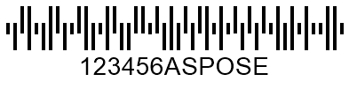
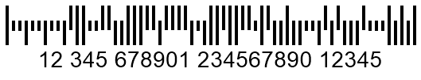
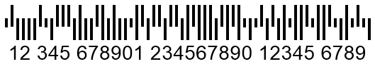

## **Overview**
*Postal* barcode standards have been developed to mitigate various limitations associated with 1D barcodes. In *Postal* barcodes, data encoding is based on varying the barcode height instead of the width of lines and spaces as in the case of 1D symbologies. In contrast, the information about horizontal parameters is ignored while reading *Postal* barcodes to avoid false-positive recognition.  
  
*Postal* barcodes have been specifically developed for the needs of postal services in different countries; therefore, they are functionally similar to each other and have only minor differences. There are two types of *Postal* symbologies: 2-state barcodes types that can take only numerical digits as input and 4-state ones that encode both numerical digits and uppercase English letters. Using the same barcode type, the former can encode one bit of data, while the latter can encode two bits.  
  
***Aspose.BarCode for C++*** enables generation and recognition of the following 2- and 4-state *postal* symbologies: *Planet*, *Postnet*, *RM4SCC*, *Dutch KIX*, *OneCode*, *Australia Post*, and *Mailmark*. These barcode types are discussed further in the article.
  
{}*If you need any clarifications, feel free to reach out [Aspose Technical Support](/barcode/cpp/technical-support/): ask your questions at [Aspose.Barcode Forum](https://forum.aspose.com/c/barcode/13) or contact Aspose [Paid Support Helpdesk](https://helpdesk.aspose.com/).*{}

## **Barcode Height Settings**
In ***Aspose.BarCode for C++***, the height and the width of *postal* barcodes are calculated automatically based on the value of the [*XDimension*](https://reference.aspose.com/barcode/net/aspose.barcode.generation/barcodeparameters/properties/xdimension) property. However, it is possible to manually adjust the barcode height regardless of the width by initializing the [*BarHeight*](https://reference.aspose.com/barcode/net/aspose.barcode.generation/barcodeparameters/properties/barheight) property of class [*BarcodeParameters*](https://reference.aspose.com/barcode/net/aspose.barcode.generation/barcodeparameters).  
  
Sample *Planet* and *RM4SCC* barcode images provided below have been generated with different bar height settings.  
  
|Planet Barcode Height| | |
|---| :-: | :-: |
|
**Bar Height**
|
**Is Set to None**
|
**Is Set to 100 Pixels**
|
| |||
  
|RM4SCC Barcode Height| | |
|---| :-: | :-: |
|
**Bar Height**
|
**Is Set to None**
|
**Is Set to 100 Pixels**
|
| |||
  

## **Bar Filling Settings**
In ***Aspose.BarCode for C++***, developers can customize the appearance of *Postal* barcodes by setting bars to have an empty filling. It can be done using the [*FilledBars*](https://reference.aspose.com/barcode/net/aspose.barcode.generation/barcodeparameters/properties/filledbars) property of class [*BarcodeParameters*](https://reference.aspose.com/barcode/net/aspose.barcode.generation/barcodeparameters). By default, the value of this property is set to *True* that results in generating barcode images with filled bars.  
  
*Planet* and *RM4SCC* barcodes labels shown below have been created with different settings for the bar filling property.
  
|Planet Bar Filling| | |
|---| :-: | :-: |
|**Bar Filling Settings**|
**Filled Bars**
|
**Empty Bars**
|
| |||
  
|RM4SCC Bar Filling| | |
|---| :-: | :-: |
|**Bar Filling Settings**|
**Filled Bars**
|
**Empty Bars**
|
| |||
  
  
## **2-State Postal Standards**
***Aspose.BarCode for C++*** supports the following 2-state postal standards: *Planet* and *Postnet*. Both of them can encode only numerical digits and contain an obligatory checksum. The length of a numerical set to be encoded is unlimited. 

### **Planet Symbology**
In the *Planet* symbology, each character is encoded by five bars so that three of them are full-length and two ones are half-length. 
  

 
  
### **Postnet Symbology**
The *Postnet* barcode type implies encoding each character using five bars where three ones are full-length and two ones are half-length. 
  

## **Generation Specifics for 2-State Barcodes**
In ***Aspose.BarCode for C++***, the generation of 2-state postal barcodes (*Planet* or *Postnet*) has several peculiarities related to the ways of handling incorrect input text and modifying the length of bars. These specifics are explained below.

### **Incorrect Input Text Handling**
By default, in case of passing incorrect input text to the [*CodeText*](https://reference.aspose.com/barcode/net/aspose.barcode.generation/barcodegenerator/properties/codetext) property (for *Planet* or *Postnet* barcodes, any symbols besides numerical ones), class [*BarcodeGenerator*](https://reference.aspose.com/barcode/net/aspose.barcode.generation/barcodegenerator) filters out the characters that do not match the required specification and creates a barcode based on the correct numerical digits only. However, if it is required to handle invalid symbols in [*CodeText*](https://reference.aspose.com/barcode/net/aspose.barcode.generation/barcodegenerator/properties/codetext) by throwing an exception, the [*ThrowExceptionWhenCodeTextIncorrect*](https://reference.aspose.com/barcode/net/aspose.barcode.generation/barcodeparameters/properties/throwexceptionwhencodetextincorrect) property needs to be set to *True*. As a result, the following exceptions will be thrown: "*Exception: Symbology Planet - codetext is invalid*"; "*Exception: Symbology Postnet - codetext is invalid*".  

### **Short Bar Height Settings**
In general, **2-state** barcodes are composed of long and short bars so that the latter is usually defined as the half-length of the former. In ***Aspose.BarCode for C++***, it is possible to customize the height of short bars manually by initializing the [*PostalShortBarHeight*](https://reference.aspose.com/barcode/net/aspose.barcode.generation/postalparameters/properties/postalshortbarheight) property of class [*PostalParameters*](https://reference.aspose.com/barcode/net/aspose.barcode.generation/postalparameters).  
  
Sample barcode labels demonstrated below have been generated with different short bar settings.
  
|
**Short Bar Height Settings**
|
**Is Set to 10 Pixels**
|
**Is Set to 30 Pixels**
|
| :-: | :-: | :-: |  
| |||
     
## **4-State Postal Standards**
***Aspose.BarCode for C++*** supports the following 4-state postal symbologies: *RM4SCC*, *Dutch KIX*, *OneCode*, *Australia Post*, and *Mailmark*. In **4-state** barcodes, four types of bars are specified to encode information: tracker (T), descender (D), ascender (A), and full (F) bars. Each input character is encoded using four separate bars so that two bits can be encoded by one digit. Most of the 4-state standards are based on the *RM4SCC* barcode type and accordingly, can encode numerical digits and uppercase English letters. All these postal standards besides *Dutch KIX* include a checksum. Moreover, *Australia Post* and *Mailmark* provide the possibility to recover information owing to Reed-Solomon error correction. The specificities of 4-state symbology generation in ***Aspose.BarCode for C++*** are discussed further in the article.

### **RM4SCC Symbology**
The *RM4SCC* symbology can encode numerical digits and uppercase English letters. Each character in a barcode is encoded using four bars so that two of them are extended upwards and the other two ones - downwards. Different combinations provide 36 possible symbols: 10 digits and 26 letters. This symbology requires obligatory check digit calculation that is based on the modulo 6 algorithm.
   

  

### **Dutch KIX Symbology**
The *Dutch KIX* symbology is utilized by the Royal Dutch TPG Post of Netherlands to perform automated sorting of postal codes and mails. Its specification is similar to that of the RM4SCC symbology and thus can be used to encode numerical digits and uppercase English letters. However, it does not have a checksum, as well as start and stop digits.
  

  
  
### **OneCode Symbology**
The *OneCode* standard can be used to encode messages composed of numerical digits with the length fixed to 20, 25, 29, or 31 digits into 65-bar barcodes. It includes an eleven-bit cyclic redundancy check to recognize errors but does not support error correction.  
  
|
**OneCode Standard**
|
**20 Digits**
|
**25 Digits**
|
**29 Digits**
|
**31 Digits**
|
| :-: | :-: | :-: | :-: | :-: |  
| |||||
  

### **Australia Post Symbology**
In the *Australia Post* symbology, input messages include specific 2-digit format control code (FCC) fields and 8-digit sorting code (SC) fields. FCC fields are used to indicate one of three available barcode types with different fixed lengths: 37, 52, or 67 bars. Depending on FCC, barcodes may contain a customer information (CI) field that identifies one of the encoding types that support numerical or alphanumeric symbols. They are predefined in the [*AustralianPostEncodingTable*](https://reference.aspose.com/barcode/net/aspose.barcode.generation/australianpostparameters/properties/australianpostencodingtable) property. Customer information can occupy 16 bars in 52-length barcodes or 31 bars in 67-length ones. The *Australia Post* standard contains a checksum and information used for Reed-Solomon data recovery.  
  
Input messages can be defined using one of the following formats specified in the table below.  
  
|
**FCC Field**
|
**Sorting Code Field**
|
**Customer Information Field**
|  
| :-: | :-: | :-: |
|11|8 digits|None|
|59|8 digits|16 bars|
|62|8 digits|31 bars|
  
The value of the FCC field can be defined using the [*AustralianPostEncodingTable*](https://reference.aspose.com/barcode/net/aspose.barcode.generation/australianpostparameters/properties/australianpostencodingtable) property that needs to be initialized with one of the values from the [*CustomerInformationInterpretingType*](https://reference.aspose.com/barcode/net/aspose.barcode/customerinformationinterpretingtype) enumeration (as represented in the table below).
  
|Australia Post Encoding Table|Supported Symbols|
| :-: |---|
|CTable|0-9, A-Z, a-z, space symbol, and #|
|NTable|0-9|
|Other|0, 1, 2, and 3 that correspond to H, A, D, and T states, respectively|
  
Barcode images demonstrated below have been generated using different setings for the FCC field.
  
|
**Australia Post Standards**
|
**FCC 11**
|
**FCC 59 Table**
|
**FCC 62N Table**
|
**FCC 62C Table**
|
**FCC 62C Other Table**
|
| :-: | :-: | :-: | :-: | :-: | :-: |  
| ||||||
  

### **Mailmark Symbology**
The *Mailmark* symbology has been developed by Royal Mail of the United Kingdom. Its specification is similar to that of *RM4SCC* but has the predefined data format requirements and does not provide extra space for the customer-specific content. This standard allows encoding numerical digits, uppercase English letters, and space. Moreover, barcodes contain a checksum and information to perform data recovery using Reed-Solomon error correction.  
*Mailmark* supports the following options: 
- **Type L** - encodes 26 characters 
- **Type C** - encodes 22 characters
  
|
**Mailmark Standards**
|
**Type C**
|
**Type L**
|
| :-: | :-: | :-: |  
| |||
  
