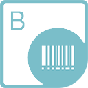

{} 

**Welcome to the Aspose.BarCode for JasperReports**

Aspose.BarCode for JasperReports provides a unique and robust solution to make your reports unique and more professional. It allows developers to display high-quality barcode labels on JasperReports. These barcode labels can be rendered in several formats: BMP, JPEG, GIF and PNG. Aspose.BarCode for JasperReports is a very lightweight component that supports more than 25 types of most popular barcode symbologies.

{} 

## **Aspose.BarCode for JasperReports Resources**

Following are the links to some useful resources you may need to accomplish your tasks.

- [Aspose.BarCode for JasperReports Online Documentation](/barcode/jasperreports/)
- [Aspose.BarCode for JasperReports Features](/barcode/jasperreports/features/)
- [Aspose.BarCode for JasperReports Release Notes](/barcode/jasperreports/release-notes/)
- [Aspose.BarCode for JasperReports Product Page](https://products.aspose.com/barcode/jasperreports)
- [Download Aspose.BarCode for JasperReports](https://downloads.aspose.com/barcode/jasperreports)
- [Aspose.BarCode for JasperReports Free Support Forum](https://forum.aspose.com/c/barcode)
- [Aspose.BarCode for JasperReports Paid Support Helpdesk](https://helpdesk.aspose.com/)