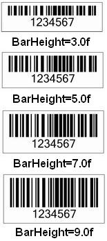

If developers want to control the height of the bars in the barcode, they can do it very easily by just calling the setBarHeight() method of the BarCodeAttributes class offered by Aspose.BarCode for JasperReports. The setBarHeight() method takes a float value to set the bar height, and it's measuring unit is the millimeter by default.

## **How to Set Height of Bars in the BarCode Image**
A barcode with different bar heights is shown in the figure below:

**The same barcode with different bar heights** 

To change the measuring unit of the bar height, use the setGraphicsUnit() method of any BarCodeAttributes class provided by Aspose.BarCode. The setGraphicsUnit() method accepts any pre-defined value in the GraphicsUnit class.

The pre-defined measuring units in the GraphicsUnit class are:
  
|**Measuring Units** |**Description** |
| :- | :- |
|Display |Specifies 1/75 inch as the unit of measure.|
|Document |Specifies the document unit (1/300 inch) as the unit of measure.|
|Inch |Specifies the inch as the unit of measure.|
|Millimeter |Specifies the millimeter as the unit of measure.|
|Pixel |Supported by the .NET Compact Framework. Specifies a device pixel as the unit of measure.|
|Point |Specifies a printer's point (1/72 inch) as the unit of measure.|
  
**Java**



 public class MyAttributes

{

    public static BarCodeAttributes Create(String text, String symbology, Color foreColor, String barHeight)

    {

        BarCodeAttributes b = new BarCodeAttributes();

        b.setCodeText(text);

        b.setSymbology(symbology);

        b.setForeColor(foreColor);

        b.setGraphicsUnit(GraphicsUnit.MILIMETER);

        b.setBarHeight(Float.parseFloat(barHeight));

        b.setCodeTextVisible(false);

        b.setAutoSize(true);

        return b;

    }

}



**JRXML**



 <image hAlign="Center">

  <reportElement x="0" y="600"  width="500" height="250" />

  <imageExpression class="net.sf.jasperreports.engine.JRRenderable">

    <![CDATA[new com.aspose.barcode.jr.BarCodeRenderer(MyAttributes.Create(

      "1234567", "Code128", java.awt.Color.BLACK, "3.0f")

   )]]>

  </imageExpression>

</image>


#### **Output**
The barcode generated by the above code is shown in the figure below.

**The barcode image generated after example code execution** 

