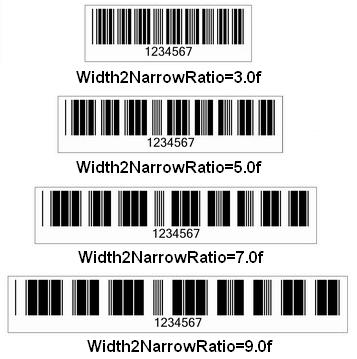

Some barcode symbologies like Code39, Interleaved2of5 and Standard2of5 allows you to set the ratio of wide to narrow elements (bar or space) of the barcode. In barcodes, a bar can be the printed black bar or the white space between the bars. So, a barcode is composed of two kinds of bars: black and white.

In such barcodes, some bars are wider than others. For example, in Code39 (sometimes called Code 3 from 9), each character is represented by 9 bars - 3 of which are wider than the others. The ratio of its bar widths can range from 2.2:1 to 3:1. To read the encoded information in a barcode reliably, the decoder must be able to differentiate between wide and narrow bars. 

To manage the widths of the bars (both wide and narrow) in a barcode, the wide to narrow ratio is configured. This ration is supported by Aspose.BarCode for JasperReports. 

## **Wide-to-Narrow Ratio Definition**
***Aspose.BarCode for JasperReports*** lets developers use the *BarCodeAttributes* class and its *setWideNarrowRatio* method to control the ratio of wide to narrow barcode elements. To specify the ratio, pass a float value to the *setWideNarrowRatio* method.

The same barcode, created with different ratios (in increasing order), is shown below.

**Different views of a barcode with different ratios** 

The wide to narrow ratio for Interleaved2of5 and Standard2of5 is configured in the same way as that of Code39.

The barcode image below was generated by the sample code.

**Barcode with a wide-to-narrow ratio of 3.0f** 

A complete example is given below to demonstrate the use of the wideNarrowRatio property. 

**Java**



 public class MyAttributes

{

    public static BarCodeAttributes Create(String text, String symbology, String wideNarrowRatio)

    {

        BarCodeAttributes b = new BarCodeAttributes();

        b.setCodeText(text);

        b.setSymbology(symbology);

        b.setWideNarrowRatio(Float.parseFloat(wideNarrowRatio));

        return b;

    }

}



**JRXML**



 <image hAlign="Center">

<reportElement x="0" y="600"  width="500" height="250" />                

<imageExpression class="net.sf.jasperreports.engine.JRRenderable">

   <![CDATA[new com.aspose.barcode.jr.BarCodeRenderer(MyAttributes.Create(

      "12345678", "CODE39EXTENDED", "3.0f")

   )]]>

</imageExpression>

</image>


