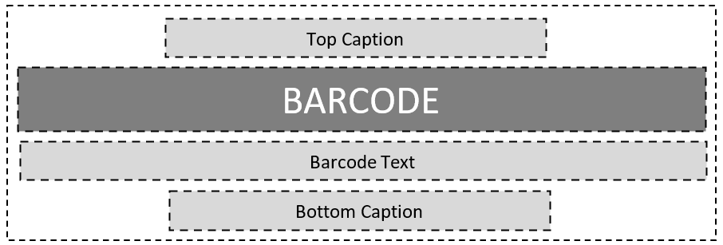
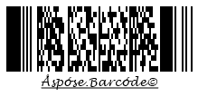
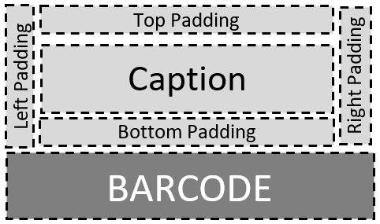

This article describes how to work with text placed on barcode images. ***Aspose.BarCode for Java*** enables customizing various parameters of barcode text: visibility, font, spacings, text location, and wrapping modes.

{}*If you need any clarifications, feel free to reach out [Aspose Technical Support](/barcode/java/technical-support/): ask your questions at [Aspose.Barcode Forum](https://forum.aspose.com/c/barcode/13) or contact [Aspose Paid Support Helpdesk](https://helpdesk.aspose.com/).*{}

## **Overview**
***Aspose.BarCode for Java*** allows developers to add human-readable text on barcode images in three different forms shown in the scheme below: main text label, top caption, and bottom caption. Any of these elements can be placed optionally or hidden.
    

   
## **Barcode Text**
The main barcode text label contains short text information detached from bars by spacings. This text label can take six positions, as explained in the figure below: top center, top left, top right, bottom center, bottom left, or bottom right.
  

   
### **Text Visibility**
***Aspose.BarCode for Java*** allows developers to visualize or hide barcode text. If there is no need to put human-readable text on a barcode image, barcode images can be generated without text labels, as shown in the example below.
  

  
   
<!--The following code sample shows how to disable barcode text.
  

BarcodeGenerator gen = new BarcodeGenerator(EncodeTypes.Pdf417, "Åspóse.Barcóde©");
gen.Parameters.Barcode.Pdf417.Rows = 12;
gen.Parameters.Barcode.XDimension.Pixels = 2;
//hide codetext
gen.Parameters.Barcode.CodeTextParameters.Location = CodeLocation.None;
gen.Save($"{path}CodetextHide.png", BarCodeImageFormat.Png);
--> 
  
### **Text Positioning**
The position of a barcode text label can be modified by customizing two parameters: alignment and location. These parameters can be adjusted through *setLocation* and *setAlignment* methods of class [CodetextParameters](https://reference.aspose.com/barcode/java/com.aspose.barcode.generation/CodetextParameters).
  
#### **Location**
  
The *setLocation* method allows setting the vertical position of a text label, namely, placing it above or below bars, as shown in figures below. The default setting is *Below*. 
  
|
**Text Location**
|
**Above Barcode**
|
**Below Barcode**
|
| :-: | :-: | :-: |
| |||
  
<!--The following code snippet explains how to modify the location of a barcode text label.
    

BarcodeGenerator gen = new BarcodeGenerator(EncodeTypes.Pdf417, "Åspóse.Barcóde©");
gen.Parameters.Barcode.Pdf417.Rows = 12;
gen.Parameters.Barcode.XDimension.Pixels = 2;
//codetext Above
gen.Parameters.Barcode.CodeTextParameters.Location = CodeLocation.Above;
gen.Save($"{path}CodetextLocationAbove.png", BarCodeImageFormat.Png);
//codetext Below
gen.Parameters.Barcode.CodeTextParameters.Location = CodeLocation.Below;
gen.Save($"{path}CodetextLocationBelow.png", BarCodeImageFormat.Png);
-->
    
#### **Alignment**
  
The *setAlignment* method is used to set the horizontal position of a text label in a barcode image: right-side, left-side, or center, as illustrated in figures below. The default setting of barcode text alignment is *Center*. 
  
|
**Text Alignment**
|
**Left**
|
**Center**
|
**Right**
|
| :-: | :-: | :-: | :-: |
| ||||
  
<!--The following code snippet explains how to manage barcode text alignment.
     

            BarcodeGenerator gen = new BarcodeGenerator(EncodeTypes.Pdf417, "Åspóse.Barcóde©");
            gen.Parameters.Barcode.Pdf417.Rows = 12;
            gen.Parameters.Barcode.XDimension.Pixels = 2;
            //set Codetext Left alignment
            gen.Parameters.Barcode.CodeTextParameters.Alignment = TextAlignment.Left;
            gen.Save($"{path}CodetextAligmentLeft.png", BarCodeImageFormat.Png);
            //set Codetext Center alignment
            gen.Parameters.Barcode.CodeTextParameters.Alignment = TextAlignment.Center;
            gen.Save($"{path}CodetextAligmentCenter.png", BarCodeImageFormat.Png);
            //set Codetext Right alignment
            gen.Parameters.Barcode.CodeTextParameters.Alignment = TextAlignment.Right;
            gen.Save($"{path}CodetextAligmentRight.png", BarCodeImageFormat.Png);
--> 
  
### **Spacing between Bars and Text Label**
The default spacing (gap) between bars and a text label is equal to 2pt. It is possible to modify this spacing using the *setSpace* method of class [*CodetextParameters*](https://reference.aspose.com/barcode/java/com.aspose.barcode.generation/CodetextParameters). This method is not applicable to several barcode types, including EAN 13, EAN 8, UPC-E, UPC-A, ISMN, ISBN, ISSN, and UpcaGs1DatabarCoupon.  
  
Sample barcode images shown below have been created with various spacing settings (five and forty pixels).
  
|
**Text Spacing**
|
**Is Set to 5 Pixels**
|
**Is Set to 40 Pixels**
|
| :-: | :-: | :-: |
| |||
  
<!--The following code sample explains how to manage spacings between bars and a text label.
   

BarcodeGenerator gen = new BarcodeGenerator(EncodeTypes.Pdf417, "Åspóse.Barcóde©");
gen.Parameters.Barcode.Pdf417.Rows = 12;
gen.Parameters.Barcode.XDimension.Pixels = 2;
//codetext space 5 pixels
gen.Parameters.Barcode.CodeTextParameters.Space.Pixels = 5;
gen.Save($"{path}CodetextSpace5Pixels.png", BarCodeImageFormat.Png);
//codetext space 40 pixels
gen.Parameters.Barcode.CodeTextParameters.Space.Pixels = 40;
gen.Save($"{path}CodetextSpace40Pixels.png", BarCodeImageFormat.Png);
--> 
  
### **Font Settings**
To manage barcode text font, ***Aspose.BarCode for Java*** provides *setFont* and *setFontMode* methods of class [*CodetextParameters*](https://reference.aspose.com/barcode/java/com.aspose.barcode.generation/CodetextParameters). The default font setting is Arial 5pt regular. This setting is ignored if the *Auto* mode is enabled using the *setFontMode* method. This method is used to manage font size settings automatically. If it is called passing the *Auto* value, font size is determined automatically based on *xDimension* in such a way that the text label should take only one text line. *FontMode.AUTO* is recommended when *AutoSizeMode.NEAREST* or *AutoSizeMode.INTERPOLATION* settings are enabled. Alternatilvely, setting *FontMode.MANUAL* allows managing font size manually. Other font parameters, including font style, are set similarly in both *Auto* and *Manual* modes.  
  
Barcode images shown below have been created with these two font modes. 
    
|
**Font Setting Mode**
|
**Auto**
|
**Manual**
|
| :-: | :-: | :-: |
| |||
  
<!--**Auto Mode**
  
The following code snippet explains how to customize text font in the *Auto* mode.
  

BarcodeGenerator gen = new BarcodeGenerator(EncodeTypes.Pdf417, "Åspóse.Barcóde©");
gen.Parameters.Barcode.Pdf417.Rows = 12;
gen.Parameters.Barcode.XDimension.Pixels = 2;
//automatic font set
gen.Parameters.Barcode.CodeTextParameters.FontMode = FontMode.Auto;
gen.Parameters.Barcode.CodeTextParameters.Font.FamilyName = "Lucida Handwriting";
gen.Parameters.Barcode.CodeTextParameters.Font.Style = FontStyle.Underline;
//font size is ignored
gen.Parameters.Barcode.CodeTextParameters.Font.Size.Point = 10;
gen.Save($"{path}CodetextFontModeAuto.png", BarCodeImageFormat.Png);
 
  
**Manual Mode**
  
The following code sample shows how to manage text font in the *Manual* mode.
    

BarcodeGenerator gen = new BarcodeGenerator(EncodeTypes.Pdf417, "Åspóse.Barcóde©");
gen.Parameters.Barcode.Pdf417.Rows = 12;
gen.Parameters.Barcode.XDimension.Pixels = 2;
//manual font set
gen.Parameters.Barcode.CodeTextParameters.FontMode = FontMode.Manual;
gen.Parameters.Barcode.CodeTextParameters.Font.FamilyName = "Lucida Handwriting";
gen.Parameters.Barcode.CodeTextParameters.Font.Style = FontStyle.Underline;
//font size is set
gen.Parameters.Barcode.CodeTextParameters.Font.Size.Point = 10;
gen.Save($"{path}CodetextFontModeManual.png", BarCodeImageFormat.Png);
--> 

### **NoWrap Mode for Text**
It is possible to avoid line breaks in text that is too long for a single row using the *setNoWrap* method of class [*CodetextParameters*](https://reference.aspose.com/barcode/java/com.aspose.barcode.generation/CodetextParameters). Whe the *True* setting is enabled, the text label is displayed in a single row reagrdless of the text length. The default setting is *False*. Barcode images shown below have been created with different *NoWrap* settings.

|
**Text Wrapping Mode**
|
**Wrap**
|
**No Wrap**
|
| :-: | :-: | :-: |
| |||
  
<!--The following code snippet allows enabling and disabling the *NoWrap* mode.
  

BarcodeGenerator gen = new BarcodeGenerator(EncodeTypes.Pdf417, "Extremely long codetext for one row");
gen.Parameters.Barcode.Pdf417.Rows = 12;
gen.Parameters.Barcode.XDimension.Pixels = 2;
gen.Parameters.Barcode.CodeTextParameters.FontMode = FontMode.Manual;
gen.Parameters.Barcode.CodeTextParameters.Font.Size.Point = 12;
//text wrapping mode on
gen.Parameters.Barcode.CodeTextParameters.NoWrap = false;
gen.Save($"{path}CodetextLongTextWrap.png", BarCodeImageFormat.Png);
//text wrapping mode off
gen.Parameters.Barcode.CodeTextParameters.NoWrap = true;
gen.Save($"{path}CodetextLongTextNoWrap.png", BarCodeImageFormat.Png);
--> 
  
## **Replacing Barcode Text in 2D Barcodes**
To replace barcode text in 2D barcodes with some other text label with improved readability without modifications of the barcode image itself, it is possible to call the *setTwoDDisplayText* method of class [*CodetextParameters*](https://reference.aspose.com/barcode/java/com.aspose.barcode.generation/CodetextParameters) and pass new text to be placed. This is applicable to selected 2D symbologies, including QR Code, Aztec, DataMatrix, MaxiCode, PDF417, and DotCode.  
  
The sample barcode image shown below has been created using the *TwoDDisplayText* setting.
  

  
<!--The following code snippet explains how to replace barcode text for 2D barcodes.
    

BarcodeGenerator gen = new BarcodeGenerator(EncodeTypes.Pdf417, "Åspóse.Barcóde©");
gen.Parameters.Barcode.Pdf417.Rows = 12;
gen.Parameters.Barcode.XDimension.Pixels = 2;
//replace visible codetext for 2D barcodes: Aztec, Pdf417, DataMatrix, QR, MaxiCode, DotCode
gen.Parameters.Barcode.CodeTextParameters.TwoDDisplayText = "Replace Codetext";
gen.Save($"{path}CodetextTwoDDisplayText.png", BarCodeImageFormat.Png);
-->
  
## **Caption**  
***Aspose.BarCode for Java*** allows dedvelopers to place additional text labels in a barcode image in form of captions above and below barcodes. As demonstrated in the figure below, such text captions have a parameter called *Padding* that allows modifying spacing size between captions and the nearest element (barcodes, main text label, or borders). Both text captions are disabled by default. If required, they can be shown by one or both simulteneously.
     

  
### **Caption Visibility**

As stated above, additional text captions *CaptionAbove* and *CaptionBelow* are disabled by default. When required, top and bottom caption labels can be shown independently from each other or enabled simulteneously. The *setVisible* method of class [*CaptionParameters*](https://reference.aspose.com/barcode/java/com.aspose.barcode.generation/CaptionParameters) can be used to display one or two captions. Then, caption text can be inserted through the *setText* method. If required, caption labels can replace main text in 1D barcodes by enabling the former and disabling the latter. Figures given below demonstrate how caption positioning options.
  
|
**Caption Visibility**
|
**Above**
|
**Below**
|
| :-: | :-: | :-: |
| |||
  
<!--The following code sample shows how to manage text captions.
  

BarcodeGenerator gen = new BarcodeGenerator(EncodeTypes.Pdf417, "Åspóse.Barcóde©");
gen.Parameters.Barcode.Pdf417.Rows = 12;
gen.Parameters.Barcode.XDimension.Pixels = 2;
//set Top Caption visible
gen.Parameters.CaptionAbove.Visible = true;
gen.Parameters.CaptionAbove.Text = "Caption Above";
gen.Parameters.CaptionAbove.Font.Size.Point = 14;
gen.Save($"{path}CaptionVisibleAbove.png", BarCodeImageFormat.Png);
gen.Parameters.CaptionAbove.Visible = false;
//set Bottom Caption visible
gen.Parameters.CaptionBelow.Visible = true;
gen.Parameters.CaptionBelow.Text = "Caption Below";
gen.Parameters.CaptionBelow.Font.Size.Point = 14;
gen.Save($"{path}CaptionVisibleBelow.png", BarCodeImageFormat.Png);
-->
    
### **Text Positioning**
The *setAlignment* method of class [*CaptionParameters*](https://reference.aspose.com/barcode/java/com.aspose.barcode.generation/CaptionParameters) allows modifying horizontal positions of caption labels in three directions: right, left, and center. The default position of captions is center. Figures shown below demonstrate barcode images with the top caption label with different alignment positions.
  
|
**Caption Alignment**
|
**Left**
|
**Center**
|
**Right**
|
| :-: | :-: | :-: | :-: |
| ||||
  
<!--The following code snippet shows how to adjust caption alignment.


BarcodeGenerator gen = new BarcodeGenerator(EncodeTypes.Pdf417, "Åspóse.Barcóde©");
gen.Parameters.Barcode.Pdf417.Rows = 12;
gen.Parameters.Barcode.XDimension.Pixels = 2;
gen.Parameters.CaptionAbove.Visible = true;
gen.Parameters.CaptionAbove.Text = "Caption Above";
gen.Parameters.CaptionAbove.Font.Size.Point = 14;
//set Caption Above Left alignment
gen.Parameters.CaptionAbove.Alignment = TextAlignment.Left;
gen.Save($"{path}CaptionAlignmentLeft.png", BarCodeImageFormat.Png);
//set Caption Above Center alignment
gen.Parameters.CaptionAbove.Alignment = TextAlignment.Center;
gen.Save($"{path}CaptionAlignmentCenter.png", BarCodeImageFormat.Png);
//set Caption Above Right alignment
gen.Parameters.CaptionAbove.Alignment = TextAlignment.Right;
gen.Save($"{path}CaptionAlignmentRight.png", BarCodeImageFormat.Png);
--> 
   
### **Caption Padding**
The *setPadding* method of class [*CaptionParameters*](https://reference.aspose.com/barcode/java/com.aspose.barcode.generation/CaptionParameters) can be used to manage spacings for text captions. By default, the spacinng value is set to {5pt; 5pt; 0; 5pt} for the top caption and {0; 5pt; 5pt; 5pt} for the bottom one according to the standard Rectangle setting {Top, Left, Bottom, Right}. This method is inapplicable when captions are disabled. Barcode images shown below have been generated with different padding settings.
  
|
**Caption Padding**
|
**Is Set to 5 Pixels**
|
**Is Set to 40 Pixels**
|
| :-: | :-: | :-: |
| |||
  
<!--The following code explains how to manage caption paddings.
  

BarcodeGenerator gen = new BarcodeGenerator(EncodeTypes.Pdf417, "Åspóse.Barcóde©");
gen.Parameters.Barcode.Pdf417.Rows = 12;
gen.Parameters.Barcode.XDimension.Pixels = 2;
gen.Parameters.CaptionAbove.Visible = true;
gen.Parameters.CaptionAbove.Text = "Caption Above";
gen.Parameters.CaptionAbove.Font.Size.Point = 14;
//Set all padding values around the Caption to 5 pixels
gen.Parameters.CaptionAbove.Padding.Left.Pixels = 5;
gen.Parameters.CaptionAbove.Padding.Top.Pixels = 5;
gen.Parameters.CaptionAbove.Padding.Right.Pixels = 5;
gen.Parameters.CaptionAbove.Padding.Bottom.Pixels = 5;
gen.Save($"{path}CaptionPadding5Pixels.png", BarCodeImageFormat.Png);
//Set all padding values around the Caption to 40 pixels
gen.Parameters.CaptionAbove.Padding.Left.Pixels = 40;
gen.Parameters.CaptionAbove.Padding.Top.Pixels = 40;
gen.Parameters.CaptionAbove.Padding.Right.Pixels = 40;
gen.Parameters.CaptionAbove.Padding.Bottom.Pixels = 40;
gen.Save($"{path}CaptionPadding40Pixels.png", BarCodeImageFormat.Png);
--> 

### **Caption Font**
***Aspose.BarCode for Java*** does not enable automatic font size setting based on barcode size. Accordingly, caption font size requires manual setting. For top and bottom captions, various parameters, including font style and size can be set independently. Caption font can be customized through special methods of class [*FontUnit*](https://reference.aspose.com/barcode/java/com.aspose.barcode.generation/FontUnit). The default setting for caption font is Arial 8pt regular. 
The barcode image shown below explains different caption font settings.
   

  
The following code snippet is given to demonstrate how to manage caption font parameters.
   
<!--
BarcodeGenerator gen = new BarcodeGenerator(EncodeTypes.Pdf417, "Åspóse.Barcóde©");
gen.Parameters.Barcode.Pdf417.Rows = 12;
gen.Parameters.Barcode.XDimension.Pixels = 2;
gen.Parameters.CaptionAbove.Visible = true;
gen.Parameters.CaptionAbove.Text = "Caption Above";
//set Caption font
gen.Parameters.CaptionAbove.Font.FamilyName = "Lucida Handwriting";
gen.Parameters.CaptionAbove.Font.Style = FontStyle.Underline;
gen.Parameters.CaptionAbove.Font.Size.Point = 10;
gen.Save($"{path}CaptionFont.png", BarCodeImageFormat.Png);
-->

### **NoWrap Mode for Caption**

The *setNoWrap* method of class [*CaptionParameters*](https://reference.aspose.com/barcode/java/com.aspose.barcode.generation/CaptionParameters) allows disabling text line breaks when a text string is too large to fit in one line. When this method is called passing the *True* value, caption text is always displayed as a single line. Barcode images below show the difference between *setNoWrao.TRUE* and *setNoWrao.FALSE* settings.
  
|
**Caption Wrapping**
|
**Is Set to *Wrap***
|
**Is Set to *No Wrap***
|
| :-: | :-: | :-: |
| |||
  
<!--The following code sample illustrates how to manage the *NoWrap* setting for barcode captions.
  

BarcodeGenerator gen = new BarcodeGenerator(EncodeTypes.Pdf417, "Åspóse.Barcóde©");
gen.Parameters.Barcode.Pdf417.Rows = 12;
gen.Parameters.Barcode.XDimension.Pixels = 2;
gen.Parameters.CaptionAbove.Visible = true;
gen.Parameters.CaptionAbove.Text = "Caption Above";
gen.Parameters.CaptionAbove.Font.Size.Point = 28;
//set wrapping Caption text mode
gen.Parameters.CaptionAbove.NoWrap = false;
gen.Save($"{path}CaptionTextWrap.png", BarCodeImageFormat.Png);
//set no wrapping Caption text mode
gen.Parameters.CaptionAbove.NoWrap = true;
gen.Save($"{path}CaptionTextNoWrap.png", BarCodeImageFormat.Png);
--> 