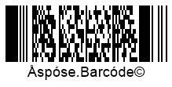
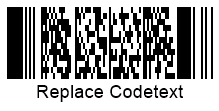

In the present article, you can find detailed information about how to manage text that can be placed onto barcode labels. To customize appearance-related parameters of barcode text in ***Aspose.BarCode for Java***, developers can adjust various settings, such as visibility, location, font, spacings, and wrapping modes.

{}*If you need any clarifications, feel free to reach out [Aspose Technical Support](/barcode/java/technical-support/): ask your questions at [Aspose.Barcode Forum](https://forum.aspose.com/c/barcode/13) or contact [Aspose Paid Support Helpdesk](https://helpdesk.aspose.com/).*{}

## **Overview**
Besides a barcode label itself, ***Aspose.BarCode for Java*** enables the possibility to place human-readable text onto generated barcode images. This text information may include three fields as shown in the scheme below: main text, top caption, and bottom caption; any of these elements can be hidden.
    

   
## **Barcode Text**
Main barcode text represents short text information that is separated from the barcode label itself by some spacing. It can be placed on a barcode label in six different positions as shown in the scheme provided below: top left, top center, top right, bottom left, bottom center, or bottom right.
  

   
### **Text Visibility**

In ***Aspose.BarCode for Java***, developers can decide whether barcode text needs to be displayed or not. In case, when there is no necessity to place additional text on a barcode image, it can be hidden as in the barcode sample image shown below.
  

  
   
The following code snippet explains how to hide barcode text.
  

BarcodeGenerator gen = new BarcodeGenerator(EncodeTypes.Pdf417, "Åspóse.Barcóde©");
gen.Parameters.Barcode.Pdf417.Rows = 12;
gen.Parameters.Barcode.XDimension.Pixels = 2;
//hide codetext
gen.Parameters.Barcode.CodeTextParameters.Location = CodeLocation.None;
gen.Save($"{path}CodetextHide.png", BarCodeImageFormat.Png);
 
  
### **Text Positioning**
Barcode text can be adjusted on a barcode image in terms of its positioning, namely, location and alignment. To manage these parameters, it is necessary to call *setLocation* and *setAlignment* methods of class [CodetextParameters](https://apireference.aspose.com/barcode/java/com.aspose.barcode.generation/CodetextParameters).
  
**Location**
  
The *setLocation* method is used to adjust the vertical position of barcode text: above or below the barcode label, as demonstrated in the figures below. By default, barcode text location is set to "Below". 
  
|
**Text Location**
|
**Above Barcode**
|
**Below Barcode**
|
| :-: | :-: | :-: |
| |||
  
The following code sample illustrates how to set the desired barcode text location.
    

BarcodeGenerator gen = new BarcodeGenerator(EncodeTypes.Pdf417, "Åspóse.Barcóde©");
gen.Parameters.Barcode.Pdf417.Rows = 12;
gen.Parameters.Barcode.XDimension.Pixels = 2;
//codetext Above
gen.Parameters.Barcode.CodeTextParameters.Location = CodeLocation.Above;
gen.Save($"{path}CodetextLocationAbove.png", BarCodeImageFormat.Png);
//codetext Below
gen.Parameters.Barcode.CodeTextParameters.Location = CodeLocation.Below;
gen.Save($"{path}CodetextLocationBelow.png", BarCodeImageFormat.Png);
 
  
**Alignment**
  
The *setAlignment* method allows modifying the horizontal position of barcode text: on the left, in the center, or on the right, as demonstrated in the figures below. By default, barcode text alignment is set to "Center". 
  
|
**Text Alignment**
|
**Left**
|
**Center**
|
**Right**
|
| :-: | :-: | :-: | :-: |
| ||||
  
The following code example shows how to specify the required barcode text alignment.
     

            BarcodeGenerator gen = new BarcodeGenerator(EncodeTypes.Pdf417, "Åspóse.Barcóde©");
            gen.Parameters.Barcode.Pdf417.Rows = 12;
            gen.Parameters.Barcode.XDimension.Pixels = 2;
            //set Codetext Left alignment
            gen.Parameters.Barcode.CodeTextParameters.Alignment = TextAlignment.Left;
            gen.Save($"{path}CodetextAligmentLeft.png", BarCodeImageFormat.Png);
            //set Codetext Center alignment
            gen.Parameters.Barcode.CodeTextParameters.Alignment = TextAlignment.Center;
            gen.Save($"{path}CodetextAligmentCenter.png", BarCodeImageFormat.Png);
            //set Codetext Right alignment
            gen.Parameters.Barcode.CodeTextParameters.Alignment = TextAlignment.Right;
            gen.Save($"{path}CodetextAligmentRight.png", BarCodeImageFormat.Png);
 
  
### **Spacing between Barcode and Text**
By default, the spacing (gap) between a barcode label and text is rather small (2pt). Developers can increase or decrease this spacing by calling the *setSpace* method of class [*CodetextParameters*](https://apireference.aspose.com/barcode/java/com.aspose.barcode.generation/CodetextParameters). This property is used to manage the spacing between barcode text and the barcode label from above or below depending on the barcode text position. It cannot be initialized for several symbologies, such as EAN8, EAN13, UPC E, UPC A, ISBN, ISMN, ISSN, and UpcaGs1DatabarCoupon.  
  
The images provided below illustrate the barcodes generated with different spacing settings, namely, five and forty pixels.
  
|
**Text Spacing**
|
**Is Set to 5 Pixels**
|
**Is Set to 40 Pixels**
|
| :-: | :-: | :-: |
| |||
  
The following code snippet is provided to demonstrate how to adjust the spacing between the barcode label and text.
   

BarcodeGenerator gen = new BarcodeGenerator(EncodeTypes.Pdf417, "Åspóse.Barcóde©");
gen.Parameters.Barcode.Pdf417.Rows = 12;
gen.Parameters.Barcode.XDimension.Pixels = 2;
//codetext space 5 pixels
gen.Parameters.Barcode.CodeTextParameters.Space.Pixels = 5;
gen.Save($"{path}CodetextSpace5Pixels.png", BarCodeImageFormat.Png);
//codetext space 40 pixels
gen.Parameters.Barcode.CodeTextParameters.Space.Pixels = 40;
gen.Save($"{path}CodetextSpace40Pixels.png", BarCodeImageFormat.Png);
 
  
### **Text Font Settings**
To customize the font of barcode text, *setFont* and *setFontMode* methods of class [*CodetextParameters*](https://apireference.aspose.com/barcode/java/com.aspose.barcode.generation/CodetextParameters) need to be used. By default, barcode text font is set to Arial 5pt regular; it is ignored in the case when the *Auto* mode is set using the *setFontMode* method, and the font size will be set automatically based on the *xDimension* value.  
  
The *setFontMode* method allows adjusting the font size of barcode text automatically. If the *setFontMode* method is called passing the *Auto* value, font size will be calculated automatically based on *xDimension* so that the text should preferably fit into a single line. It is recommended to use *FontMode.AUTO* specifically in the case of setting *AutoSizeMode.NEAREST* or *AutoSizeMode.INTERPOLATION*. In contrast, the *Manual* mode implies setting font size manually. Other parameters, such as font style, can be adjusted in *Auto* and *Manual* modes similarly.  
  
The sample barcode images shown below have been generated using different font modes. 
    
|
**Font Setting Mode**
|
**Auto**
|
**Manual**
|
| :-: | :-: | :-: |
| |||
  
**Auto Mode**
  
The following code sample illustrates how to set barcode text font in the *Auto* mode.
  

BarcodeGenerator gen = new BarcodeGenerator(EncodeTypes.Pdf417, "Åspóse.Barcóde©");
gen.Parameters.Barcode.Pdf417.Rows = 12;
gen.Parameters.Barcode.XDimension.Pixels = 2;
//automatic font set
gen.Parameters.Barcode.CodeTextParameters.FontMode = FontMode.Auto;
gen.Parameters.Barcode.CodeTextParameters.Font.FamilyName = "Lucida Handwriting";
gen.Parameters.Barcode.CodeTextParameters.Font.Style = FontStyle.Underline;
//font size is ignored
gen.Parameters.Barcode.CodeTextParameters.Font.Size.Point = 10;
gen.Save($"{path}CodetextFontModeAuto.png", BarCodeImageFormat.Png);
 
  
**Manual Mode**
  
The code snippet provided below explains how to set barcode text font in the *Manual* mode.
    

BarcodeGenerator gen = new BarcodeGenerator(EncodeTypes.Pdf417, "Åspóse.Barcóde©");
gen.Parameters.Barcode.Pdf417.Rows = 12;
gen.Parameters.Barcode.XDimension.Pixels = 2;
//manual font set
gen.Parameters.Barcode.CodeTextParameters.FontMode = FontMode.Manual;
gen.Parameters.Barcode.CodeTextParameters.Font.FamilyName = "Lucida Handwriting";
gen.Parameters.Barcode.CodeTextParameters.Font.Style = FontStyle.Underline;
//font size is set
gen.Parameters.Barcode.CodeTextParameters.Font.Size.Point = 10;
gen.Save($"{path}CodetextFontModeManual.png", BarCodeImageFormat.Png);
 

### **NoWrap Mode for Text**
The *setNoWrap* method of class [*CodetextParameters*](https://apireference.aspose.com/barcode/java/com.aspose.barcode.generation/CodetextParameters) is used to disable line breaks within the text when it is too long for a single row. If *NoWrap* is set to "*True*", barcode text is always displayed in one row. By default, the property is set to "*False*". 
The figures below illustrate the difference in resulting barcode images in cases when the *NoWrap* property is set to *True* and *False*.

|
**Text Wrapping Mode**
|
**Wrap**
|
**No Wrap**
|
| :-: | :-: | :-: |
| |||
  
The following code sample illustrates how to enable and disable the *NoWrap* mode.
  

BarcodeGenerator gen = new BarcodeGenerator(EncodeTypes.Pdf417, "Extremely long codetext for one row");
gen.Parameters.Barcode.Pdf417.Rows = 12;
gen.Parameters.Barcode.XDimension.Pixels = 2;
gen.Parameters.Barcode.CodeTextParameters.FontMode = FontMode.Manual;
gen.Parameters.Barcode.CodeTextParameters.Font.Size.Point = 12;
//text wrapping mode on
gen.Parameters.Barcode.CodeTextParameters.NoWrap = false;
gen.Save($"{path}CodetextLongTextWrap.png", BarCodeImageFormat.Png);
//text wrapping mode off
gen.Parameters.Barcode.CodeTextParameters.NoWrap = true;
gen.Save($"{path}CodetextLongTextNoWrap.png", BarCodeImageFormat.Png);
 
  
## **Replacing Barcode Text in 2D Barcodes**
In case when it is necessary to replace the barcode text for 2D barcodes with some other text with better readability without changing the barcode itself, developers can call the *setTwoDDisplayText* method of class [*CodetextParameters*](https://apireference.aspose.com/barcode/java/com.aspose.barcode.generation/CodetextParameters) by inserting new text to be displayed. This solution applies to the following 2D symbologies: Aztec, Pdf417, DataMatrix, QR, MaxiCode, and DotCode.  
  
The following barcode image has been generated with barcode text replaced by initializing the *TwoDDisplayText* property.
  

  
The following code snippet explains how to replace barcode text for 2D barcodes.
    

BarcodeGenerator gen = new BarcodeGenerator(EncodeTypes.Pdf417, "Åspóse.Barcóde©");
gen.Parameters.Barcode.Pdf417.Rows = 12;
gen.Parameters.Barcode.XDimension.Pixels = 2;
//replace visible codetext for 2D barcodes: Aztec, Pdf417, DataMatrix, QR, MaxiCode, DotCode
gen.Parameters.Barcode.CodeTextParameters.TwoDDisplayText = "Replace Codetext";
gen.Save($"{path}CodetextTwoDDisplayText.png", BarCodeImageFormat.Png);

  
## **Caption**  
In some cases, it may be necessary to display additional text information on a barcode image. To address such a need, ***Aspose.BarCode for Java*** enables the possibility to place captions above and below the barcode label. As shown in the scheme below, captions have a property called *Padding* that is used to specify the size of spacings for all sides between a caption and the nearest element (barcode label itself, barcode text, or border). By default, both captions are hidden; they can be displayed by one or both at the same time.
     

  
### **Caption Visibility**

As previously mentioned, both captions, *CaptionAbove* and *CaptionBelow* are hidden by default. To display any of them or both, it is required to call the *setVisible* method of class [*CaptionParameters*](https://apireference.aspose.com/barcode/java/com.aspose.barcode.generation/CaptionParameters) and caption text using the *setText* method of the same class. Top and bottom captions can be placed in a barcode image independently from each other and barcode elements. If required, a caption can replace barcode text for 1D barcodes by setting the former visible and hiding the latter. The figures provided below illustrate how captions can be placed on generated barcode images.
  
|
**Caption Visibility**
|
**Above**
|
**Below**
|
| :-: | :-: | :-: |
| |||
  
The following code snippet explains how to set captions visible.
  

BarcodeGenerator gen = new BarcodeGenerator(EncodeTypes.Pdf417, "Åspóse.Barcóde©");
gen.Parameters.Barcode.Pdf417.Rows = 12;
gen.Parameters.Barcode.XDimension.Pixels = 2;
//set Top Caption visible
gen.Parameters.CaptionAbove.Visible = true;
gen.Parameters.CaptionAbove.Text = "Caption Above";
gen.Parameters.CaptionAbove.Font.Size.Point = 14;
gen.Save($"{path}CaptionVisibleAbove.png", BarCodeImageFormat.Png);
gen.Parameters.CaptionAbove.Visible = false;
//set Bottom Caption visible
gen.Parameters.CaptionBelow.Visible = true;
gen.Parameters.CaptionBelow.Text = "Caption Below";
gen.Parameters.CaptionBelow.Font.Size.Point = 14;
gen.Save($"{path}CaptionVisibleBelow.png", BarCodeImageFormat.Png);

    
### **Text Positioning**
The *setAlignment* method of class [*CaptionParameters*](https://apireference.aspose.com/barcode/java/com.aspose.barcode.generation/CaptionParameters) is used to adjust the horizontal positioning of captions in three ways: on the left, in the center, or on the right. By default, captions are placed in the center position. The figures below represent the barcode images generated with the top caption aligned in three ways.
  
|
**Caption Alignment**
|
**Left**
|
**Center**
|
**Right**
|
| :-: | :-: | :-: | :-: |
| ||||
  
The following code sample shows how to adjust caption alignment.


BarcodeGenerator gen = new BarcodeGenerator(EncodeTypes.Pdf417, "Åspóse.Barcóde©");
gen.Parameters.Barcode.Pdf417.Rows = 12;
gen.Parameters.Barcode.XDimension.Pixels = 2;
gen.Parameters.CaptionAbove.Visible = true;
gen.Parameters.CaptionAbove.Text = "Caption Above";
gen.Parameters.CaptionAbove.Font.Size.Point = 14;
//set Caption Above Left alignment
gen.Parameters.CaptionAbove.Alignment = TextAlignment.Left;
gen.Save($"{path}CaptionAlignmentLeft.png", BarCodeImageFormat.Png);
//set Caption Above Center alignment
gen.Parameters.CaptionAbove.Alignment = TextAlignment.Center;
gen.Save($"{path}CaptionAlignmentCenter.png", BarCodeImageFormat.Png);
//set Caption Above Right alignment
gen.Parameters.CaptionAbove.Alignment = TextAlignment.Right;
gen.Save($"{path}CaptionAlignmentRight.png", BarCodeImageFormat.Png);
 
   
### **Caption Padding**
The *setPadding* method of class [*CaptionParameters*](https://apireference.aspose.com/barcode/java/com.aspose.barcode.generation/CaptionParameters) allows setting spacings for top and bottom captions. The default value is set to {5pt; 5pt; 0; 5pt} for *CaptionAbove* and to {0; 5pt; 5pt; 5pt} for *CaptionBelow* in line with standard Rectangle properties {Top, Left, Bottom, Right}. In the case of setting captions invisible this property is ignored. The sample barcode images provided below have been created passing the values of five and forty pixels to the *setPadding* methods.
  
|
**Caption Padding**
|
**Is Set to 5 Pixels**
|
**Is Set to 40 Pixels**
|
| :-: | :-: | :-: |
| |||
  
The following code snippet demonstrates how to set caption paddings.
  

BarcodeGenerator gen = new BarcodeGenerator(EncodeTypes.Pdf417, "Åspóse.Barcóde©");
gen.Parameters.Barcode.Pdf417.Rows = 12;
gen.Parameters.Barcode.XDimension.Pixels = 2;
gen.Parameters.CaptionAbove.Visible = true;
gen.Parameters.CaptionAbove.Text = "Caption Above";
gen.Parameters.CaptionAbove.Font.Size.Point = 14;
//Set all padding values around the Caption to 5 pixels
gen.Parameters.CaptionAbove.Padding.Left.Pixels = 5;
gen.Parameters.CaptionAbove.Padding.Top.Pixels = 5;
gen.Parameters.CaptionAbove.Padding.Right.Pixels = 5;
gen.Parameters.CaptionAbove.Padding.Bottom.Pixels = 5;
gen.Save($"{path}CaptionPadding5Pixels.png", BarCodeImageFormat.Png);
//Set all padding values around the Caption to 40 pixels
gen.Parameters.CaptionAbove.Padding.Left.Pixels = 40;
gen.Parameters.CaptionAbove.Padding.Top.Pixels = 40;
gen.Parameters.CaptionAbove.Padding.Right.Pixels = 40;
gen.Parameters.CaptionAbove.Padding.Bottom.Pixels = 40;
gen.Save($"{path}CaptionPadding40Pixels.png", BarCodeImageFormat.Png);
 

### **Caption Font**
***Aspose.BarCode for Java*** does not provide the possibility to enable automatic font size adjustment depending on the size of a barcode label. Therefore, this parameter needs to be set manually. For top and bottom captions, it is possible to set the font, its style, and size independently. Caption font parameters can be adjusted using methods of class [*FontUnit*](https://apireference.aspose.com/barcode/java/com.aspose.barcode.generation/FontUnit). By default, caption font is set to Arial 8pt regular. 
The barcode image below illustrates how the caption font can be displayed according to desired settings.
   

  
The following code sample explains how to adjust caption font settings.
   

BarcodeGenerator gen = new BarcodeGenerator(EncodeTypes.Pdf417, "Åspóse.Barcóde©");
gen.Parameters.Barcode.Pdf417.Rows = 12;
gen.Parameters.Barcode.XDimension.Pixels = 2;
gen.Parameters.CaptionAbove.Visible = true;
gen.Parameters.CaptionAbove.Text = "Caption Above";
//set Caption font
gen.Parameters.CaptionAbove.Font.FamilyName = "Lucida Handwriting";
gen.Parameters.CaptionAbove.Font.Style = FontStyle.Underline;
gen.Parameters.CaptionAbove.Font.Size.Point = 10;
gen.Save($"{path}CaptionFont.png", BarCodeImageFormat.Png);


### **NoWrap Mode for Caption**

The *setNoWrap* method of class [*CaptionParameters*](https://apireference.aspose.com/barcode/java/com.aspose.barcode.generation/CaptionParameters) is intended to disable text line breaks in the case when a text string is too long to fit in a single line. When this method is called passing the *True* value, caption text is always displayed in a single line. The following barcode images show the difference in resulting barcode images in cases when the *setNoWrap* method is called using *True* and *False* values.
  
|
**Caption Wrapping**
|
**Is Set to *Wrap***
|
**Is Set to *No Wrap***
|
| :-: | :-: | :-: |
| |||
  
The code snippet provided below explains how to set the *NoWrap* mode for a barcode caption.
  

BarcodeGenerator gen = new BarcodeGenerator(EncodeTypes.Pdf417, "Åspóse.Barcóde©");
gen.Parameters.Barcode.Pdf417.Rows = 12;
gen.Parameters.Barcode.XDimension.Pixels = 2;
gen.Parameters.CaptionAbove.Visible = true;
gen.Parameters.CaptionAbove.Text = "Caption Above";
gen.Parameters.CaptionAbove.Font.Size.Point = 28;
//set wrapping Caption text mode
gen.Parameters.CaptionAbove.NoWrap = false;
gen.Save($"{path}CaptionTextWrap.png", BarCodeImageFormat.Png);
//set no wrapping Caption text mode
gen.Parameters.CaptionAbove.NoWrap = true;
gen.Save($"{path}CaptionTextNoWrap.png", BarCodeImageFormat.Png);
 