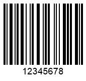

This article outlines the ways of outputting generated barcode images as files, streams, or bitmaps, as well as various raster (PNG, JPEG, BMP, GIF, and TIFF) and vector (SVG and EMF) image file formats.

## **Overview**
During barcode generation, it may be required to save barcode images not only in common raster image formats but also as streams or vector files. ***Aspose.BarCode for Java*** enables different options for saving generated barcodes: five common image formats, two vector formats, and some other ways, such as outputting barcode labels to a file, stream, or a bitmap. These options are discussed further.

{}*If you need any clarifications, feel free to reach out [Aspose Technical Support](/barcode/java/technical-support/): ask your questions at [Aspose.Barcode Forum](https://forum.aspose.com/c/barcode/13) or contact [Aspose Paid Support Helpdesk](https://helpdesk.aspose.com/).*{}

## **Save Barcode to File**
***Aspose.BarCode for Java*** enables saving generated barcode images as files in the desired format using class [*BarcodeGenerator*](https://reference.aspose.com/barcode/java/com.aspose.barcode.generation/BarcodeGenerator). 
<!--The code sample given below explains how to use this setting.  
  

BarcodeGenerator gen = new BarcodeGenerator(EncodeTypes.Code128, "12345678");
gen.Save($"{path}StoreImageAsFile.png", BarCodeImageFormat.Png);
--> 

## **Save Barcode to Stream**
It may be necessary to output generated barcode images in the form of a stream, in other words, in a binary format. A stream can be viewed as a byte sequence abstraction. To save barcode images as streams, class [*BarcodeGenerator*](https://reference.aspose.com/barcode/java/com.aspose.barcode.generation/BarcodeGenerator) provides the public method *save(java.io.OutputStream stream, BarCodeImageFormat format)* that takes *Stream* as an input parameter<!--, as shown in the code snippet below-->.  

<!--
using (Stream str = new FileStream($"{path}StoreImageAsStream.png", FileMode.Create, FileAccess.Write))
{
    BarcodeGenerator gen = new BarcodeGenerator(EncodeTypes.Code128, "12345678");
    gen.Save(str, BarCodeImageFormat.Png);
}
--> 

## **Save Barcode as Bitmap**

***Aspose.BarCode for Java*** enables saving barcode images in the form of bitmap objects and then converting it to the required format or using it in graphical transformations. These objects can be fetched from instances of class [*BarcodeGenerator*](https://reference.aspose.com/barcode/java/com.aspose.barcode.generation/BarcodeGenerator) through the *generateBarCodeImage* method and then processed further. 
<!--The following code sample shows how to use this output option in ***Aspose.BarCode for Java***.


BarcodeGenerator gen = new BarcodeGenerator(EncodeTypes.Code128, "12345678");
using (Bitmap bmp = gen.GenerateBarCodeImage())
    bmp.Save($"{path}StoreImageAsBitmap.png", ImageFormat.Png);
--> 

## **Output Barcodes in Raster Formats**

In ***Aspose.BarCode for Java***, barcode images can be saved to common raster image formats, namely, PNG, GIF, BMP, JPEG, and TIFF. The value of the [*BarCodeImageFormat*](https://reference.aspose.com/barcode/java/com.aspose.barcode.generation/BarCodeImageFormat) enum can be passed as the second argument to the *save(java.lang.String filename, BarCodeImageFormat format)* method to output barcode images in the specified format. The description of all supported image formats is given further.

### **BMP Format**
BMP images are bitmap files that store bitmap digital images regardless of a graphics adapter. The BMP file format enables storing information as two-dimensional digital images in monochrome and color formats with different color depths. Using the BMP format for image generation results in producing images without compression. In this case, barcode images will have a large size and 24-bit color depth. Moreover, they will not contain losses and artifacts. 
<!--The code snippet provided below illustrates how to save barcode images in the BMP format.


BarcodeGenerator gen = new BarcodeGenerator(EncodeTypes.Code128, "12345678");
//save as BMP
gen.Save($"{path}RasterImageBmp.bmp", BarCodeImageFormat.Bmp);
-->
  
The sample BMP barcode image is given below.
  

<image src="rasterimagebmp.bmp">

### **PNG Format**
Portable Network Graphics (PNG) is a raster image format that is used for lossless data compression. This format is the most preferable to generate barcode labels. Images created using this format have 32-bit color depth and no losses. 
<!--The following code sample explains how to save barcode images in the PNG format.
  

BarcodeGenerator gen = new BarcodeGenerator(EncodeTypes.Code128, "12345678");
//save as Png
gen.Save($"{path}RasterImagePng.png", BarCodeImageFormat.Png);
-->
   
The sample barcode image in the PNG format is provided below.
  

<image src="rasterimagebmp.bmp">

### **GIF Format**
Graphics Interchange Format (GIF) is a lossless raster file format that supports only 256 colors and enables creating both static and animated images. ***Aspose.BarCode for Java*** allows using this format only for black and white raster images. The code following code snippet explains how to generate barcodes in the GIF format.
  
<!--
BarcodeGenerator gen = new BarcodeGenerator(EncodeTypes.Code128, "12345678");
//save as Gif
gen.Save($"{path}RasterImageGif.gif", BarCodeImageFormat.Gif);
-->
   
The GIF barcode image generated using this code is shown below.
  

<image src="rasterimagegif.gif">

### **JPEG Format**
JPEG is a common image file format used for lossy and compressed image data. As a result of compression, generating JPEG images require finding a trade-off between image quality and storage size and therefore often have artifacts and graphical noises. This file format is not recommended for barcode generation. The following code sample shows how to create JPEG barcode images.

<!--
BarcodeGenerator gen = new BarcodeGenerator(EncodeTypes.Code128, "12345678");
//save as Jpeg
gen.Save($"{path}RasterImageJpeg.jpeg", BarCodeImageFormat.Jpeg);
-->
   
The example of a JPEG barcode image is given below.
  

<image src="rasterimagejpeg.jpeg">

### **TIFF (TIFFInCMYK) Format**
Tagged Image File Format (TIFF) is a lossless raster image format that allows creating images of very high quality and 32-bit color. Only a variation of this format, TIFFInCMYK, supports the CMYK color scheme. The code snippet provided below explains how to generate barcode images in the TIFF format.

<!--
BarcodeGenerator gen = new BarcodeGenerator(EncodeTypes.Code128, "12345678");
//save as Tiff
gen.Save($"{path}RasterImageTiff.tiff", BarCodeImageFormat.Tiff);
//save as TiffInCmyk
gen.Save($"{path}RasterImageTiffInCmyk.tiff", BarCodeImageFormat.TiffInCmyk);
-->  

TIFF and TIFFInCMYK barcode images are given below.
  
|
**Output Format**
|
TIFF
|
TIFFInCMYK
|
| :-: | :-: | :-: |
| |||
  
## **Vector Image Formats**
Vector image formats represent images as a set of graphical operations executed consequently on a graphics unit. Vector images can be generated through mathematical formulas that specify points on a grid. This format allows scaling without resolution losses. Accordingly, vector image formats may be more suitable than raster ones in some cases. ***Aspose.BarCode for Java*** supports outputting barcode images in two vector formats: EMF and SVG.

### **EMF Format**
Enhanced Metafile (EMF) is a vector image format that is device-independent and is commonly used in Windows operating systems for printing tasks. An EMF image file comprises variable-length records in chronological order. Then, a vector image can be rendered on any output device. Such records can serve to represent objects, drawing commands, and graphics parameters that are critical to rendering vector images. When a digital device opens an EMF metafile through its graphics environment, dimension parameters, proportions, color scheme, and other graphics properties of the source image do not get altered on any platform. 
<!--The following code sample shows how to generate EMF barcode images.


BarcodeGenerator gen = new BarcodeGenerator(EncodeTypes.Code128, "12345678");
//save as Emf
gen.Save($"{path}VectorImageEmf.emf", BarCodeImageFormat.Emf);
--> 
  
<a href="vectorimageemf.emf"> 
 
</a>

### **SVG Format**
Scalable Vector Graphics (SVG) corresponds to a vector image format based on XML. It is used to create two-dimensional images in web applications. In SVG images, the image appearance is described in XML text. Such files can be scaled to various size measures keeping resolution quality. Accordingly, this vector image format is suitable for websites and graphics printing owing to its capability to resize images in line with various design requirements. 
  
<!--The following code snippet explains how to create SVG barcode images.  


BarcodeGenerator gen = new BarcodeGenerator(EncodeTypes.Code128, "12345678");
//save as Svg
gen.Save($"{path}VectorImageSvg.svg", BarCodeImageFormat.Svg);
--> 
  

<image src="vectorimagesvg.svg">
