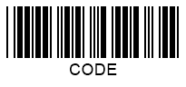
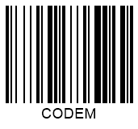

## **Overview**
The idea of using **checksum** (or *check digit*) as an error identification mechanism has been proposed to check for the integrity and accuracy of data encoded in 1D barcodes. Checksum can be used to assure that barcode information has not been lost or damage and that barcode recognition has been executed accurately. Generally, a checksum is the last symbol in a barcode sequence encoded as a character. 1D barcodes may include a checksum digit optionally or obligatory and is calculated based on a special algorithm. Barcode scanner decoders perform checksum controls through mathematical operations based on barcode digits preceding the checksum character and then compare the calculation result with the checksum value.  
  
Barcodes of symbologies without obligatory checksum verification comprise self-checking characters. Such barcodes are inherently resistant to errors as any character alteration is viewed as erroneous. Two inconsistent modifications performed in a barcode digit and a scan line simultaneosly may lead to inappropriate barcode recognition. This is called substitution error and can be mititgated by using checksum controls.

{}*If you need any clarifications, feel free to reach out [Aspose Technical Support](/barcode/java/technical-support/): ask your questions at [Aspose.Barcode Forum](https://forum.aspose.com/c/barcode/13) or contact [Aspose Paid Support Helpdesk](https://helpdesk.aspose.com/).*{}
 
## **Checksum Definition**
Most of 1D barcode types have been created in the 70s. For many of them, checksum controls are identified in simple ways: as a sum of all preceding digits modulo the index of the maximum encoded character. As further development, barcode standards introduced at the beginning of the 2000s use more sophisticated checksum verification algorithms.  
  
In general, enabling checksum in ***Aspose.BarCode for Java*** for 1D barcodes allows verifying barcodes with minor damages. However, in the case of significantly damaged barcode images, the probability of inaccurate recognition increases.  
  
Checksum calculations for *Code 39* and *Code 128* are provided further.  
  
**Code 39 Checksum**
  
In *Code 39*, checksum controls are optional. The maximum number of digits to be encoded equals 43, and therefore, the checksum is computed as the sum of preceding barcode digits modulo 43.
  
**Code 128 Checksum**  
  
The *Code 128* standard uses an improved algorithm for checksum controls compared with *Code 39*. In this algorithm, each barcode digit is weighted based on its position index. 
  
## **Checksum Settings**
Different types use particluar checksum controls (optional or obligatory) and different checksum calculation algorithms. When checksum controls are obligatory, ***Aspose.BarCode for Java*** utilizes the most common algorithm for that symbology. When needed, the checksum character is added as the last barcode character. The [*EnableChecksum*](https://reference.aspose.com/barcode/java/com.aspose.barcode.generation/EnableChecksum) enum is intended for checksum calculation in 1D barcodes. It is set to *Yes* for the types with obligatory checksum controls and *No* for those with an optional check digit by default.  
  
Barcode standards with optional and obligatory checksum settings are listed below.
  
|Checksum Controls|1D Barcode Types|
|---|---|
|**Optional**|Codabar, Code 39, Italian Post 25, Interleaved 2-of-5, Matrix 2-of-5, MSI, Pharmacode, PatchCode, PZN, Standard 2-of-5|
|**Obligatory**|Codablock-F, Code 11, Code 128, Code16K, Code 32, Code 93, DataBar Expanded Stacked, DataBar Expanded, DataBar Omnidirectional, DataBar Stacked Omnidirectional, DataBar Stacked, DataBar Limited, DataBar Truncated, EAN 13, EAN 14, EAN 2, EAN 5, EAN 8, GS1 Codablock-F, GS1 Code 128, IATA 2-of-5, ISBN, ISMN, ISSN, ITF 14, ITF6, OPC, SSCC 14, SSCC 18, UPC-A, UPC-E, UpcaGs1DatabarCoupon, VIN|

### **Optional Checksum Controls**
Linear barcode types with optional checksum controls do not require check digit calculation by default. For such barcode types, the [*EnableChecksum*](https://reference.aspose.com/barcode/java/com.aspose.barcode.generation/EnableChecksum) enum provides the following options:
- **public static final EnableChecksum DEFAULT** and **public static final EnableChecksum NO**. Checksum control is not enabled.
- **public static final EnableChecksum YES**. The checksum algorithm of the most appropriate type for the given symbology is used.
  
|
**Checksum Controls**
|
**Checksum Enabled**
|
**Checksum Disabled**
|
| :-: | :-: | :-: |
| |||
  
<!--The following code sample explains how to enable and disable checksum controls for *Code 39*.
  

BarcodeGenerator gen = new BarcodeGenerator(EncodeTypes.Code39Extended, "CODE");
//default value with no checksum
gen.Parameters.Barcode.IsChecksumEnabled = EnableChecksum.No;
gen.Save($"{path}OneCSCode39WithoutChecksum.png", BarCodeImageFormat.Png);
//value with checksum
gen.Parameters.Barcode.IsChecksumEnabled = EnableChecksum.Yes;
gen.Save($"{path}OneCSCode39WithChecksum.png", BarCodeImageFormat.Png);
--> 
  
### **Obligatory Checksum Controls**
For barcode types with obligatory checksum controls, objects of [*EnableChecksum*](https://reference.aspose.com/barcode/java/com.aspose.barcode.generation/EnableChecksum) can be initialized as follows:
- **public static final EnableChecksum DEFAULT** and **public static final EnableChecksum YES**. Checksum calculation is performed according to the specific algorithm.
- **public static final EnableChecksum NO**. 

The following barcode image has been generated with obligatory checksum enabled.   

<!--The code snippet given below illustrates checksum settings for *Code 39*. 


BarcodeGenerator gen = new BarcodeGenerator(EncodeTypes.Code93Extended, "CODE");
//default value with checksum
gen.Parameters.Barcode.IsChecksumEnabled = EnableChecksum.Yes;
gen.Save($"{path}OneCSCode93WithChecksum.png", BarCodeImageFormat.Png);
//no checksum value throws exception
try
{
    gen.Parameters.Barcode.IsChecksumEnabled = EnableChecksum.No;
    gen.GenerateBarCodeImage();
}
catch (Exception e)
{
    Console.WriteLine(e.Message);
}
-->
  
## **Displaying Checksum for Code 128**
For *Code 128* and *GS1 Code 128*, ***Aspose.BarCode for Java*** allows developers to use a specific method called *setChecksumAlwaysShow* of class [*BarcodeParameters*](https://reference.aspose.com/barcode/java/com.aspose.barcode.generation/BarcodeParameters). In this case, the checksum digit is displayed in the *CodeText* field as human-readable barcode text. 
  
|
**Checksum Visibility**
|
**Displayed**
|
**Hidden**
|
| :-: | :-: | :-: |
| |||
  
<!--The code sample below explains how to manage checksum display settings.
  

BarcodeGenerator gen = new BarcodeGenerator(EncodeTypes.Code128, "CODE");
//do not display checksum
gen.Parameters.Barcode.ChecksumAlwaysShow = false;
gen.Save($"{path}OneCSCode128NotShowChecksum.png", BarCodeImageFormat.Png);
//display checksum
gen.Parameters.Barcode.ChecksumAlwaysShow = true;
gen.Save($"{path}OneCSCode128ShowChecksum.png", BarCodeImageFormat.Png);
--> 