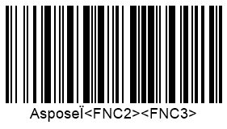

{}[Read Barcodes Online](https://products.aspose.app/barcode/recognize): You can test the quality of ***Aspose.BarCode*** recognition functionality and view the results online.{}
  
## **Overview**
In the barcode recognition process implemented in ***Aspose.BarCode for Java***, barcode data decoding is initiated according to the special protocol after scanning the raw data from a graphical representation. Some linear and postal symbologies have passed standardization after their wide implementation, and therefore, it has lead to the appearance of incompatible decoding formats. To resolve possible conflicts, class [*BarCodeReader*](https://apireference.aspose.com/barcode/java/com.aspose.barcode.barcoderecognition/BarCodeReader) provides a special class called [*BarcodeSettings*](https://apireference.aspose.com/barcode/java/com.aspose.barcode.barcoderecognition/BarcodeSettings) used to manage barcode decoding settings.

{}*If you need any clarifications, feel free to reach out to [Aspose Technical Support](/barcode/java/technical-support/): ask your questions at [Aspose.Barcode Forum](https://forum.aspose.com/c/barcode/13) or contact [Aspose Paid Support Helpdesk](https://helpdesk.aspose.com/).*{}

## **Checksum Verification**
Varios 1D and postal symbologies include checksum control mechanisms for data integrity verification. To adjust checksum settings for data validation purposes, class [*BarcodeSettings*](https://apireference.aspose.com/barcode/java/com.aspose.barcode.barcoderecognition/BarcodeSettings) contains the [*ChecksumValidation*](https://apireference.aspose.com/barcode/java/com.aspose.barcode.barcoderecognition/ChecksumValidation) enum. Generally, symbologies can be classified according to the following types: with obligatory checksum controls and with optional ones. The [*ChecksumValidation*](https://apireference.aspose.com/barcode/java/com.aspose.barcode.barcoderecognition/ChecksumValidation) enum suggests different options for these two groups. The barcode recognition procedure varies in line with checksum settings.  

### **Checksum Validation for symbologies with Obligatory Checksum**
Barcoded types with obligatory checksum controls require performing compulsive checksum validation when [*ChecksumValidation*](https://apireference.aspose.com/barcode/java/com.aspose.barcode.barcoderecognition/ChecksumValidation) is initialized using *ChecksumValidation.DEFAULT* or *ChecksumValidation.ON* values. Alternatively, setting the *ChecksumValidation.Off* value turns off checksum verification and in this way, allows decoding information from invalid barcodes. This option increases the probability of incorrect recognition.  
  
The following code sample shows how to adjust checksum settings for the barcode type with obligatory checksum controls (namely, *Code 11*). 
 

//create barcode
using (BarcodeGenerator gen = new BarcodeGenerator(EncodeTypes.Code11, "123456"))
{
    gen.Parameters.Barcode.XDimension.Pixels = 2;
    gen.Save($"{path}Code11.png", BarCodeImageFormat.Png);
}

//read barcode image with ChecksumValidation.Default being set
Console.WriteLine("ReadChecksumCode11:");
Console.WriteLine("ChecksumValidation: Default");
using (BarCodeReader read = new BarCodeReader($"{path}Code11.png", DecodeType.Code11))
{
    read.BarcodeSettings.ChecksumValidation = ChecksumValidation.Default;
    foreach (BarCodeResult result in read.ReadBarCodes())
    {
        Console.WriteLine($"CodeType:{result.CodeTypeName}");
        Console.WriteLine($"CodeText:{result.CodeText}");
        Console.WriteLine($"1D Value:{result.Extended.OneD.Value}");
        Console.WriteLine($"1D CheckSum:{result.Extended.OneD.CheckSum}");
    }
}

//read barcode image with ChecksumValidation.Off being set
Console.WriteLine("ChecksumValidation: Off");
using (BarCodeReader read = new BarCodeReader($"{path}Code11.png", DecodeType.Code11))
{
    read.BarcodeSettings.ChecksumValidation = ChecksumValidation.Off;
    foreach (BarCodeResult result in read.ReadBarCodes())
    {
        Console.WriteLine($"CodeType:{result.CodeTypeName}");
        Console.WriteLine($"CodeText:{result.CodeText}");
        Console.WriteLine($"1D Value:{result.Extended.OneD.Value}");
        Console.WriteLine($"1D CheckSum:{result.Extended.OneD.CheckSum}");
    }
}

  

 

### **Checksum Validation for Symbologies with Optional Checksum**
[*ChecksumValidation*](https://apireference.aspose.com/barcode/java/com.aspose.barcode.barcoderecognition/ChecksumValidation) allows enabling and disabling checksum controls for barcode standards with optional checksum verification. To request checjsum validation, the following setting should be used: *ChecksumValidation.ON*. When other options, *ChecksumValidation.DEFAULT* and *ChecksumValidation.OFF*, are enabled, checksum controls are disabled.  
  
The following code snippet illustrates recognition options for symbologies with optional checksum controls (i.e. *Code 39*). 
  

//create barcode
using (BarcodeGenerator gen = new BarcodeGenerator(EncodeTypes.Code39Extended, "123456"))
{
    gen.Parameters.Barcode.XDimension.Pixels = 2;
    gen.Parameters.Barcode.IsChecksumEnabled = EnableChecksum.Yes;
    gen.Save($"{path}Code39.png", BarCodeImageFormat.Png);
}

//read barcode image with ChecksumValidation.Default being set
Console.WriteLine("ReadChecksumCode39:");
Console.WriteLine("ChecksumValidation: Default");
using (BarCodeReader read = new BarCodeReader($"{path}Code39.png", DecodeType.Code39Extended))
{
    read.BarcodeSettings.ChecksumValidation = ChecksumValidation.Default;
    foreach (BarCodeResult result in read.ReadBarCodes())
    {
        Console.WriteLine($"CodeType:{result.CodeTypeName}");
        Console.WriteLine($"CodeText:{result.CodeText}");
        Console.WriteLine($"1D Value:{result.Extended.OneD.Value}");
        Console.WriteLine($"1D CheckSum:{result.Extended.OneD.CheckSum}");
    }
}

//read barcode image with ChecksumValidation.On being set
Console.WriteLine("ChecksumValidation: On");
using (BarCodeReader read = new BarCodeReader($"{path}Code39.png", DecodeType.Code39Extended))
{
    read.BarcodeSettings.ChecksumValidation = ChecksumValidation.On;
    foreach (BarCodeResult result in read.ReadBarCodes())
    {
        Console.WriteLine($"CodeType:{result.CodeTypeName}");
        Console.WriteLine($"CodeText:{result.CodeText}");
        Console.WriteLine($"1D Value:{result.Extended.OneD.Value}");
        Console.WriteLine($"1D CheckSum:{result.Extended.OneD.CheckSum}");
    }
}

  

## **Managing Barcodes with Unicode Encodings**
***Aspose.BarCode for Java*** provides class [*BarcodeSettings*](https://apireference.aspose.com/barcode/java/com.aspose.barcode.barcoderecognition/BarcodeSettings) that contains a special method called *setDetectEncoding* that enables the automatic recognition of UTF8 and UTF16 Unicode encodings for 2D symbologies and allows re-encoding barcode information into a string with Unicode characters. If this recognition mode is turned off, barcode information can be scanned and decoded manually based on the desired encoding.  
  
The following code sample explains how to decode barcodes with UTF8 and UTF16 Unicode encodings automatically (namely, *QR Code* has been used). 


using (BarcodeGenerator gen = new BarcodeGenerator(EncodeTypes.QR, "بالقمة Aspose"))
{
    gen.Parameters.Barcode.XDimension.Pixels = 4;
    gen.Parameters.Barcode.QR.CodeTextEncoding = Encoding.UTF8;
    gen.Save($"{path}QRDetectEncoding.png", BarCodeImageFormat.Png);
}

Console.WriteLine("ReadDetectEncoding:");
//read barcode image with DetectEncoding set to true
Console.WriteLine("DetectEncoding: true");
using (BarCodeReader read = new BarCodeReader($"{path}QRDetectEncoding.png", DecodeType.QR))
{
    read.BarcodeSettings.DetectEncoding = true;
    foreach (BarCodeResult result in read.ReadBarCodes())
    {
        Console.WriteLine($"CodeType:{result.CodeTypeName}");
        Console.WriteLine($"CodeText:{result.CodeText}");
    }
}

//read barcode image with DetectEncoding set to False
Console.WriteLine("DetectEncoding: false");
using (BarCodeReader read = new BarCodeReader($"{path}QRDetectEncoding.png", DecodeType.QR))
{
    read.BarcodeSettings.DetectEncoding = false;
    foreach (BarCodeResult result in read.ReadBarCodes())
    {
        Console.WriteLine($"CodeType:{result.CodeTypeName}");
        Console.WriteLine($"CodeText:{result.CodeText}");
    }
}

  

## **FNC Symbols**
The GS1 association suggests using FNC character to perform decoding of some symbologies, including *Code 128* and *Code 128*. Four types of FNC symbols (FNC1-4) are supported. FNC1 is the most widely used one that is intended for GS1 Application Identifier (AI) marking. When a barcode does not relate to any of GS1 types (e.g. *Code 128* or *GS1 Code 128*), the decoder processes FNC symbols as “<FNC#>”. These symbols can be removed from decoding results passing the *False* value to the *setStripFNC* method.  
  
The following code snippet explains how to manage FCN symbols.


//create barcode
using (BarcodeGenerator gen = new BarcodeGenerator(EncodeTypes.Code128, "Aspose" + FNC1 + FNC2 + FNC3))
{
    gen.Parameters.Barcode.XDimension.Pixels = 2;
    gen.Save($"{path}Code128FNC.png", BarCodeImageFormat.Png);
}

//read barcode image with StripFNC set to False
Console.WriteLine("ReadWithStripFNC:");
Console.WriteLine("StripFNC: false");
using (BarCodeReader read = new BarCodeReader($"{path}Code128FNC.png", DecodeType.Code128))
{
    read.BarcodeSettings.StripFNC = false;
    foreach (BarCodeResult result in read.ReadBarCodes())
    {
        Console.WriteLine($"CodeType:{result.CodeTypeName}");
        Console.WriteLine($"CodeText:{result.CodeText}");
    }
}

//read barcode image with StripFNC set to True
Console.WriteLine("StripFNC: true");
using (BarCodeReader read = new BarCodeReader($"{path}Code128FNC.png", DecodeType.Code128))
{
    read.BarcodeSettings.StripFNC = true;
    foreach (BarCodeResult result in read.ReadBarCodes())
    {
        Console.WriteLine($"CodeType:{result.CodeTypeName}");
        Console.WriteLine($"CodeText:{result.CodeText}");
    }
}

  

## **Australia Post Barcodes**
*Australia Post* is a 4-state postal barcode type implemented by the Australian Post. This symbology suggests including special two-digit format control code (FCC) fields and eight-digit sorting code (SC) fields into barcode information. FCC fields are intended to set one of three supported types with various fixed number of bars: 37, 52, or 67 bars. For some FCC, barcodes may comprise a customer information (CI) field that indicates one of the encoding types supporting numerical or alphanumeric characters. Customer information can take 31 bars in 67-length barcodes or 16 bars in 52-length ones. The *Australia Post* symbology has checksum controls and supports Reed-Solomon error correction.  
*See more details about this symbology [here](/barcode/java/postal-barcodes/#australia-post-symbology)*.  
  
Because of the possible presence of customer information in barcode information for *Australia Post*, the recognition process has some peculiarities. ***Aspose.BarCode for Java*** provides class [*AustraliaPostSettings*](https://apireference.aspose.com/barcode/java/com.aspose.barcode.barcoderecognition/AustraliaPostSettings) to manage recognition parameters according to specific industrial needs. 

### **Decoding Customer Information in Standard Formats**
The *Australia Post* standard enables encoding additional customer data in three formats; automatic detection of the used format is not supported. The desired decoding format can be enabled through the *setCustomerInformationInterpretingType* method that can take different values explained in the table below.
  
|Australia Post Encoding Table|Supported Symbols|
|---|---|
|CTable|Numerical digits, English letters, space symbol, and #|
|NTable|Numerical digits|
|Other|0, 1, 2, and 3 that correspond to H, A, D, and T states|
  
**CTable**  
  
The following code sample shows how to enable the decoding format through the *CTable* option. 
  

//create barcode
using (BarcodeGenerator gen = new BarcodeGenerator(EncodeTypes.AustraliaPost, "6201234567ASPOSE"))
{
    gen.Parameters.Barcode.XDimension.Pixels = 4;
    gen.Parameters.Barcode.BarHeight.Pixels = 50;
    gen.Parameters.Barcode.AustralianPost.AustralianPostEncodingTable = CustomerInformationInterpretingType.CTable;
    gen.Save($"{path}AustraliaPostCTable.png", BarCodeImageFormat.Png);
}

//read barcode image
Console.WriteLine("ReadAustraliaPostCTable:");
using (BarCodeReader read = new BarCodeReader($"{path}AustraliaPostCTable.png", DecodeType.AustraliaPost))
{
    read.BarcodeSettings.AustraliaPost.CustomerInformationInterpretingType = CustomerInformationInterpretingType.CTable;
    foreach (BarCodeResult result in read.ReadBarCodes())
    {
        Console.WriteLine($"CodeType:{result.CodeTypeName}");
        Console.WriteLine($"CodeText:{result.CodeText}");
    }
}

  

**NTable**  
  
The following code snippet explains how to use the *NTable* decoding format. 
  

//create barcode
using (BarcodeGenerator gen = new BarcodeGenerator(EncodeTypes.AustraliaPost, "620123456701234"))
{
    gen.Parameters.Barcode.XDimension.Pixels = 4;
    gen.Parameters.Barcode.BarHeight.Pixels = 50;
    gen.Parameters.Barcode.AustralianPost.AustralianPostEncodingTable = CustomerInformationInterpretingType.NTable;
    gen.Save($"{path}AustraliaPostNTable.png", BarCodeImageFormat.Png);
}

//read barcode image
Console.WriteLine("ReadAustraliaPostNTable:");
using (BarCodeReader read = new BarCodeReader($"{path}AustraliaPostNTable.png", DecodeType.AustraliaPost))
{
    read.BarcodeSettings.AustraliaPost.CustomerInformationInterpretingType = CustomerInformationInterpretingType.NTable;
    foreach (BarCodeResult result in read.ReadBarCodes())
    {
        Console.WriteLine($"CodeType:{result.CodeTypeName}");
        Console.WriteLine($"CodeText:{result.CodeText}");
    }
}

  

**Other**  
  
The following code sample shows how to use the *Other* decoding format. 
  

//create barcode
using (BarcodeGenerator gen = new BarcodeGenerator(EncodeTypes.AustraliaPost, "6201234567321032103210"))
{
    gen.Parameters.Barcode.XDimension.Pixels = 4;
    gen.Parameters.Barcode.BarHeight.Pixels = 50;
    gen.Parameters.Barcode.AustralianPost.AustralianPostEncodingTable = CustomerInformationInterpretingType.Other;
    gen.Save($"{path}AustraliaPostOther.png", BarCodeImageFormat.Png);
}

//read barcode image
Console.WriteLine("ReadAustraliaPostOther:");
using (BarCodeReader read = new BarCodeReader($"{path}AustraliaPostOther.png", DecodeType.AustraliaPost))
{
    read.BarcodeSettings.AustraliaPost.CustomerInformationInterpretingType = CustomerInformationInterpretingType.Other;
    foreach (BarCodeResult result in read.ReadBarCodes())
    {
        Console.WriteLine($"CodeType:{result.CodeTypeName}");
        Console.WriteLine($"CodeText:{result.CodeText}");
    }
}

  

### **Removal of Fill Patterns**
The *Australia Post* symbology requires setting fixed size for each subtype. When the *CTable* format is enabled, the empty space included in the input message is decoded as “z”. To disable this property, the *setIgnoreEndingFillingPatternsForCTable* method needs to be called.  
  
The following code snippet shows how to remove filling empty patters for the *CTable* decoding mode. 


//create barcode
using (BarcodeGenerator gen = new BarcodeGenerator(EncodeTypes.AustraliaPost, "6201234567END"))
{
    gen.Parameters.Barcode.XDimension.Pixels = 4;
    gen.Parameters.Barcode.BarHeight.Pixels = 50;
    gen.Parameters.Barcode.AustralianPost.AustralianPostEncodingTable = CustomerInformationInterpretingType.CTable;
    gen.Save($"{path}AustraliaPostCTableIgnoreEnding.png", BarCodeImageFormat.Png);
}

Console.WriteLine("ReadAustraliaPostCTableIgnoreEnding:");
//read barcode image with IgnoreEndingFillingPatternsForCTable set to true
Console.WriteLine("IgnoreEndingFillingPatternsForCTable: true");
using (BarCodeReader read = new BarCodeReader($"{path}AustraliaPostCTableIgnoreEnding.png", DecodeType.AustraliaPost))
{
    read.BarcodeSettings.AustraliaPost.CustomerInformationInterpretingType = CustomerInformationInterpretingType.CTable;
    read.BarcodeSettings.AustraliaPost.IgnoreEndingFillingPatternsForCTable = true;
    foreach (BarCodeResult result in read.ReadBarCodes())
    {
        Console.WriteLine($"CodeType:{result.CodeTypeName}");
        Console.WriteLine($"CodeText:{result.CodeText}");
    }
}

//read barcode image with IgnoreEndingFillingPatternsForCTable set to false
Console.WriteLine("IgnoreEndingFillingPatternsForCTable: false");
using (BarCodeReader read = new BarCodeReader($"{path}AustraliaPostCTableIgnoreEnding.png", DecodeType.AustraliaPost))
{
    read.BarcodeSettings.AustraliaPost.CustomerInformationInterpretingType = CustomerInformationInterpretingType.CTable;
    read.BarcodeSettings.AustraliaPost.IgnoreEndingFillingPatternsForCTable = false;
    foreach (BarCodeResult result in read.ReadBarCodes())
    {
        Console.WriteLine($"CodeType:{result.CodeTypeName}");
        Console.WriteLine($"CodeText:{result.CodeText}");
    }
}

  

### **Decoding Customer Information in Custom Format**
***Aspose.BarCode for Java*** allows decoding customer data in various specific formats. To do this, a special interface called [*AustraliaPostCustomerInformationDecoder*](https://apireference.aspose.com/barcode/java/com.aspose.barcode.barcoderecognition/AustraliaPostCustomerInformationDecoder) is available. In this case, barcode data decoding is processed according to this interface; [*CustomerInformationInterpretingType*](https://apireference.aspose.com/barcode/java/com.aspose.barcode.barcoderecognition/CustomerInformationInterpretingType) and *ignoreEndingFillingPatternsForCTable* settings are ignored.  
  
The following code snippet explains how to decode customer data in the *NTable* format. 


class NTableDecoder : AustraliaPostCustomerInformationDecoder
{
    string[] N_Table = { "00", "01", "02", "10", "11", "12", "20", "21", "22", "30" };
    public string Decode(string customerInformationField)
    {
        StringBuilder bd = new StringBuilder();
        for (int i = 0; i < customerInformationField.Length; i += 2)
        {
            if (i + 2 <= customerInformationField.Length)
            {
                string tmp = customerInformationField.Substring(i, 2);
                for (int j = 0; j < N_Table.Length; j++)
                {
                    if (N_Table[j].Equals(tmp))
                    {
                        bd.Append(j);
                        break;
                    }
                }
            }
        }
        return bd.ToString();
    }
}
//create barcode
using (BarcodeGenerator gen = new BarcodeGenerator(EncodeTypes.AustraliaPost, "620123456701234"))
{
    gen.Parameters.Barcode.XDimension.Pixels = 4;
    gen.Parameters.Barcode.BarHeight.Pixels = 50;
    gen.Parameters.Barcode.AustralianPost.AustralianPostEncodingTable = CustomerInformationInterpretingType.NTable;
    gen.Save($"{path}AustraliaPostCustomerInformationDecoder.png", BarCodeImageFormat.Png);
}

//read barcode image
Console.WriteLine("ReadAustraliaPostCustomerInformationDecoder:");
using (BarCodeReader read = new BarCodeReader($"{path}AustraliaPostCustomerInformationDecoder.png", DecodeType.AustraliaPost))
{
    read.BarcodeSettings.AustraliaPost.CustomerInformationDecoder = new NTableDecoder();
    foreach (BarCodeResult result in read.ReadBarCodes())
    {
        Console.WriteLine($"CodeType:{result.CodeTypeName}");
        Console.WriteLine($"CodeText:{result.CodeText}");
    }
}

  

