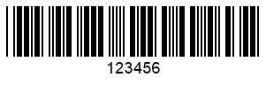

## **Overview**
Various 1D and postal types include checksum control mechanisms for data integrity verification. To adjust checksum settings for data validation purposes, class [*BarcodeSettings*](https://reference.aspose.com/barcode/java/com.aspose.barcode.barcoderecognition/BarcodeSettings) contains the [*ChecksumValidation*](https://reference.aspose.com/barcode/java/com.aspose.barcode.barcoderecognition/ChecksumValidation) enum. Generally, barcode types can be classified according to the following types: with obligatory checksum controls and with optional ones. The [*ChecksumValidation*](https://reference.aspose.com/barcode/java/com.aspose.barcode.barcoderecognition/ChecksumValidation) enum suggests different options for these two groups. The barcode recognition procedure varies in line with checksum settings.  

## **Checksum Validation for Barcodes with Obligatory Checksum**
Barcoded types with obligatory checksum controls require performing compulsive checksum validation when [*ChecksumValidation*](https://reference.aspose.com/barcode/java/com.aspose.barcode.barcoderecognition/ChecksumValidation) is initialized using *ChecksumValidation.DEFAULT* or *ChecksumValidation.ON* values. Alternatively, setting the *ChecksumValidation.Off* value turns off checksum verification and in this way, allows decoding information from invalid barcodes. This option increases the probability of incorrect recognition.  
  
<!--The following code sample shows how to adjust checksum settings for the barcode type with obligatory checksum controls (namely, *Code 11*). 
 

//create barcode
using (BarcodeGenerator gen = new BarcodeGenerator(EncodeTypes.Code11, "123456"))
{
    gen.Parameters.Barcode.XDimension.Pixels = 2;
    gen.Save($"{path}Code11.png", BarCodeImageFormat.Png);
}

//read barcode image with ChecksumValidation.Default being set
Console.WriteLine("ReadChecksumCode11:");
Console.WriteLine("ChecksumValidation: Default");
using (BarCodeReader read = new BarCodeReader($"{path}Code11.png", DecodeType.Code11))
{
    read.BarcodeSettings.ChecksumValidation = ChecksumValidation.Default;
    foreach (BarCodeResult result in read.ReadBarCodes())
    {
        Console.WriteLine($"CodeType:{result.CodeTypeName}");
        Console.WriteLine($"CodeText:{result.CodeText}");
        Console.WriteLine($"1D Value:{result.Extended.OneD.Value}");
        Console.WriteLine($"1D CheckSum:{result.Extended.OneD.CheckSum}");
    }
}

//read barcode image with ChecksumValidation.Off being set
Console.WriteLine("ChecksumValidation: Off");
using (BarCodeReader read = new BarCodeReader($"{path}Code11.png", DecodeType.Code11))
{
    read.BarcodeSettings.ChecksumValidation = ChecksumValidation.Off;
    foreach (BarCodeResult result in read.ReadBarCodes())
    {
        Console.WriteLine($"CodeType:{result.CodeTypeName}");
        Console.WriteLine($"CodeText:{result.CodeText}");
        Console.WriteLine($"1D Value:{result.Extended.OneD.Value}");
        Console.WriteLine($"1D CheckSum:{result.Extended.OneD.CheckSum}");
    }
}
-->
  

 

### **Checksum Validation for Barcodes with Optional Checksum**
[*ChecksumValidation*](https://reference.aspose.com/barcode/java/com.aspose.barcode.barcoderecognition/ChecksumValidation) allows enabling and disabling checksum controls for barcode standards with optional checksum verification. To request checksum validation, the following setting should be used: *ChecksumValidation.ON*. When other options *ChecksumValidation.DEFAULT* and *ChecksumValidation.OFF* are enabled, checksum controls are disabled.  
  
<!--The following code snippet illustrates recognition options for symbologies with optional checksum controls (i.e. *Code 39*). 
  

//create barcode
using (BarcodeGenerator gen = new BarcodeGenerator(EncodeTypes.Code39Extended, "123456"))
{
    gen.Parameters.Barcode.XDimension.Pixels = 2;
    gen.Parameters.Barcode.IsChecksumEnabled = EnableChecksum.Yes;
    gen.Save($"{path}Code39.png", BarCodeImageFormat.Png);
}

//read barcode image with ChecksumValidation.Default being set
Console.WriteLine("ReadChecksumCode39:");
Console.WriteLine("ChecksumValidation: Default");
using (BarCodeReader read = new BarCodeReader($"{path}Code39.png", DecodeType.Code39Extended))
{
    read.BarcodeSettings.ChecksumValidation = ChecksumValidation.Default;
    foreach (BarCodeResult result in read.ReadBarCodes())
    {
        Console.WriteLine($"CodeType:{result.CodeTypeName}");
        Console.WriteLine($"CodeText:{result.CodeText}");
        Console.WriteLine($"1D Value:{result.Extended.OneD.Value}");
        Console.WriteLine($"1D CheckSum:{result.Extended.OneD.CheckSum}");
    }
}

//read barcode image with ChecksumValidation.On being set
Console.WriteLine("ChecksumValidation: On");
using (BarCodeReader read = new BarCodeReader($"{path}Code39.png", DecodeType.Code39Extended))
{
    read.BarcodeSettings.ChecksumValidation = ChecksumValidation.On;
    foreach (BarCodeResult result in read.ReadBarCodes())
    {
        Console.WriteLine($"CodeType:{result.CodeTypeName}");
        Console.WriteLine($"CodeText:{result.CodeText}");
        Console.WriteLine($"1D Value:{result.Extended.OneD.Value}");
        Console.WriteLine($"1D CheckSum:{result.Extended.OneD.CheckSum}");
    }
}
-->
  

