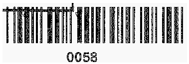
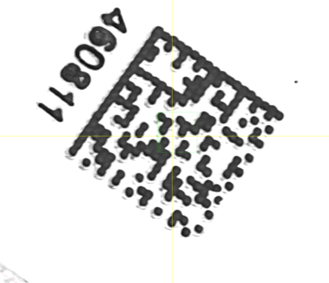

 
## **Read Barcode Images with Gaussian Noise**
Gaussian noise is one of the most common damages that may deteriorate the quality of a source barcode. Most of difficulties correspond to the cases when barcode images have the monochrome color scheme or the distortion grain is considerably bigger than the minimal element of a barcode. To cope with these effects, median filtering mechanisms suitable for both 1D and 2D symbologies can be applied. Median filtering mechanisms also affect image quality due to the possible removal of some barcode elements together with noise; however, they still may be helpful in improving readability of key barcode modules.
  
{}*If you need any clarifications, feel free to reach out to [Aspose Technical Support](/barcode/java/technical-support/): ask your questions at [Aspose.Barcode Forum](https://forum.aspose.com/c/barcode/13) or contact [Aspose Paid Support Helpdesk](https://helpdesk.aspose.com/).*{}

### **Median Filtering for 2D Barcodes**
In ***Aspose.BarCode for Java***, median filtering can be implemented using a special method called *setAllowMedianSmoothing* and setting the median filtering window using the *setMedianSmoothingWindowSize* method. Unlike 1D barcodes, automated selection of a suitable median filtering window is not supported for 2D types.  
  
<!--The following code snippet illustrates how to perform median filtering for the sample barcode image given below.-->
  

<!--
Console.WriteLine("MedianSmoothing:");

//read barcode image with AllowMedianSmoothing set to false
Console.WriteLine("AllowMedianSmoothing: false");
using (BarCodeReader read = new BarCodeReader($"{path}datamatrix_noised.png", DecodeType.DataMatrix))
{
    read.QualitySettings.AllowMedianSmoothing = false;
    Console.WriteLine($"Barcodes read: {read.ReadBarCodes().Length}");
    foreach (BarCodeResult result in read.FoundBarCodes)
        Console.WriteLine($"{result.CodeTypeName}:{result.CodeText}");
}

//read barcode image with AllowMedianSmoothing set to true
Console.WriteLine("AllowMedianSmoothing: true");
using (BarCodeReader read = new BarCodeReader($"{path}datamatrix_noised.png", DecodeType.DataMatrix))
{
    read.QualitySettings.AllowMedianSmoothing = true;
    read.QualitySettings.MedianSmoothingWindowSize = 4;
    Console.WriteLine($"Barcodes read: {read.ReadBarCodes().Length}");
    foreach (BarCodeResult result in read.FoundBarCodes)
        Console.WriteLine($"{result.CodeTypeName}:{result.CodeText}");
}
-->

### **Median Filtering for 1D Barcodes**
One-dimensional filtering for linear barcodes can be set using a method called *setAllowSaltAndPaperFiltering*. In this case, the filtering window size is selected automatically.  
  
<!--The following code sample explains how to apply median filtering to 1D barcodes, such as, for example, the barcode image shown further.--> 

<!--
Console.WriteLine("SaltAndPaperFiltering:");

//read barcode image with AllowSaltAndPaperFiltering set to false
Console.WriteLine("AllowSaltAndPaperFiltering: false");
using (BarCodeReader read = new BarCodeReader($"{path}saltandpaper.png", DecodeType.Code39Standard, DecodeType.Code39Extended))
{
    read.QualitySettings.AllowSaltAndPaperFiltering = false;
    Console.WriteLine($"Barcodes read: {read.ReadBarCodes().Length}");
    foreach (BarCodeResult result in read.FoundBarCodes)
        Console.WriteLine($"{result.CodeTypeName}:{result.CodeText}");
}

//read barcode image with AllowSaltAndPaperFiltering set to true
Console.WriteLine("AllowSaltAndPaperFiltering: true");
using (BarCodeReader read = new BarCodeReader($"{path}saltandpaper.png", DecodeType.Code39Standard, DecodeType.Code39Extended))
{
    read.QualitySettings.AllowSaltAndPaperFiltering = true;
    Console.WriteLine($"Barcodes read: {read.ReadBarCodes().Length}");
    foreach (BarCodeResult result in read.FoundBarCodes)
        Console.WriteLine($"{result.CodeTypeName}:{result.CodeText}");
}
-->

### **Median Filtering for Postal Barcodes**
One-dimensional median filtering for postal symbologies can be performed using the *AllowMicroWhiteSpotsRemoving* method. The size of the filtering window is set automatically.  
  
<!--The following code snippet demonstrates how to perform median filtering in the case of postal barcodes (as the sample *Planet* barcode given below).-->

<!--
Console.WriteLine("MicroWhiteSpotsRemoving:");

//read barcode image with AllowMicroWhiteSpotsRemoving set to False
Console.WriteLine("AllowMicroWhiteSpotsRemoving: false");
using (BarCodeReader read = new BarCodeReader($"{path}planet_noised.png", DecodeType.Planet))
{
    read.QualitySettings.AllowMicroWhiteSpotsRemoving = false;
    Console.WriteLine($"Barcodes read: {read.ReadBarCodes().Length}");
    foreach (BarCodeResult result in read.FoundBarCodes)
        Console.WriteLine($"{result.CodeTypeName}:{result.CodeText}");
}

//read barcode image with AllowMicroWhiteSpotsRemoving set to True
Console.WriteLine("AllowMicroWhiteSpotsRemoving: true");
using (BarCodeReader read = new BarCodeReader($"{path}planet_noised.png", DecodeType.Planet))
{
    read.QualitySettings.AllowMicroWhiteSpotsRemoving = true;
    Console.WriteLine($"Barcodes read: {read.ReadBarCodes().Length}");
    foreach (BarCodeResult result in read.FoundBarCodes)
        Console.WriteLine($"{result.CodeTypeName}:{result.CodeText}");
}
-->

### **Filtering Out White Spots**
The presence of white spots in barcode images is a frequent problem that appears while sending documents with barcodes through fax transmission. To mitigate this issue in ***Aspose.BarCode for Java***, it is possible to use a special method called *setAllowWhiteSpotsRemoving* that allows filtering out not all Gaussian noise but only white spots.  
  
<!--The following code sample illustrates how to filter out white spot artifacts from the source barcode image demonstrated below.-->

<!--
Console.WriteLine("WhiteSpotsRemoving:");

//read barcode image with AllowWhiteSpotsRemoving set to false
Console.WriteLine("AllowWhiteSpotsRemoving: false");
using (BarCodeReader read = new BarCodeReader($"{path}code128_whitespots.png", DecodeType.Code128))
{
    read.QualitySettings.AllowWhiteSpotsRemoving = false;
    Console.WriteLine($"Barcodes read: {read.ReadBarCodes().Length}");
    foreach (BarCodeResult result in read.FoundBarCodes)
        Console.WriteLine($"{result.CodeTypeName}:{result.CodeText}");
}

//read barcode image with AllowWhiteSpotsRemoving set to true
Console.WriteLine("AllowWhiteSpotsRemoving: true");
using (BarCodeReader read = new BarCodeReader($"{path}code128_whitespots.png", DecodeType.Code128))
{
    read.QualitySettings.AllowWhiteSpotsRemoving = true;
    Console.WriteLine($"Barcodes read: {read.ReadBarCodes().Length}");
    foreach (BarCodeResult result in read.FoundBarCodes)
        Console.WriteLine($"{result.CodeTypeName}:{result.CodeText}");
}
-->

## **Reduce Barcode Image Size to Eliminate Visual Artifacts**
In some cases, distortions caused by excessive scaling of a barcode image can be mitigated by reducing the scale space. In ***Aspose.BarCode for Java***, it can be done using a special method called *setAllowDecreasedImage*. Its purpose is to reduce the size of an image and in this way, to facilitate barcode reading by eliminating visual artifacts.   
  
<!--The following code snippet explains how to the size of the source barcode image shown below can be reduced to improve recognition quality.-->

<!--
Console.WriteLine("DecreasedImage:");

//read barcode image with AllowDecreasedImage false
Console.WriteLine("AllowDecreasedImage: false");
using (BarCodeReader read = new BarCodeReader($"{path}datamatrix_waved.png", DecodeType.DataMatrix))
{
    read.QualitySettings.AllowDecreasedImage = false;
    Console.WriteLine($"Barcodes read: {read.ReadBarCodes().Length}");
    foreach (BarCodeResult result in read.FoundBarCodes)
        Console.WriteLine($"{result.CodeTypeName}:{result.CodeText}");
}

//read barcode image with AllowDecreasedImage true
Console.WriteLine("AllowDecreasedImage: true");
using (BarCodeReader read = new BarCodeReader($"{path}datamatrix_waved.png", DecodeType.DataMatrix))
{
    read.QualitySettings.AllowDecreasedImage = true;
    Console.WriteLine($"Barcodes read: {read.ReadBarCodes().Length}");
    foreach (BarCodeResult result in read.FoundBarCodes)
        Console.WriteLine($"{result.CodeTypeName}:{result.CodeText}");
}
-->

## **Read Severely Distorted QR Codes and Micro QR Codes**
***Aspose.BarCode for Java*** allows reading severely corrupted *QR Code* and *Micro QR Code* labels. This can be enabled by setting the *setAllowQRMicroQrRestoration* parameter. 
<!--The following code sample illustrates how to read a severely damaged *QR Code* barcode that is demonstrated further.-->

<!--
Console.WriteLine("QRMicroQrRestoration:");

//recognize image with AllowQRMicroQrRestoration false
Console.WriteLine("AllowQRMicroQrRestoration: false");
using (BarCodeReader read = new BarCodeReader($"{path}microqr_3d_distorted.png", DecodeType.MicroQR))
{
    read.QualitySettings.AllowQRMicroQrRestoration = false;
    Console.WriteLine($"Barcodes read: {read.ReadBarCodes().Length}");
    foreach (BarCodeResult result in read.FoundBarCodes)
        Console.WriteLine($"{result.CodeTypeName}:{result.CodeText}");
}

//recognize image with AllowQRMicroQrRestoration true
Console.WriteLine("AllowQRMicroQrRestoration: true");
using (BarCodeReader read = new BarCodeReader($"{path}microqr_3d_distorted.png", DecodeType.MicroQR))
{
    read.QualitySettings.AllowQRMicroQrRestoration = true;
    Console.WriteLine($"Barcodes read: {read.ReadBarCodes().Length}");
    foreach (BarCodeResult result in read.FoundBarCodes)
        Console.WriteLine($"{result.CodeTypeName}:{result.CodeText}");
}
-->

## **Read Evidently Incorrect Barcodes**
In cases when it is necessary just to detect the presence of barcodes regardless of their validity and corresponding recognition correctness, it is possible to enable two special settings called *setAllowIncorrectBarcodes* and *setReadTinyBarcodes*. The first one is used to attempt performing partial barcode recognition even if the reading process has provided incorrect results; in this case, the barcode data is decoded with [*BarCodeConfidence*](https://reference.aspose.com/barcode/java/com.aspose.barcode.barcoderecognition/BarCodeConfidence) being set to *None*, which means that the correctness of recognition is not guaranteed.  
  
The *setReadTinyBarcodes* method facilitates reading small barcode labels in large images. It is ignored if the *setAllowIncorrectBarcodes* method is called passing the *True* value. However, enabling this parameter may result in recognizing false barcodes in place of actual text or tables.  
  
<!--The following code snippet explains how to force the recognition of the barcode known as unreadable (given below).-->

<!--
Console.WriteLine("IncorrectBarcodes:");

//read barcode image with AllowIncorrectBarcodes set to False
Console.WriteLine("AllowIncorrectBarcodes: false");
using (BarCodeReader read = new BarCodeReader($"{path}pdf417_qr_corrupted.png", DecodeType.Pdf417, DecodeType.QR))
{
    read.QualitySettings.AllowIncorrectBarcodes = false;
    Console.WriteLine($"Barcodes read: {read.ReadBarCodes().Length}");
    foreach (BarCodeResult result in read.FoundBarCodes)
        Console.WriteLine($"{result.CodeTypeName}:{result.CodeText}");
}

//read barcode image with AllowIncorrectBarcodes set to True
Console.WriteLine("AllowIncorrectBarcodes: true");
using (BarCodeReader read = new BarCodeReader($"{path}pdf417_qr_corrupted.png", DecodeType.Pdf417, DecodeType.QR))
{
    read.QualitySettings.AllowIncorrectBarcodes = true;
    Console.WriteLine($"Barcodes read: {read.ReadBarCodes().Length}");
    foreach (BarCodeResult result in read.FoundBarCodes)
        Console.WriteLine($"{result.CodeTypeName}:{result.CodeText}");
}
-->

## **Read Barcodes with Erased or Displaced Bars**
While scanning or sending barcode images using fax transmission, the problem of displaced or erased bars in 1D barcode labels often appears, especially, in those printed out using ink-jet printers. To resolve this issue, ***Aspose.BarCode for Java*** provides two methods called *setAllowOneDWipedBarsRestoration* and *setCheckMore1DVariants* that allow selecting the most suitable recognition option according to the checksum value and other barcode elements. However, it should be noted that enabling these settings may result in incorrect recognition of 1D barcodes.  
  
<!--The following code snippet shows how to work with a barcode image having displaced bars as in the example provided below.-->  

<!--
Console.WriteLine("OneDWipedBarsRestoration:");

//read barcode image with AllowQRMicroQrRestoration and CheckMore1DVariants set to False
Console.WriteLine("AllowQRMicroQrRestoration and CheckMore1DVariants: false");
using (BarCodeReader read = new BarCodeReader($"{path}code128_wipedbars.png", DecodeType.Code128))
{
    read.QualitySettings.AllowOneDWipedBarsRestoration = false;
    read.QualitySettings.CheckMore1DVariants = false;
    Console.WriteLine($"Barcodes read: {read.ReadBarCodes().Length}");
    foreach (BarCodeResult result in read.FoundBarCodes)
        Console.WriteLine($"{result.CodeTypeName}:{result.CodeText}");
}

//read barcode image with AllowQRMicroQrRestoration and CheckMore1DVariants set to True
Console.WriteLine("AllowQRMicroQrRestoration and CheckMore1DVariants: true");
using (BarCodeReader read = new BarCodeReader($"{path}code128_wipedbars.png", DecodeType.Code128))
{
    read.QualitySettings.AllowOneDWipedBarsRestoration = true;
    read.QualitySettings.CheckMore1DVariants = true;
    Console.WriteLine($"Barcodes read: {read.ReadBarCodes().Length}");
    foreach (BarCodeResult result in read.FoundBarCodes)
        Console.WriteLine($"{result.CodeTypeName}:{result.CodeText}");
}
-->

