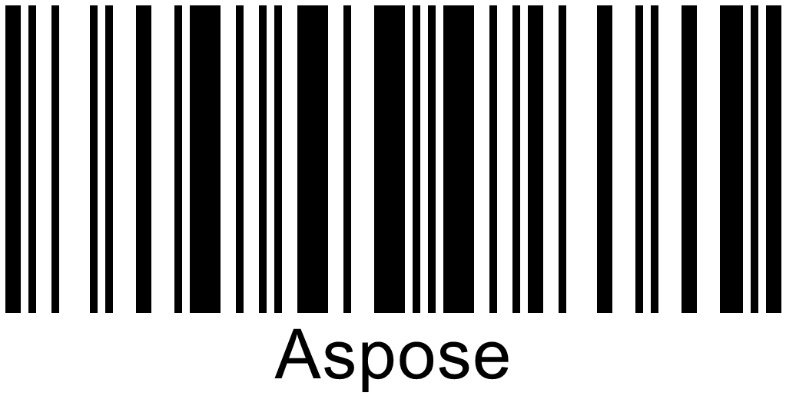

## **Fast Detection for High-Quality Barcode Images**
To recognize high-quality 1D barcodes created through web-based applications, it is suggested to use *setAllowOneDFastBarcodesDetector* and *setFastScanOnly* reading methods. These methods enable fast scanning of target image areas through lightweight scanning techniques. The difference between these two options is that the *setFastScanOnly* method does not enable further barcode search after the failure to idetify more barcodes through lightweight scanning methods.  
  
<!--The following code snippet explains how to implement fast barcode recognition.-->  

<!--
Console.WriteLine("FastScan:");

//read barcode image with FastScan options disabled
Console.WriteLine("FastScan: disabled");
using (BarCodeReader read = new BarCodeReader($"{path}code128_hq.png", DecodeType.Code128))
{
    read.QualitySettings.FastScanOnly = false;
    read.QualitySettings.AllowOneDFastBarcodesDetector = false;
    Stopwatch watch = new Stopwatch();
    watch.Start();
    read.ReadBarCodes();
    watch.Stop();
    Console.WriteLine($"Barcodes read: {read.FoundCount}, Recognition time:{(int)watch.ElapsedMilliseconds} ms");
    foreach (BarCodeResult result in read.FoundBarCodes)
        Console.WriteLine($"{result.CodeTypeName}:{result.CodeText}");
}

//read barcode image with FastScan options enabled
Console.WriteLine("FastScan: enabled");
using (BarCodeReader read = new BarCodeReader($"{path}code128_hq.png", DecodeType.Code128))
{
    read.QualitySettings.FastScanOnly = true;
    read.QualitySettings.AllowOneDFastBarcodesDetector = true;
    Stopwatch watch = new Stopwatch();
    watch.Start();
    read.ReadBarCodes();
    watch.Stop();
    Console.WriteLine($"Barcodes read: {read.FoundCount}, Recognition time:{(int)watch.ElapsedMilliseconds} ms");
    foreach (BarCodeResult result in read.FoundBarCodes)
        Console.WriteLine($"{result.CodeTypeName}:{result.CodeText}");
}
-->

## **Recognition of Regular Barcode Images without Damage**
To decode regular norma-quality barcode images, ***Aspose.BarCode for Java*** applies a method called *setAllowRegularImage* that uses standard recognition techniques. This mode is suggested to be enabled in most cases, as its deactivation may lead to decoding failures for regular barcode images.  
  
<!--The following code sample shows how to perform regular barcode recognition.-->
  

<!--
Console.WriteLine("RegularImage:");

//read barcode image with AllowRegularImage set to false
Console.WriteLine("AllowRegularImage: false");
using (BarCodeReader read = new BarCodeReader($"{path}aztec_regular_inverse.png", DecodeType.Aztec))
{
    read.QualitySettings = QualitySettings.HighPerformance;
    read.QualitySettings.AllowRegularImage = false;
    read.QualitySettings.AllowInvertImage = true;
    Console.WriteLine($"Barcodes read: {read.ReadBarCodes().Length}");
    foreach (BarCodeResult result in read.FoundBarCodes)
        Console.WriteLine($"{result.CodeTypeName}:{result.CodeText}");
}

//read barcode image with AllowRegularImage set to true
Console.WriteLine("AllowRegularImage: true");
using (BarCodeReader read = new BarCodeReader($"{path}aztec_regular_inverse.png", DecodeType.Aztec))
{
    read.QualitySettings = QualitySettings.HighPerformance;
    read.QualitySettings.AllowRegularImage = true;
    read.QualitySettings.AllowInvertImage = true;
    Console.WriteLine($"Barcodes read: {read.ReadBarCodes().Length}");
    foreach (BarCodeResult result in read.FoundBarCodes)
        Console.WriteLine($"{result.CodeTypeName}:{result.CodeText}");
}
-->
