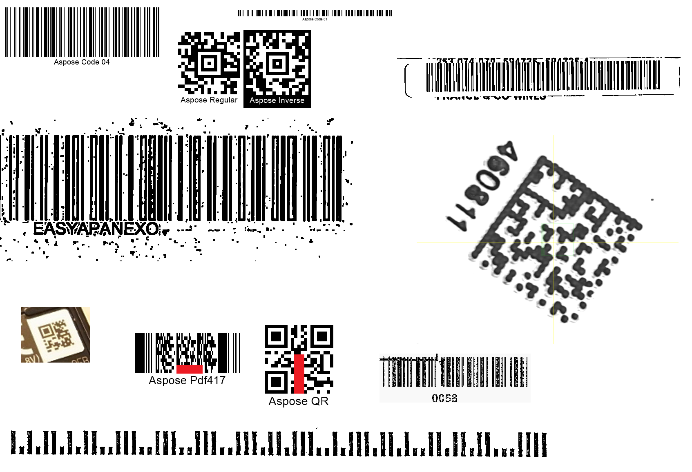

## **Overview**
***Aspose.BarCode for Java*** contains class [*QualitySettings*](https://reference.aspose.com/barcode/java/com.aspose.barcode.barcoderecognition/QualitySettings) that is used to enable and disable various algorithms to read barcodes with damages or artifacts. See the article [**Recognition Specificities**](/barcode/java/recognition-specificities/) for additional information about special recognition cases. In addition, class [*QualitySettings*](https://reference.aspose.com/barcode/java/com.aspose.barcode.barcoderecognition/QualitySettings) allows customizing the trade-off between recognition quality and speed in common cases. Corresponding methods are grouped into dedicated presets that allow improving image recovery and barcode reading for various scenarios.

## **Recognition Presets**
In this section, supported recognition presets are described, including *HighPerformance*, *NormalQuality*, *HighQuality*, *MaxBarCodes*, and others, as represented in the table below. By default, the *NormalQuality* preset is applied. 

|Recognition Preset|Description|
|---|---|
|*NormalQuality*|Suitable for regular-quality barcode images|
|*HighQuality*|Intended for low-quality barcode images. It allows scanning diagonal and severely damaged barcode images|
|*HighPerformance*|Used for high-quality barcode images|
|*HighQualityDetection*|Same as *NormalQuality* but with the [*setDetectorSettings*](https://reference.aspose.com/barcode/java/com.aspose.barcode.barcoderecognition/BarcodeSvmDetectorSettings) method called passing the *HighQuality* value|
|*MaxQualityDetection*|Same as *NormalQuality* but with the [*setDetectorSettings*](https://reference.aspose.com/barcode/java/com.aspose.barcode.barcoderecognition/BarcodeSvmDetectorSettings) method called using the *MaxQuality* value. It allows detecting diagonal and damaged barcode images|
|*MaxBarcodes*|Allows scanning all barcodes possibly presented in an image, including invalid ones. It is recommended for debugging tasks only|
  
### **Universal Presets for All Barcode Types**
***Aspose.BarCode for Java*** suggests various universal recognition presets and corresponding methods to activate them, such as *setHighPerformance*, *setNormalQuality*, and *setHighQuality*. These presets establish linear dependence between reading accuracy and speed for all barcode types. Generally, using the default *NormalQuality* preset is sufficient for most of barcodes that have acceptable scanning quality. 
  
<!--The following code sample shows how to use universal presets.-->
  

  
<!--
Console.WriteLine("QualityPresetsMain:");

//read barcode image with QualitySettings set to HighPerformance
Console.WriteLine("QualitySettings: HighPerformance");
using (BarCodeReader read = new BarCodeReader($"{path}barcodes_different_quality.png", DecodeType.Code128, 
    DecodeType.Code39Extended, DecodeType.Planet, DecodeType.QR, DecodeType.MicroQR, DecodeType.Pdf417, DecodeType.DataMatrix, DecodeType.Aztec))
{
    read.QualitySettings = QualitySettings.HighPerformance;
    Console.WriteLine($"Barcodes read: {read.ReadBarCodes().Length}");
    foreach (BarCodeResult result in read.FoundBarCodes)
        Console.WriteLine($"{result.CodeTypeName}:{result.CodeText}");
}

//read barcode image with QualitySettings set to NormalQuality
Console.WriteLine("QualitySettings: NormalQuality");
using (BarCodeReader read = new BarCodeReader($"{path}barcodes_different_quality.png", DecodeType.Code128,
    DecodeType.Code39Extended, DecodeType.Planet, DecodeType.QR, DecodeType.MicroQR, DecodeType.Pdf417, DecodeType.DataMatrix, DecodeType.Aztec))
{
    read.QualitySettings = QualitySettings.NormalQuality;
    Console.WriteLine($"Barcodes read: {read.ReadBarCodes().Length}");
    foreach (BarCodeResult result in read.FoundBarCodes)
        Console.WriteLine($"{result.CodeTypeName}:{result.CodeText}");
}

//read barcode image with QualitySettings set to HighQuality
Console.WriteLine("QualitySettings: HighQuality");
using (BarCodeReader read = new BarCodeReader($"{path}barcodes_different_quality.png", DecodeType.Code128,
    DecodeType.Code39Extended, DecodeType.Planet, DecodeType.QR, DecodeType.MicroQR, DecodeType.Pdf417, DecodeType.DataMatrix, DecodeType.Aztec))
{
    read.QualitySettings = QualitySettings.HighQuality;
    Console.WriteLine($"Barcodes read: {read.ReadBarCodes().Length}");
    foreach (BarCodeResult result in read.FoundBarCodes)
        Console.WriteLine($"{result.CodeTypeName}:{result.CodeText}");
}
-->

### **Presets for 1D Barcode Types**
To scan linear barcodes, ***Aspose.BarCode for Java*** allows using dedicated recognition presets suitable for normal-quality barcodes. These presets provide improved methods for 1D barcode detection and decoding and are useful to work with barcodes of small dimensions or complex documents with multiple text blocks and tables. For example, compared with general recognition settings, *HighQualityDetection* and *MaxQualityDetection* presets allow improving recognition results for 1D barcodes in complex documents. Alternatilvely, such imprment can be implemented using the *NormalQuality* preset and tuning [*BarcodeSvmDetectorSettings*](https://reference.aspose.com/barcode/java/com.aspose.barcode.barcoderecognition/BarcodeSvmDetectorSettings) through the *setDetectorSettings* method.  
  
The image shown below is a sample document with multiple barcodes that contains also text parts and figures. 

  
<!--The following code sample shows how to tune reading quality parameters to enable correct detection and decoding of all 1D barcodes corresponding to the target symbologies. 


Console.WriteLine("QualityPresetsOneD:");

//read barcode image with QualitySettings set to NormalQuality
Console.WriteLine("QualitySettings: NormalQuality");
using (BarCodeReader read = new BarCodeReader($"{path}many_code128.png", DecodeType.Code128))
{
    read.QualitySettings = QualitySettings.NormalQuality;
    Console.WriteLine($"Barcodes read: {read.ReadBarCodes().Length}");
    foreach (BarCodeResult result in read.FoundBarCodes)
        Console.WriteLine($"{result.CodeTypeName}:{result.CodeText}");
}

//read barcode image with QualitySettings set to HighQualityDetection
Console.WriteLine("QualitySettings: HighQualityDetection");
using (BarCodeReader read = new BarCodeReader($"{path}many_code128.png", DecodeType.Code128))
{
    read.QualitySettings = QualitySettings.HighQualityDetection;
    Console.WriteLine($"Barcodes read: {read.ReadBarCodes().Length}");
    foreach (BarCodeResult result in read.FoundBarCodes)
        Console.WriteLine($"{result.CodeTypeName}:{result.CodeText}");
}

//read barcode image with QualitySettings set to MaxQualityDetection
Console.WriteLine("QualitySettings: MaxQualityDetection");
using (BarCodeReader read = new BarCodeReader($"{path}many_code128.png", DecodeType.Code128))
{
    read.QualitySettings = QualitySettings.MaxQualityDetection;
    Console.WriteLine($"Barcodes read: {read.ReadBarCodes().Length}");
    foreach (BarCodeResult result in read.FoundBarCodes)
        Console.WriteLine($"{result.CodeTypeName}:{result.CodeText}");
}
-->

### *****MaxBarCodes*** Preset for Debugging**
To detect all possible barcodes in an image including invalid ones, ***Aspose.BarCode for Java*** contains a special preset called *MaxBarCodes*. This preset allows restoring up to 1% more barcodes (severely damaged or incorrectly generated) in comparison with the results that can be reached by the *NormalQuality* preset. Similar reading settings can be implemented through the *setAllowIncorrectBarcodes* method.
The *MaxBarCodes* preset may be used to scan even unreadable barcodes; however, it is intended for debugging tasks only as it may result in considerably augmenting the time needed to complete the reading process and providing invalid decoding outputs. This preset is suggested only for advanced users of the ***Aspose.BarCode*** library. 
  
<!--The following code sample shows how to use the *MaxBarCodes* preset.


Console.WriteLine("MaxBarCodesPreset:");

//read barcode image with QualitySettings set to MaxBarCodes
Console.WriteLine("QualitySettings: MaxBarCodes");
using (BarCodeReader read = new BarCodeReader($"{path}barcodes_different_quality.png", DecodeType.Code128,
    DecodeType.Code39Extended, DecodeType.Planet, DecodeType.QR, DecodeType.MicroQR, DecodeType.Pdf417, DecodeType.DataMatrix, DecodeType.Aztec))
{
    read.QualitySettings = QualitySettings.MaxBarCodes;
    Console.WriteLine($"Barcodes read: {read.ReadBarCodes().Length}");
    foreach (BarCodeResult result in read.FoundBarCodes)
        Console.WriteLine($"{result.CodeTypeName}:{result.CodeText}");
}
-->

