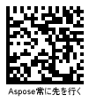

{}[Read Barcodes Online](https://products.aspose.app/barcode/recognize): You can test the quality of ***Aspose.BarCode*** recognition functionality and view the results online.{}
  
## **Overview**
***Aspose.BarCode for Java*** not only enables reading information encoded in a barcode but also provides a possibility to analyze its technical properties, including symbology, orientation angle, position, and metadata. This data is stored in objects of class [*BarCodeResult*](https://apireference.aspose.com/barcode/java/com.aspose.barcode.barcoderecognition/BarCodeResult) and can be fetched using special methods described further in this article.  

<!--The following code snippet illustrates how to get contents of the [*BarCodeResult*](https://apireference.aspose.com/barcode/java/com.aspose.barcode.barcoderecognition/BarCodeResult) instance.
 
 BarcodeGenerator generator = new BarcodeGenerator(EncodeTypes.Code128, "12345");
 generator.save("c:\\test.png");
 BarCodeReader reader = new BarCodeReader("c:\\test.png", DecodeType.CODE_39_STANDARD, DecodeType.CODE_128);
 for(BarCodeResult result : reader.readBarCodes())
 {
     System.out.println("BarCode Type: " + result.getCodeTypeName());
     System.out.println("BarCode CodeText: " + result.getCodeText());
     System.out.println("BarCode Confidence: " + result.getConfidence());
     System.out.println("BarCode ReadingQuality: " + result.getReadingQuality());
     System.out.println("BarCode Angle: " + result.getRegion().getAngle());
 }-->  

{}*If you need any clarifications, feel free to reach out to [Aspose Technical Support](/barcode/java/technical-support/): ask your questions at [Aspose.Barcode Forum](https://forum.aspose.com/c/barcode/13) or contact [Aspose Paid Support Helpdesk](https://helpdesk.aspose.com/).*{}

## **Barcode Type and Encoded Data**
To obtain input barcode data and its symbology, *getCodeText* and *getCodeType* methods of class [*BarCodeResult*](https://apireference.aspose.com/barcode/java/com.aspose.barcode.barcoderecognition/BarCodeResult) can be used. The other method called *getCodeTypeName* returns the text name of the barcode type.
  
<!--The following code snippet shows how to use these methods.
 

//create barcode
using (BarcodeGenerator gen = new BarcodeGenerator(EncodeTypes.QR, "Åspóse.Barcóde©"))
{
    gen.Parameters.Barcode.XDimension.Pixels = 4;
    gen.Save($"{path}QRCodetext.png", BarCodeImageFormat.Png);
}

//recognize image
Console.WriteLine("ReadExtCodetext:");
using (BarCodeReader read = new BarCodeReader($"{path}QRCodetext.png", DecodeType.QR))
{
    foreach (BarCodeResult result in read.ReadBarCodes())
    {
        Console.WriteLine($"CodeText:{result.CodeText}");
        Console.WriteLine($"CodeType:{result.CodeType.ToString()}");
        Console.WriteLine($"CodeTypeName:{result.CodeTypeName}");
    }
}
-->

 
  
## **Reading Barcode Data as Byte Stream**
It is possible to load barcode data as a byte stream using a special method of class [*BarCodeResult*](https://apireference.aspose.com/barcode/java/com.aspose.barcode.barcoderecognition/BarCodeResult) that is called *getCodeBytes*. 

<!--The following code sample explains how to fetch barcode data as a byte stream.  
   

byte[] encodedArr = { 0xFF, 0xFE, 0xFD, 0xFC, 0xFB, 0xFA, 0xF9 };

//encode array to string
StringBuilder strBld = new StringBuilder(encodedArr.Length);
foreach (byte bval in encodedArr)
    strBld.Append((char)bval);

//encode array of bytes
using (BarcodeGenerator gen = new BarcodeGenerator(EncodeTypes.Pdf417, strBld.ToString()))
{
    gen.Parameters.Barcode.XDimension.Pixels = 2;
    gen.Parameters.Barcode.Pdf417.Pdf417CompactionMode = Pdf417CompactionMode.Binary;
    gen.Parameters.Barcode.Pdf417.Columns = 2;
    gen.Parameters.Barcode.CodeTextParameters.TwoDDisplayText = "Bytes mode";
    gen.Save($"{path}ExtCodeBytes.png", BarCodeImageFormat.Png);
}

//attempt to recognize array of bytes
Console.WriteLine("ReadExtCodeBytes:");
using (BarCodeReader read = new BarCodeReader($"{path}ExtCodeBytes.png", DecodeType.Pdf417))
    foreach (BarCodeResult result in read.ReadBarCodes())
    {
        Console.WriteLine($"CodeTypeName:{result.CodeTypeName}");
        Console.WriteLine($"CodeBytes:{BitConverter.ToString(result.CodeBytes)}");
    }
-->

## **Decoding Barcode Text in Unicode**
For barcodes in which the barcode data is encoded in a Unicode encoding, the library provides the *getCodeText* method that can be used to enable the required encoding in the following format: getCodeText(java.nio.charset.Charset encoding).  
  
<!--The following code snippet shows how to get barcode data encoded using the UTF8 encoding.
   

//create encoded Unicode codetext
using (BarcodeGenerator gen = new BarcodeGenerator(EncodeTypes.DataMatrix, "Aspose常に先を行く"))
{
    gen.Parameters.Barcode.XDimension.Pixels = 4;
    gen.Parameters.Barcode.DataMatrix.CodeTextEncoding = Encoding.UTF8;
    gen.Save($"{path}ExtUnicodeCodeText.png", BarCodeImageFormat.Png);
}

//try to recognize Unicode codetext
Console.WriteLine("ReadExtUnicodeCodeText:");
using (BarCodeReader read = new BarCodeReader($"{path}ExtUnicodeCodeText.png", DecodeType.DataMatrix))
    foreach (BarCodeResult result in read.ReadBarCodes())
    {
        Console.WriteLine($"CodeTypeName:{result.CodeTypeName}");
        Console.WriteLine($"GetCodeText:{result.GetCodeText(Encoding.UTF8)}");
    }
-->

   
## **Quality Check of Recognition Results**
Developers may need to check whether barcode reading outputs are accurate and complete. For this purpose, ***Aspose.BarCode for Java*** provides two specific methods of class [*BarCodeResult*](https://apireference.aspose.com/barcode/java/com.aspose.barcode.barcoderecognition/BarCodeResult): *getConfidence* and *getReadingQuality*.  
Depending of the quality of barcode reading results, the *getConfidence* method returns a instance of the [*BarCodeConfidence*](https://apireference.aspose.com/barcode/java/com.aspose.barcode.barcoderecognition/BarCodeConfidence) enum that denotes the recognition confidence level. This enumeration contains values *STRONG*, *NONE*, and *MODERATE* that are discussed below. The *getReadingQuality* method returns an estimate of recognition quality corresponding to the confidence level, as explained in the table below.
  
|Confidence Level|Quality Value|Description|
|---|---|---|
|*NONE*|0|If the confidence level is *None*, it indicates that the barcode is invalid and its information has been read with errors. If required, it is possible to get its symbology and position in the image and decode barcode information partially|
|*MODERATE*|80|This confidence level may be returned for linear and postal barcode types with weak or absent checksum controls. Furthermore, it is necessary to analyze the result of the *getReadingQuality* method. The absolute correctness of barcode reading results is not assured|
|*STRONG*|100|This confidence level is returned for all 2D symbologies with Reed-Solomon error correction. It means that barcode text has been recognized accurately|
  
<!--The following code sample shows how to obtain the recognition quality estimate.
  

//recognize image
Console.WriteLine("ReadExtQuality:");
using (BarCodeReader read = new BarCodeReader($"{path}qr_code128.png", DecodeType.QR, DecodeType.Code128))
{
    foreach (BarCodeResult result in read.ReadBarCodes())
    {
        Console.WriteLine($"CodeType:{result.CodeTypeName}");
        Console.WriteLine($"CodeText:{result.CodeText}");
        Console.WriteLine($"Confidence:{result.Confidence.ToString()}");
        Console.WriteLine($"ReadingQuality:{result.ReadingQuality.ToString()}");
    }
}
-->
  
## **Barcode Position and Orientation Angle**
To obtain the position of a source barcode and its orientation angle, methods class [*BarCodeRegionParameters*](https://apireference.aspose.com/barcode/java/com.aspose.barcode.barcoderecognition/BarCodeRegionParameters) can be used. This class allows getting the information about the barcode region in the following forms:
-	Quadrangle – a quadrangle object that bounds a barcode
-	Rectangle - a rectangle object that bounds a barcode
-	Points – an array of points constituting a barcode
-	Angle – an orientation angle in degrees
  
<!--The following code snippet shows how to fetch the information about barcode positiom and orientation angle.


//recognize image
Console.WriteLine("ReadExtRegion:");
using (BarCodeReader read = new BarCodeReader($"{path}qr_code128.png", DecodeType.QR, DecodeType.Code128))
{
    foreach (BarCodeResult result in read.ReadBarCodes())
    {
        Console.WriteLine($"CodeType:{result.CodeTypeName}");
        Console.WriteLine($"CodeText:{result.CodeText}");
        Console.WriteLine($"Quadrangle:{result.Region.Quadrangle.ToString()}");
        Console.WriteLine($"Angle:{result.Region.Angle.ToString()}");
        Console.WriteLine($"Rectangle:{result.Region.Rectangle.ToString()}");
        string ptStr = "";
        foreach (Point pt in result.Region.Points)
            ptStr += pt.ToString() + "";
        Console.WriteLine($"Points:{ptStr}");
    }
}
-->
  

## **Barcode Metadata**

### **Reading Macro PDF417 and Macro PDF417 Metadata**

Metadata from *PDF417* barcodes can be obtained using methods of class [*Pdf417ExtendedParameters*](https://apireference.aspose.com/barcode/java/com.aspose.barcode.barcoderecognition/Pdf417ExtendedParameters) that are listed below.
  
|PDF417 Metadata Method|Description|
|---|---|
|*getPdf417MacroFileID*|Gets the unique identifier of a barcode series or a PDF417 file|
|*getPdf417MacroSegmentID*|Gets the current identifier of a segment|
|*getPdf417MacroSegmentsCount*|Returns the number of barcodes in a series|
|*getPdf417MacroFileName*|Returns the name of a file|
|*getPdf417MacroChecksum*|Gets the checksum value computed using CCITT-16 polynomial|
|*getPdf417MacroFileSize*|Returs the total size of bytes in a series|
|*getPdf417MacroTimeStamp*|Returns the time spent to generate/send the file|
|*getPdf417MacroAddressee*|Gets the address of the file sender|
|*getPdf417MacroSender*|Returns the name of the file sender|
  
<!--The following code sample explains how to obtain metadata from a *PDF417* barcode.  
 

//generate Macro PDF417 with metadata
using (BarcodeGenerator gen = new BarcodeGenerator(EncodeTypes.MacroPdf417, "Åspóse.Barcóde©"))
{
    gen.Parameters.Barcode.XDimension.Pixels = 2;
    gen.Parameters.Barcode.Pdf417.Columns = 5;
    gen.Parameters.Barcode.Pdf417.Pdf417MacroFileID = 12345678;
    gen.Parameters.Barcode.Pdf417.Pdf417MacroSegmentID = 12;
    gen.Parameters.Barcode.Pdf417.Pdf417MacroSegmentsCount = 20;
    gen.Parameters.Barcode.Pdf417.Pdf417MacroFileName = "file01";
    //checksumm must be calculated in CCITT-16 / CRC-16-CCITT encoding
    //https://en.wikipedia.org/wiki/Cyclic_redundancy_check#Polynomial_representations_of_cyclic_redundancy_checks
    //for the example we use random number
    gen.Parameters.Barcode.Pdf417.Pdf417MacroChecksum = 1234;
    gen.Parameters.Barcode.Pdf417.Pdf417MacroFileSize = 400000;
    gen.Parameters.Barcode.Pdf417.Pdf417MacroTimeStamp = new DateTime(2019, 11, 1);
    gen.Parameters.Barcode.Pdf417.Pdf417MacroAddressee = "street";
    gen.Parameters.Barcode.Pdf417.Pdf417MacroSender = "aspose";
    gen.Save($"{path}ExtPDF417Meta.png", BarCodeImageFormat.Png);
}

//attempt to recognize PDF417 metadata
Console.WriteLine("ReadExtPDF417Meta:");
using (BarCodeReader read = new BarCodeReader($"{path}ExtPDF417Meta.png", DecodeType.MacroPdf417))
{
    foreach (BarCodeResult result in read.ReadBarCodes())
    {
        Console.WriteLine($"CodeType:{result.CodeTypeName}");
        Console.WriteLine($"CodeText:{result.CodeText}");
        Console.WriteLine($"Pdf417MacroFileID:{result.Extended.Pdf417.MacroPdf417FileID}");
        Console.WriteLine($"Pdf417MacroSegmentID:{result.Extended.Pdf417.MacroPdf417SegmentID.ToString()}");
        Console.WriteLine($"Pdf417MacroSegmentsCount:{result.Extended.Pdf417.MacroPdf417SegmentsCount.ToString()}");
        Console.WriteLine($"Pdf417MacroFileName:{result.Extended.Pdf417.MacroPdf417FileName}");
        Console.WriteLine($"Pdf417MacroChecksum:{result.Extended.Pdf417.MacroPdf417Checksum.ToString()}");
        Console.WriteLine($"Pdf417MacroFileSize:{result.Extended.Pdf417.MacroPdf417FileSize.ToString()}");
        Console.WriteLine($"Pdf417MacroTimeStamp:{result.Extended.Pdf417.MacroPdf417TimeStamp.ToString()}");
        Console.WriteLine($"Pdf417MacroAddressee:{result.Extended.Pdf417.MacroPdf417Addressee}");
        Console.WriteLine($"Pdf417MacroSender:{result.Extended.Pdf417.MacroPdf417Sender}");
    }
}
-->
  

  

### **Reading Metadata from QR Codes with Structured Append**
To fetch metadata from *QR Code* barcodes with structured append, ***Aspose.BarCode for Java*** provides a special class called [*QRExtendedParameters*](https://apireference.aspose.com/barcode/java/com.aspose.barcode.barcoderecognition/QRExtendedParameters). Methods of this class enable reading the information from structured append that is used to combine several *QR Code* barcode into one. This data can be obtained using the following methods:

- *getQRStructuredAppendModeBarCodeIndex* - returns the sequence number of the current barcode (starting from 0)
- *getQRStructuredAppendModeBarCodesQuantity* - returns the number of barcodes in a composite *QR Code* barcode taht can take values from 2 to 16
- *getQRStructuredAppendModeParityData* - returns the checksum identifier byte that is usually computed as *XOR* of all bytes in which UTF16BE characters are encoded in two bytes  
  
<!--The code sample below shows how to fetch metadata from a sample *QR Code* barcode with structured append.
   

//generate QR with metadata
using (BarcodeGenerator gen = new BarcodeGenerator(EncodeTypes.QR, "Åspóse.Barcóde©"))
{
    gen.Parameters.Barcode.XDimension.Pixels = 4;
    gen.Parameters.Barcode.QR.StructuredAppend.TotalCount = 3;
    gen.Parameters.Barcode.QR.StructuredAppend.SequenceIndicator = 1;
    gen.Parameters.Barcode.QR.StructuredAppend.ParityByte = 123;
    gen.Save($"{path}ExtQRMeta.png", BarCodeImageFormat.Png);
}

//attempt to recognize QR metadata
Console.WriteLine("ReadExtQRMeta:");
using (BarCodeReader read = new BarCodeReader($"{path}ExtQRMeta.png", DecodeType.QR))
{
    foreach (BarCodeResult result in read.ReadBarCodes())
    {
        Console.WriteLine($"CodeType:{result.CodeTypeName}");
        Console.WriteLine($"CodeText:{result.CodeText}");
        Console.WriteLine($"BarCodesQuantity:{result.Extended.QR.QRStructuredAppendModeBarCodesQuantity}");
        Console.WriteLine($"BarCodeIndex:{result.Extended.QR.QRStructuredAppendModeBarCodeIndex}");
        Console.WriteLine($"ParityData:{result.Extended.QR.QRStructuredAppendModeParityData}");
    }
}
-->

  
### **Reading Metadata from DataBar Barcodes with 2D Components**
Metadata from *DataBar* barcodes with 2D components can be obtained using class called [*DataBarExtendedParameters*](https://apireference.aspose.com/barcode/java/com.aspose.barcode.barcoderecognition/DataBarExtendedParameters) that provides a special method called *is2DCompositeComponent*. This methods allows enabling or disabling a 2D component in *DataBar* barcodes.  
  
<!--The following code snippet shows how to fetch metadata from a sample *DataBar* barcode with a 2D component.
  

//generate Databar with metadata
using (BarcodeGenerator gen = new BarcodeGenerator(EncodeTypes.DatabarExpandedStacked, "ASPOSE.BARCODE"))
{
    gen.Parameters.Barcode.XDimension.Pixels = 2;
    gen.Parameters.Barcode.DataBar.Rows = 2;
    gen.Parameters.Barcode.DataBar.Is2DCompositeComponent = true;
    gen.Save($"{path}ExtDataBarMeta.png", BarCodeImageFormat.Png);
}

//attempt to recognize Databar metadata
Console.WriteLine("ReadExtDataBarMeta:");
using (BarCodeReader read = new BarCodeReader($"{path}ExtDataBarMeta.png", DecodeType.DatabarExpanded, DecodeType.DatabarExpandedStacked))
{
    foreach (BarCodeResult result in read.ReadBarCodes())
    {
        Console.WriteLine($"CodeType:{result.CodeTypeName}");
        Console.WriteLine($"CodeText:{result.CodeText}");
        Console.WriteLine($"Is2DCompositeComponent:{result.Extended.DataBar.Is2DCompositeComponent}");
    }
}
-->

### **Reading Metadata from 1D Barcodes**
Some 1D barcode types, i.e. *EAN 13*, allow separating barcode input information itself from the checksum value. To do this, class [*OneDExtendedParameters*](https://apireference.aspose.com/barcode/java/com.aspose.barcode.barcoderecognition/OneDExtendedParameters) provides the *getValue* method that allows getting 1D barcode text and the *getCheckSum* method that returns the result of checksum computation.
  
<!--The following code snippet explains how to get the barcode text of a EAN 13 barcode and its checksum value.
 
BarcodeGenerator generator = new BarcodeGenerator(EncodeTypes.EAN_13, "1234567890128");
 generator.save("c:\\test.png");
 BarCodeReader reader = new BarCodeReader("c:\\test.png", DecodeType.EAN_13);
 for(BarCodeResult result : reader.readBarCodes())
 {
    System.out.println("BarCode Type: " + result.getCodeTypeName());
    System.out.println("BarCode CodeText: " + result.getCodeText());
    System.out.println("BarCode Value: " + result.getExtended().getOneD().getValue());
    System.out.println("BarCode Checksum: " + result.getExtended().getOneD().getCheckSum());
}-->
 

  
### **Getting Raw Data from Code 128 Barcodes**
Input data stored in *Code 128* barcodes can be encoded in three ways: A, B, or C. Class [*Code128ExtendedParameters*](https://apireference.aspose.com/barcode/java/com.aspose.barcode.barcoderecognition/Code128ExtendedParameters) provides a special method called *getCode128DataPortions* that returns decoded parts of barcode input information and the encoding mode.

<!--The following code sample shows how to fetch *Code 128* raw data.

 BarcodeGenerator generator = new BarcodeGenerator(EncodeTypes.Code128, "12345");
 generator.save("c:\\test.png");
 BarCodeReader reader = new BarCodeReader("c:\\test.png", DecodeType.CODE_128);
 for(BarCodeResult result : reader.readBarCodes())
 {
    System.out.println("BarCode Type: " + result.getCodeTypeName());
    System.out.println("BarCode CodeText: " + result.getCodeText());
    System.out.println("Code128 Data Portions: " + result.getExtended().getCode128());
 }-->

