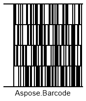

{}[Generate Code16K Barcodes Online](https://products.aspose.app/barcode/generate/code16k): You can test the quality of ***Aspose.BarCode*** generation for Code16K barcodes and get results online.{}

## **Overview**
*Code16K* is a stacked multiple-row symbology that may include at most 16 rows. Each row in a barcode has a fixed length and can encode up to five symbols. It supports the data encoding structure that is similar to that of *Code 128* and encodes the same character set with the same data density. *Code16K* comprises checksum digits computed in two last characters for the whole barcode. However, no separate checksum controls are supported for a single row. A *Code16K* can encode at most 77 symbols or 154 numerical digits. Currently, this symbology is considered from the historical viewpoint and is rarely applied to real-life business tasks.
  
{}*If you need any clarifications, feel free to reach out [Aspose Technical Support](/barcode/java/technical-support/): ask your questions at [Aspose.Barcode Forum](https://forum.aspose.com/c/barcode/13) or contact [Aspose Paid Support Helpdesk](https://helpdesk.aspose.com/).*{}

## **Barcode Height Settings**
In ***Aspose.BarCode for Java***, it is possible to modify the row height of a *Code16K* barcode through the *setAspectRatio* method of class [*Code16KParameters*](https://reference.aspose.com/barcode/java/com.aspose.barcode.generation/Code16KParameters). *AspectRatio* is determined as a relative coefficient to the value of *XDimension*. In the *Code16K* standard, the value of *AspectRatio* should be set larger than 8.  
  
The following *Code16K* barcodes have been created using various barcode height settings. 
  
|Aspect Ratio|Is Set to 10|Is Set to 20|
| :-: | :-: | :-: |
| |||
  
<!--The following code sample explains how to determine the height of *Code16K* barcode rows.
  

BarcodeGenerator gen = new BarcodeGenerator(EncodeTypes.Code16K, "Aspose.Barcode");
gen.Parameters.Barcode.XDimension.Pixels = 2;
//set Code 16K aspect ratio 10
gen.Parameters.Barcode.Code16K.AspectRatio = 10;
gen.Save($"{path}Code16KAspectRatio10.png", BarCodeImageFormat.Png);
//set Code 16K aspect ratio 20
gen.Parameters.Barcode.Code16K.AspectRatio = 20;
gen.Save($"{path}Code16KAspectRatio20.png", BarCodeImageFormat.Png);
-->

## **Quiet Zone Settings**
***Aspose.BarCode for Java*** allows modifying the size of quiet zones in *Code16K* barcodes by calling *setQuietZoneLeftCoef* and *setQuietZoneRightCoef* methods of class [*Code16KParameters*](https://reference.aspose.com/barcode/java/com.aspose.barcode.generation/Code16KParameters). Quiet zone coefficients are determined relatively to the value of *XDimension*.  
  
The following *Code16K* barcodes have been generated using various quiet zone settings.
  
|Quiet Zone Coefficient|Is Set to 10|Is Set to 20|
| :-: | :-: | :-: | :-: | :-: |
| |||
  
<!--The following code snippet shows how to modify quiet zone settings for *Code16K* barcodes.
  

BarcodeGenerator gen = new BarcodeGenerator(EncodeTypes.Code16K, "Aspose.Barcode");
gen.Parameters.Barcode.XDimension.Pixels = 2;
//set Code 16K quiet zone 10
gen.Parameters.Barcode.Code16K.QuietZoneLeftCoef = 10;
gen.Parameters.Barcode.Code16K.QuietZoneRightCoef = 10;
gen.Save($"{path}Code16KQuietZoneL10R10.png", BarCodeImageFormat.Png);
//set Code 16K quiet zone 20
gen.Parameters.Barcode.Code16K.QuietZoneLeftCoef = 20;
gen.Parameters.Barcode.Code16K.QuietZoneRightCoef = 20;
gen.Save($"{path}Code16KQuietZoneL20R20.png", BarCodeImageFormat.Png);
-->