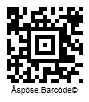
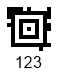
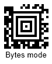
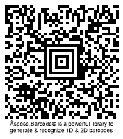
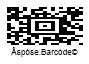

{}[Generate Aztec Barcodes Online](https://products.aspose.app/barcode/generate/aztec): You can check the quality of ***Aspose.BarCode*** generation for Aztec barcodes and view the results online.{}

## **Overview**
*Aztec Code* is a 2D barcode type that allows encoding alphanumeric characters and streams of bytes. *Aztec Code* barcodes are composed of square modules that create individual patterns in the center of a barcode image. These so-called bulls-eye signs facilitate barcode detection and scanning. This type supports Reed-Solomon error correction to assure data integrity and completeness. It benefits from high reading accuracy and data density.  
  
The *Aztec Code* barcode type supports three subtypes:
-	*Full-Range Aztec Code* - allows encoding up to 3,832 numerical or 3,067 alphanumeric symbols or 1,914 bytes
-	*Compact Aztec Code* - allows encoding up to 110 numerical or 89 alphanumeric symbols or 53 bytes
-	*Aztec Rune* - allows encoding values from 0 to 255 and is mainly used to label objects in Augmented Reality systems
  
{}*If you need any clarifications, feel free to reach out [Aspose Technical Support](/barcode/java/technical-support/): ask your questions at [Aspose.Barcode Forum](https://forum.aspose.com/c/barcode/13) or contact [Aspose Paid Support Helpdesk](https://helpdesk.aspose.com/).*{}
  
## **Generation Modes**
The preferred generation mode can be set using the [*AztecSymbolMode*](https://reference.aspose.com/barcode/java/com.aspose.barcode.generation/AztecSymbolMode) enum of class [*AztecParameters*](https://reference.aspose.com/barcode/java/com.aspose.barcode.generation/AztecParameters). Following modes are supported:
- *Auto*: identifies the most suitable *Aztec Code* type with the data capacity that is sufficient to encode data passed through the *setCodeText* method
- *Compact*: allows generating *Compact Aztec Code* barcodes with at most 4 layers and 27x27 modules
- *FullRange*: creates *Full-Range Aztec Code* barcodes with at most 32 layers and 151x151 modules
- *Rune*: generates *Aztec Rune* barcodes with at most 11x11 modules and can encode only numerical symbols from 0 to 255
  
Following *Aztec Code* barcode images have been generated through various generation modes.
  
|
**Generation Mode**
|
***Auto***
|
***Compact***
|
***Full-Range***
|
***Rune***
|
| :-: | :-: | :-: | :-: | :-: |
| |||||
  
The following code sample shows how to specify the preferred generation mode for *Aztec Code*.


// The path to the resource directory.
String dataDir = Utils.getDataDir(SetAztecSymbolMode.class) + "TwoD_barcodes/BasicFeatures/";

// Create an instance of BarCodeGenerator class.
BarcodeGenerator generator = new BarcodeGenerator(com.aspose.barcode.EncodeTypes.AZTEC, "25");

// set the AztecSymbolMode property.
generator.getParameters().getBarcode().getAztec().setAztecSymbolMode(AztecSymbolMode.RUNE);

// Save the barcode as PNG image.
generator.save(dataDir + "testRune25.png");



<!--
BarcodeGenerator gen = new BarcodeGenerator(EncodeTypes.Aztec, "Åspóse.Barcóde©");
gen.Parameters.Barcode.XDimension.Pixels = 4;
//set symbol mode Auto
gen.CodeText = "Åspóse.Barcóde©";
gen.Parameters.Barcode.Aztec.AztecSymbolMode = AztecSymbolMode.Auto;
gen.Save($"{path}AztecSymbolModeAuto.png", BarCodeImageFormat.Png);
//set symbol mode FullRange
gen.CodeText = "Åspóse.Barcóde©";
gen.Parameters.Barcode.Aztec.AztecSymbolMode = AztecSymbolMode.FullRange;
gen.Save($"{path}AztecSymbolModeFullRange.png", BarCodeImageFormat.Png);
//set symbol mode Compact
gen.CodeText = "Åspóse.Barcóde©";
gen.Parameters.Barcode.Aztec.AztecSymbolMode = AztecSymbolMode.Compact;
gen.Save($"{path}AztecSymbolModeCompact.png", BarCodeImageFormat.Png);
//set symbol mode Auto
gen.CodeText = "123";
gen.Parameters.Barcode.Aztec.AztecSymbolMode = AztecSymbolMode.Rune;
gen.Save($"{path}AztecSymbolModeRune.png", BarCodeImageFormat.Png);
-->
 
## **Encoding Byte Streams**
In ***Aspose.BarCode for Java***, streams of bytes can be encoded as *Aztec Code* barcodes. To display the text label, it is required to call the *setTwoDDisplayText* method of class [*CodetextParameters*](https://reference.aspose.com/barcode/java/com.aspose.barcode.generation/CodetextParameters). 
<!--The following code snippet explains how to encode a byte stream into an *Aztec* barcode.


byte[] encodedArr = { 0xFF, 0xFE, 0xFD, 0xFC, 0xFB, 0xFA, 0xF9 };

//encode array to string
StringBuilder strBld = new StringBuilder();
foreach (byte bval in encodedArr)
    strBld.Append((char)bval);

//encode in Aztec barcode
BarcodeGenerator gen = new BarcodeGenerator(EncodeTypes.Aztec, strBld.ToString());
gen.Parameters.Barcode.XDimension.Pixels = 4;
//set symbol mode Auto
gen.Parameters.Barcode.Aztec.AztecSymbolMode = AztecSymbolMode.Auto;
gen.Parameters.Barcode.CodeTextParameters.TwoDDisplayText = "Bytes mode";
gen.Save($"{path}AztecBytesEncoding.png", BarCodeImageFormat.Png);

//attempt to recognize
BarCodeReader read = new BarCodeReader(gen.GenerateBarCodeImage(), DecodeType.Aztec);
foreach (BarCodeResult result in read.ReadBarCodes())
    Console.WriteLine("AztecBytesEncoding:" + BitConverter.ToString(result.CodeBytes));
-->
  

  
## **Encoding Unicode Symbols**
In ***Aspose.BarCode for Java***, Unicode symbols can be encoded using the *setCodeTextEncoding* method of class [*AztecParameters*](https://reference.aspose.com/barcode/java/com.aspose.barcode.generation/AztecParameters). This method is applicable to all *Aztec Code* barcodes except *Rune*.
<!--The following code sample demonstrates how to specify different Unicode encodings.  


Console.OutputEncoding = Encoding.Unicode;
BarcodeGenerator gen = new BarcodeGenerator(EncodeTypes.Aztec, "Aspose常に先を行く");
gen.Parameters.Barcode.XDimension.Pixels = 4;
//set UTF8 encoding
gen.Parameters.Barcode.Aztec.CodeTextEncoding = Encoding.UTF8;
gen.Save($"{path}AztecCodeTextEncoding.png", BarCodeImageFormat.Png);
//try to recognize it
BarCodeReader read = new BarCodeReader(gen.GenerateBarCodeImage(), DecodeType.Aztec);
foreach (BarCodeResult result in read.ReadBarCodes())
    Console.WriteLine("AztecCodeTextEncoding:" + result.GetCodeText(Encoding.UTF8));
-->
  

  
## **Error Correction Settings**
*Aztec Code* barcodes include recovery information that can occupy from 5 to 95% of the entire encoded data stream. It is recommended to set this parameter to 23%. To select the required error correction level, it is necessary to use the *setAztecErrorLevel* method of class [*AztecParameters*](https://reference.aspose.com/barcode/java/com.aspose.barcode.generation/AztecParameters).  
  
Following barcode images have been created using various error correction levels.
  
|
**Error Correction Level**
|
**Is Set to 5**
|
**Is Set to 50**
|
| :-: | :-: | :-: |
| |||
  
<!--The following code snippet shows how to specify the preferred error correction level for *Aztec* barcodes.


BarcodeGenerator gen = new BarcodeGenerator(EncodeTypes.Aztec, "Åspóse.Barcóde© is a powerful library to generate & recognize 1D & 2D barcodes");
gen.Parameters.Barcode.XDimension.Pixels = 4;
gen.Parameters.Barcode.Aztec.AztecSymbolMode = AztecSymbolMode.FullRange;
//set error correction capacity to 5%
gen.Parameters.Barcode.Aztec.AztecErrorLevel = 5;
gen.Save($"{path}AztecErrorLevel5.png", BarCodeImageFormat.Png);
//set error correction capacity to 50%
gen.Parameters.Barcode.Aztec.AztecErrorLevel = 50;
gen.Save($"{path}AztecErrorLevel50.png", BarCodeImageFormat.Png);
-->

## **Aspect Ratio Settings**
*Aspect Ratio* is defined as the ratio between the barcode width and height. To modify proportions using the X and Y coordinates, ***Aspose.BarCode for Java*** provides the *setAspectRatio* method of class [*AztecParameters*](https://reference.aspose.com/barcode/java/com.aspose.barcode.generation/AztecParameters). *AspectRatio* is determined as a relative coefficient to the value of *XDimension*. In general, it is recommended to set *AspectRatio* equal to 1. If the proportions of *Aztec Code* barcodes to be generated need to be adjusted, the *setAspectRatio* method can be used to do this.  
  
Following barcodes have been generated with various values of the aspect ratio.
  
|
**Aspect Ratio**
|
**Is Set to 1**
|
**Is Set to 0.5**
|
| :-: | :-: | :-: |
| |||
  
<!--The following code sample demonstrates how to customize the aspect ratio for *Aztec* barcodes.


BarcodeGenerator gen = new BarcodeGenerator(EncodeTypes.Aztec, "Åspóse.Barcóde©");
gen.Parameters.Barcode.XDimension.Pixels = 4;
//set aspect ratio to 1
gen.Parameters.Barcode.Aztec.AspectRatio = 1;
gen.Save($"{path}AztecAspectRatio1.png", BarCodeImageFormat.Png);
//set aspect ratio to 0.5
gen.Parameters.Barcode.Aztec.AspectRatio = 0.5f;
gen.Save($"{path}AztecAspectRatio0.5.png", BarCodeImageFormat.Png);
-->