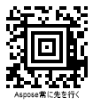

{}[Generate Aztec Barcodes Online](https://products.aspose.app/barcode/generate/aztec): You can check the quality of ***Aspose.BarCode*** generation for Aztec barcodes and view the results online.{}

## **Overview**
*Aztec* is a 2D matrix symbology that supports encoding both byte streams and alphanumeric characters. *Aztec* barcodes are depicted as square-grid modules with a unique pattern in the middle of a barcode image that facilitates barcode scanning and recognition. Moreover, it enables Reed-Solomon error correction to verify data integrity and recover encoded information. This symbology provides high data density and recognition accuracy.  
  
The *Aztec* symbology includes three barcode types:
-	*Full-Range Aztec Code* - encodes up to 1,914 bytes or 3,832 numerical (3,067 alphanumeric) digits
-	*Compact Aztec Code* - can encode up to 53 byte or 110 numerical (89 alphanumeric) digits
-	*Aztec Rune* - encodes values from 0 to 255 and is intended to mark objects in Augmented Reality applications
  
{}*If you need any clarifications, feel free to reach out [Aspose Technical Support](/barcode/java/technical-support/): ask your questions at [Aspose.Barcode Forum](https://forum.aspose.com/c/barcode/13) or contact [Aspose Paid Support Helpdesk](https://helpdesk.aspose.com/).*{}
  
## **Aztec Generation Mode Settings**
To select the required generation mode for *Aztec* barcodes in ***Aspose.BarCode for Java***, it is necessary to initialize the [*AztecSymbolMode*]() field of class [*AztecParameters*](). This property can take the following values:
- *Auto*. In this generation mode, the library selects the most compact *Aztec* barcode type with the capacity sufficient to encode the information inputted into [*CodeText*]().
- *Compact*. This mode is used to generate *Compact Aztec Code* barcodes up to 4 layers with the maximal size of 27x27 modules. 
- *FullRange*. This mode is set to create *Full-Range Aztec Code* barcodes up to 32 layers with the maximal size of 151x151 modules.
- *Rune*. This mode is intended to generate *Aztec Rune* barcodes and allows encoding only numerical digits from 0 to 255. *Aztec Rune* barcodes correspond to small machine-readable marks with the maximal size of 11x11 modules.  
  
Sample *Aztec* barcode labels provided below have been created using different generation modes.
  
|
**Generation Mode**
|
***Auto***
|
***Compact***
|
***Full-Range***
|
***Rune***
|
| :-: | :-: | :-: | :-: | :-: |
| |||||
  
The following code snippet illustrates how to set the required generation mode for *Aztec* barcodes.

 
## **Encoding Byte Streams**
***Aspose.BarCode for Java*** allows encoding streams of bytes as *Aztec* barcodes. To visualize the text under *Aztec* barcodes, it is necessary to initialize the [*TwoDDisplayText*]() property (see more information about this property [here](https://docs.aspose.com/barcode/java/barcode-text-appearance/#replacing-barcode-text-in-2d-barcodes/)). The code sample provided below shows how to encode a stream of bytes into an *Aztec* barcode.

  

  
## **Encoding Unicode Symbols**
***Aspose.BarCode for Java*** enables encoding Unicode symbols using the [*CodeTextEncoding*]() property of class [*AztecParameters*](). This property is valid for all *Aztec* barcodes except *Rune*. The following code snippet explains how to set various Unicode encodings during *Aztec* barcode generation.  

  

  
## **Error Correction Level Settings**
In addition to the main barcode data, *Aztec* barcodes contain recovery information that can occupy from 5 to 95% of the entire encoded data stream. It is recommended to set this parameter to 23%. To select the required error correction level for *Aztec* barcodes in ***Aspose.BarCode for Java***, it is necessary to initialize the [*AztecErrorLevel*]() property of class [*AztecParameters*]().  
  
Sample barcode labels demonstrated below have been generated with different error correction level settings.
  
|
**Error Correction Level**
|
**Is Set to 5**
|
**Is Set to 50**
|
| :-: | :-: | :-: |
| |||
  
The following code sample is given to explain how to set the required error correction level for *Aztec* barcodes.

## **Aspect Ratio Settings**
*Aspect Ratio* is the ratio between the height and the width of a barcode. To adjust barcode proportions using the X and Y coordinates in ***Aspose.BarCode for Java***, it is necessary to use the [*AspectRatio*]() property of class [*AztecParameters*](). In ***Aspose.BarCode for Java***, it is defined as a relative coefficient to the value of [*XDimension*](). In most cases, the value of *AspectRatio* should be set to 1. However, if developers need to adjust the proportions of generated *Aztec* barcodes, it can be done using the [*AspectRatio*]() parameter.  
  
Barcode images demonstrated below have been created using different aspect ratio settings.
  
|
**Aspect Ratio**
|
**Is Set to 1**
|
**Is Set to 0.5**
|
| :-: | :-: | :-: |
| |||
  
The following code snippet shows how to manage aspect ratio settings for *Aztec* barcodes.

  